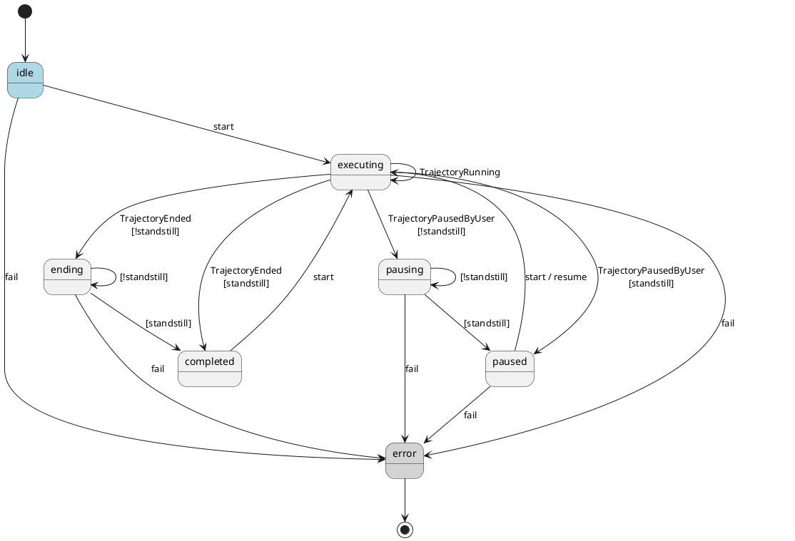
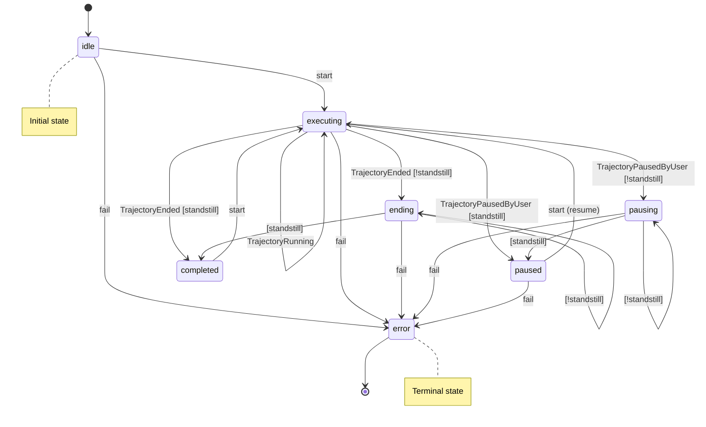

# Trajectory Execution State Machine

This module provides `TrajectoryExecutionMachine`, a finite-state machine that encapsulates the state handling logic for trajectory execution lifecycle, shared across movement controllers (`move_forward`, `TrajectoryCursor`, etc.).

## States

| State | Description |
|-------|-------------|
| `idle` | Initial state — no trajectory active, waiting for `start` |
| `executing` | Robot is moving (`TrajectoryRunning`) |
| `ending` | `TrajectoryEnded` received but robot not yet at standstill |
| `pausing` | `TrajectoryPausedByUser` received, not yet at standstill |
| `paused` | Robot paused and at standstill — may `start` again to resume |
| `completed` | Trajectory finished **and** robot at standstill |
| `error` | Unrecoverable error — terminal state |

## Transitions

### External Commands
- `start` — begin or resume execution (from `idle`, `paused`, or `completed`)
- `fail` — signal an error from any non-terminal state

### Internal Transitions (via `process_motion_state`)
- `TrajectoryRunning` → stay in `executing`
- `TrajectoryEnded` + standstill → `completed`
- `TrajectoryEnded` (no standstill) → `ending` → (on standstill) → `completed`
- `TrajectoryPausedByUser` + standstill → `paused`
- `TrajectoryPausedByUser` (no standstill) → `pausing` → (on standstill) → `paused`

---

## PlantUML Diagram



---

## Mermaid Diagram



---

## Usage Example

```python
machine = TrajectoryExecutionMachine()
machine.send("start")

async for state in motion_group_states:
    result = machine.process_motion_state(state)

    if result.location is not None:
        update_location(result.location)

    if machine.is_completed:
        break
    if machine.is_paused:
        handle_pause()
```
