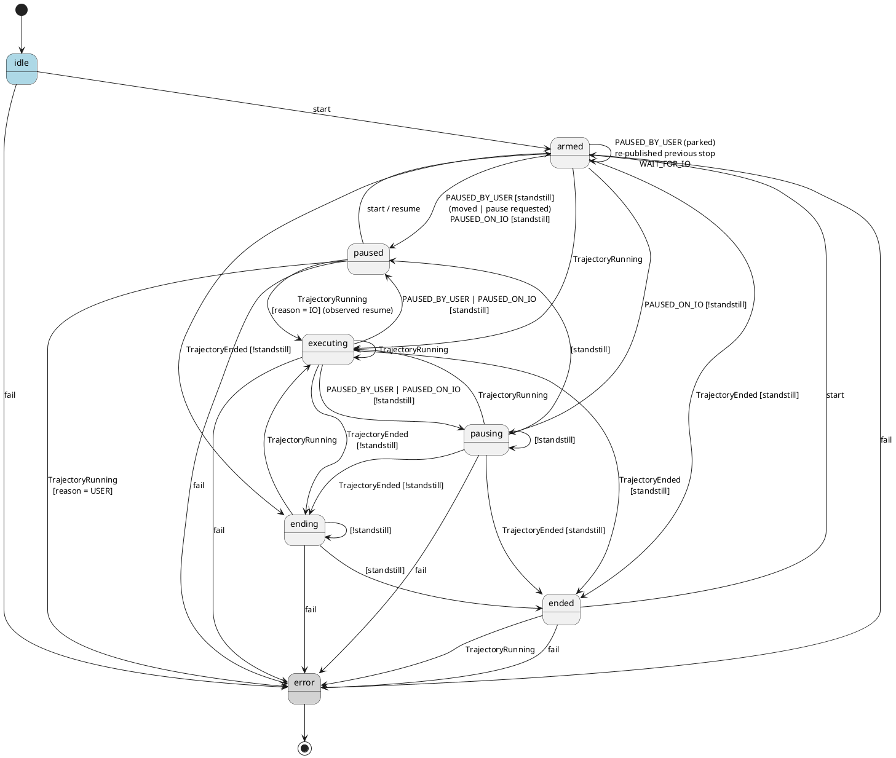
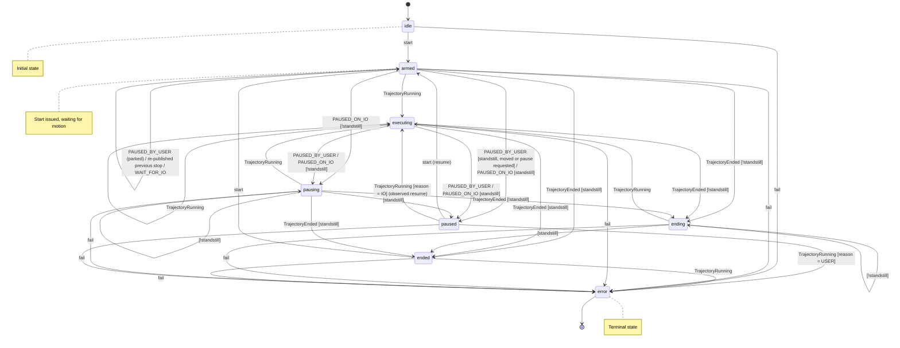

# Trajectory Execution State Machine

This module provides `TrajectoryExecutionMachine`, a finite-state machine that encapsulates the state handling logic for trajectory execution lifecycle, shared across movement controllers (`move_forward`, `TrajectoryCursor`, etc.).

## How the controller publishes execution state

Execution progress is **observed** on the `MotionGroupState` stream — the `executeTrajectory`
websocket only acknowledges requests and never delivers a completion message. The
`execute.details.state` discriminator (`RUNNING`, `END_OF_TRAJECTORY`, `PAUSED_BY_USER`,
`WAIT_FOR_IO`, `PAUSED_ON_IO`) together with the top-level `standstill` flag is the entire signal.

RAE publishes the execute state **level-based** (robotics/wbr!2262):

- The `execute` block is present from `InitializeMovementRequest` until the execution is stopped
  or its websocket is torn down — its mere presence does **not** mean the robot is moving.
- Terminal and paused states are **re-published every controller step** while they hold:
  `END_OF_TRAJECTORY` after the motion ends, `PAUSED_BY_USER` for as long as a pause holds.
  Completion and pause are durable, re-observable conditions — no consumer has to catch a
  single-step event, so any state-stream rate detects them.
- Between `InitializeMovementRequest` and the actual motion start the state is
  `PAUSED_BY_USER` at standstill: the *parked* shape. On the wire it is indistinguishable
  from a pause; the machine models it as its own phase (`armed`, below) instead.
- At motion start the two fields do not flip in the same step: `standstill` drops to `false`
  one control cycle **before** the discriminator changes from `PAUSED_BY_USER` to `RUNNING`
  (measured 2026-09-16). `standstill` can also flicker back to `true` for a few cycles while
  `RUNNING` and the location advance — an upstream defect; the SDK must not read it as a stop.
- A stopped execution also reports `PAUSED_BY_USER` (there is no separate wire kind); after
  stop/teardown the `execute` block disappears.
- `PAUSED_ON_IO` is published while the controller holds a `pause_on_io` pause. The controller
  never resumes it by itself: a new `StartMovementRequest` (honoured once the condition has
  cleared) resumes, re-arms the pause and re-attaches the IO overlay. A condition that already
  holds at the start yields `PAUSED_ON_IO` at the start location without any motion; after a
  resume the pause is re-published for a few control cycles before `RUNNING` appears
  (measured, see `docs/architecture/incoming/pause-on-signal-evaluation.md` and ADR 002).
  `END_OF_TRAJECTORY` is re-published the same way after a restart out of `ended`.

Controllers **older than wbr!2262** instead drop the `execute` block the instant the robot
settles: `END_OF_TRAJECTORY` / `PAUSED_BY_USER` are visible at standstill for only one or two
control cycles, after which nothing but bare standstill frames arrive. Since every stream between
the control loop and a client may drop frames, the machine treats a bare standstill frame as the
completion of an already-observed `ending`/`pausing` — the discriminator was seen on the way in,
the standstill concludes it.

## States

| State | Description |
|-------|-------------|
| `idle` | Initial state — no trajectory active, waiting for `start` |
| `armed` | `start` issued, robot not yet moving. The parked `PAUSED_BY_USER` and the re-published terminal state of the stop a resume leaves (same kind, same location) change nothing here |
| `executing` | Robot is moving (`TrajectoryRunning`) |
| `ending` | `TrajectoryEnded` received but robot not yet at standstill |
| `pausing` | `TrajectoryPausedByUser` or `TrajectoryPausedOnIO` received, not yet at standstill |
| `paused` | Robot paused and at standstill — may `start` again to resume; `pause_reason` is `USER` or `IO` |
| `ended` | Trajectory finished **and** robot at standstill |
| `error` | A frame contradicted the tracked execution (`failure_reason`, `failed_frame`), or `fail` was called — terminal |

Three regimes decide how a frame is read (ADR 003):

- **armed** expects the parked shape and waits for `RUNNING`;
- **transient** (`ending`, `pausing`) follows the discriminator — the robot is still moving, so a
  `RUNNING` frame returns to `executing` rather than waiting for a standstill that may be jitter;
- **rest** (`paused`, `ended`) enforces it — `RUNNING` without a `start` from this machine is an
  error for a user pause or a finished trajectory, and an observed resume for an IO pause.

## Transitions

### External Commands
- `arm()` (event `start`) — begin or resume execution (from `idle`, `paused`, or `ended`) →
  `armed`. A start out of `ended`/`paused` (a resume, or stepping on after `forward_to`) ignores
  frames that repeat the terminal state it leaves — same kind at the same location — until any
  different frame arrives. The controller keeps re-publishing the previous stop until it has
  taken up the new command; concluding the new operation from those frames reported it finished
  at its own start location (observed on the virtual controller: `forward_to(1.0)` then
  `forward()` resolved at 1.0 while the robot ran on to the end). A genuine new terminal state
  is always preceded by `WAIT_FOR_IO` or `RUNNING`, which lifts the filter — including a start
  issued at the very end of the trajectory. A pause requested on the resume is concluded by the
  very `PAUSED_BY_USER` frame the filter would otherwise ignore.
- `request_pause()` — the owner sent a `PauseMovementRequest`; the next `PAUSED_BY_USER` at
  standstill is a real pause even while `armed`.
- `fail` — signal an error from any non-error state

The owner must send `start` for a new movement command **before** processing the frames that
follow it; the rest-state rules rely on it.

### Internal Transitions (via `process_motion_state`)

`armed`:
- `TrajectoryRunning` → `executing`
- `TrajectoryPausedByUser` + standstill → stay (parked); → `paused` (`USER`) if the robot was
  seen leaving standstill before, or `request_pause()` was called
- `TrajectoryPausedByUser` (no standstill) → stay, remember that the robot moved
- `TrajectoryPausedOnIO` → `paused` / `pausing` (`IO`)
- `TrajectoryEnded` + standstill → `ended` (a zero-length trajectory may never show motion);
  (no standstill) → `ending`
- a frame repeating the stop the start left (see `arm()`) → stay
- `TrajectoryWaitForIO`, bare frames → stay

`executing`:
- `TrajectoryRunning` / `TrajectoryWaitForIO` → stay (also with `standstill=true`)
- `TrajectoryEnded` + standstill → `ended`; (no standstill) → `ending`
- `TrajectoryPausedByUser` / `TrajectoryPausedOnIO` + standstill → `paused`; (no standstill) → `pausing`

`ending` / `pausing`:
- standstill (with or without an `execute` block) → `ended` / `paused`
- `TrajectoryRunning` → `executing` (the end / pause never settled)
- `pausing` + `TrajectoryEnded` → `ended` / `ending` (a pause requested just before the end)

`paused` / `ended`:
- `TrajectoryRunning` while `paused` with `pause_reason = IO` → `executing` (observed resume)
- `TrajectoryRunning` while `paused` with `pause_reason = USER`, or while `ended` → `error`
- `TrajectoryPausedByUser` / `TrajectoryPausedOnIO` while `paused` → `pause_reason` follows the wire
- anything else → stay (logged)

The standstill that completes `ending → ended` and `pausing → paused` counts **with or without an
`execute` block on the frame**: pre-!2262 controllers drop the block at settle, so a bare
standstill frame can be the only completion signal that ever arrives. A bare standstill never
concludes anything from `armed` or `executing` — without a terminal discriminator there is
nothing to conclude.

## Completion rules in `TrajectoryCursor`

The cursor derives *operation* completion from the machine:

- The cursor arms the machine on the first frame after a movement command was issued, before
  that frame is processed. A pause requested before that (`pause()` right after `forward()`)
  arms the machine for the pause, so the parked frame concludes it.
- An operation is only marked running on **evidence of motion** (`standstill` false or a
  `RUNNING` detail) — never on the mere presence of an `execute` block.
- `ended` and `paused` conclude any **commanded** operation. A `paused` machine with
  `pause_reason = IO` completes it with `OperationResult.paused_on_io = True`
  (`final_location` is the pause location); the cursor stays attached so the movement can be
  resumed with another start. `move_forward` (the `execute()` path) cannot observe the IO yet
  and ends the execution there with a warning.
- One-shot mode (`detach_on_standstill`, i.e. `move_forward`): `ended` detaches the cursor,
  which closes the execution websocket. A `paused` with `pause_reason = USER` that this cursor
  did not request (pendant, another client) fails the operation and the protocol loop with
  `UnexpectedTrajectoryState` — there is no resume path, and waiting would never end.
- A machine in `error` fails the current operation and raises `UnexpectedTrajectoryState`
  (`nova.exceptions`) from the protocol loop, so `execute()` raises instead of hanging.

---

## PlantUML Diagram


```plantuml
@startuml TrajectoryExecutionMachine
skinparam state {
    BackgroundColor<<initial>> LightBlue
    BackgroundColor<<final>> LightGray
}

[*] --> idle

state idle <<initial>>
state error <<final>>

idle --> armed : start
paused --> armed : start / resume
ended --> armed : start

armed --> armed : PAUSED_BY_USER (parked)\nre-published previous stop\nWAIT_FOR_IO
armed --> executing : TrajectoryRunning
armed --> paused : PAUSED_BY_USER [standstill]\n(moved | pause requested)\nPAUSED_ON_IO [standstill]
armed --> pausing : PAUSED_ON_IO [!standstill]
armed --> ended : TrajectoryEnded [standstill]
armed --> ending : TrajectoryEnded [!standstill]

executing --> executing : TrajectoryRunning
executing --> ended : TrajectoryEnded\n[standstill]
executing --> ending : TrajectoryEnded\n[!standstill]
executing --> paused : PAUSED_BY_USER | PAUSED_ON_IO\n[standstill]
executing --> pausing : PAUSED_BY_USER | PAUSED_ON_IO\n[!standstill]

ending --> ending : [!standstill]
ending --> ended : [standstill]
ending --> executing : TrajectoryRunning

pausing --> pausing : [!standstill]
pausing --> paused : [standstill]
pausing --> executing : TrajectoryRunning
pausing --> ended : TrajectoryEnded [standstill]
pausing --> ending : TrajectoryEnded [!standstill]

paused --> executing : TrajectoryRunning\n[reason = IO] (observed resume)
paused --> error : TrajectoryRunning\n[reason = USER]
ended --> error : TrajectoryRunning

idle --> error : fail
armed --> error : fail
executing --> error : fail
ending --> error : fail
pausing --> error : fail
paused --> error : fail
ended --> error : fail

error --> [*]

@enduml
```

---

## Mermaid Diagram


```mermaid
stateDiagram-v2
    [*] --> idle

    idle --> armed : start
    paused --> armed : start (resume)
    ended --> armed : start

    armed --> armed : PAUSED_BY_USER (parked) / re-published previous stop / WAIT_FOR_IO
    armed --> executing : TrajectoryRunning
    armed --> paused : PAUSED_BY_USER [standstill, moved or pause requested] / PAUSED_ON_IO [standstill]
    armed --> pausing : PAUSED_ON_IO [!standstill]
    armed --> ended : TrajectoryEnded [standstill]
    armed --> ending : TrajectoryEnded [!standstill]

    executing --> executing : TrajectoryRunning
    executing --> ended : TrajectoryEnded [standstill]
    executing --> ending : TrajectoryEnded [!standstill]
    executing --> paused : PAUSED_BY_USER / PAUSED_ON_IO [standstill]
    executing --> pausing : PAUSED_BY_USER / PAUSED_ON_IO [!standstill]

    ending --> ending : [!standstill]
    ending --> ended : [standstill]
    ending --> executing : TrajectoryRunning

    pausing --> pausing : [!standstill]
    pausing --> paused : [standstill]
    pausing --> executing : TrajectoryRunning
    pausing --> ended : TrajectoryEnded [standstill]
    pausing --> ending : TrajectoryEnded [!standstill]

    paused --> executing : TrajectoryRunning [reason = IO] (observed resume)
    paused --> error : TrajectoryRunning [reason = USER]
    ended --> error : TrajectoryRunning

    idle --> error : fail
    armed --> error : fail
    executing --> error : fail
    ending --> error : fail
    pausing --> error : fail
    paused --> error : fail
    ended --> error : fail

    error --> [*]

    note right of idle : Initial state
    note right of armed : Start issued, waiting for motion
    note right of error : Terminal state
```

---

## Usage Example

```python
machine = TrajectoryExecutionMachine()
machine.arm()

async for state in motion_group_states:
    result = machine.process_motion_state(state)

    if result.location is not None:
        update_location(result.location)

    if machine.is_error:
        raise RuntimeError(machine.failure_reason)
    if machine.is_ended:
        break
    if machine.is_paused:
        handle_pause(machine.pause_reason)
```
