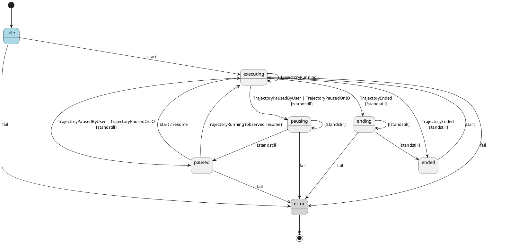
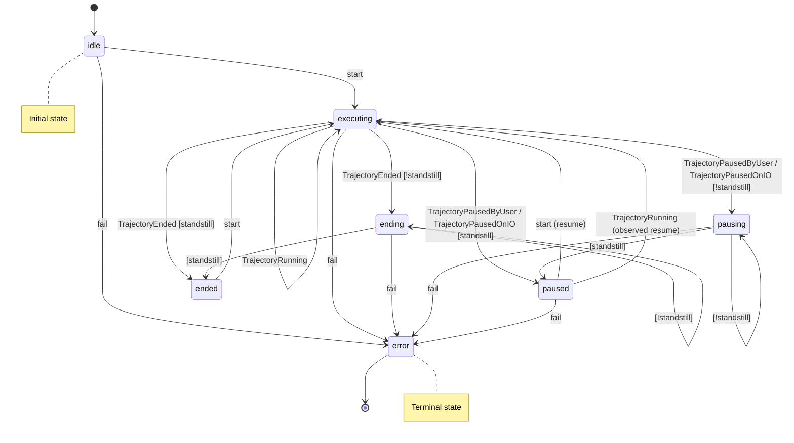

# Trajectory Execution State Machine

This module provides `TrajectoryExecutionMachine`, a finite-state machine that encapsulates the state handling logic for trajectory execution lifecycle, shared across movement controllers (`move_forward`, `TrajectoryCursor`, etc.).

## How the controller publishes execution state

Execution progress is **observed** on the `MotionGroupState` stream — the `executeTrajectory`
websocket only acknowledges requests and never delivers a completion message. The
`execute.details.state` discriminator (`RUNNING`, `END_OF_TRAJECTORY`, `PAUSED_BY_USER`,
`WAIT_FOR_IO`, `PAUSED_ON_IO`) together with the top-level `standstill` flag is the entire signal.

RAE publishes the execute state **level-based** (robotics/wbr!2262):

- The `execute` block is present from `InitializeMovementRequest` until the execution is stopped
  or its websocket is torn down — its mere presence does **not** mean the robot is moving.
- Terminal and paused states are **re-published every controller step** while they hold:
  `END_OF_TRAJECTORY` after the motion ends, `PAUSED_BY_USER` for as long as a pause holds.
  Completion and pause are durable, re-observable conditions — no consumer has to catch a
  single-step event, so any state-stream rate detects them.
- Between `InitializeMovementRequest` and the actual motion start the state is also
  `PAUSED_BY_USER` (at standstill): a *parked* trajectory is indistinguishable from a paused one
  on the wire. Consumers must not conclude a movement operation from a paused state unless that
  operation was actually seen running (see the cursor rules below).
- A stopped execution also reports `PAUSED_BY_USER` (there is no separate wire kind); after
  stop/teardown the `execute` block disappears.
- `PAUSED_ON_IO` is published while the controller holds a `pause_on_io` pause. The controller
  never resumes it by itself: a new `StartMovementRequest` (honoured once the condition has
  cleared) resumes, re-arms the pause and re-attaches the IO overlay. A condition that already
  holds at the start yields `PAUSED_ON_IO` at the start location without any motion; after a
  resume the pause is re-published for a few control cycles before `RUNNING` appears
  (measured, see `docs/architecture/incoming/pause-on-signal-evaluation.md` and ADR 002).

Controllers **older than wbr!2262** instead drop the `execute` block the instant the robot
settles: `END_OF_TRAJECTORY` / `PAUSED_BY_USER` are visible at standstill for only one or two
control cycles, after which nothing but bare standstill frames arrive. Since every stream between
the control loop and a client may drop frames, the machine treats a bare standstill frame as the
completion of an already-observed `ending`/`pausing` — the discriminator was seen on the way in,
the standstill concludes it.

## States

| State | Description |
|-------|-------------|
| `idle` | Initial state — no trajectory active, waiting for `start` |
| `executing` | Robot is moving (`TrajectoryRunning`) |
| `ending` | `TrajectoryEnded` received but robot not yet at standstill |
| `pausing` | `TrajectoryPausedByUser` or `TrajectoryPausedOnIO` received, not yet at standstill |
| `paused` | Robot paused and at standstill — may `start` again to resume; `pause_reason` is `USER` or `IO` |
| `ended` | Trajectory finished **and** robot at standstill |
| `error` | Unrecoverable error — terminal state |

## Transitions

### External Commands
- `start` — begin or resume execution (from `idle`, `paused`, or `ended`)
- `fail` — signal an error from any non-terminal state

### Internal Transitions (via `process_motion_state`)
- `TrajectoryRunning` → stay in `executing`
- `TrajectoryEnded` + standstill → `ended`
- `TrajectoryEnded` (no standstill) → `ending` → (on standstill) → `ended`
- `TrajectoryPausedByUser` + standstill → `paused` (`pause_reason = USER`)
- `TrajectoryPausedByUser` (no standstill) → `pausing` → (on standstill) → `paused`
- `TrajectoryPausedOnIO` + standstill → `paused` (`pause_reason = IO`)
- `TrajectoryPausedOnIO` (no standstill) → `pausing` → (on standstill) → `paused`
- `TrajectoryRunning` while `paused` → `executing` (a resume observed on the wire)

The standstill that completes `ending → ended` and `pausing → paused` counts **with or without an
`execute` block on the frame**: pre-!2262 controllers drop the block at settle, so a bare
standstill frame can be the only completion signal that ever arrives. A bare standstill never
concludes anything from `executing` — without a terminal discriminator there is nothing to
conclude.

## Completion rules in `TrajectoryCursor`

The cursor derives *operation* completion from the machine, with two guards for level-based
publishing:

- An operation is only marked running on **evidence of motion** (`standstill` false or a
  `RUNNING` detail) — never on the mere presence of an `execute` block, which exists from
  initialization on.
- A `paused` machine state concludes only a PAUSE operation, or a movement operation that was
  seen running. This keeps the persistent pre-start `PAUSED_BY_USER` frames from resolving a
  movement that never moved.
- A `paused` machine state with `pause_reason = IO` concludes any **commanded** operation as
  `OperationResult.paused_on_io = True` — also one that never moved, since the controller only
  reports `PAUSED_ON_IO` after a start armed with `pause_on_io`. An operation started while the
  machine is still paused on IO ignores `PAUSED_ON_IO` frames until a frame with another state
  arrived (the level-based re-publish after a resume).
- `ended` concludes any commanded operation; in one-shot mode (`move_forward`) it also detaches
  the cursor, which closes the execution websocket — the client's teardown acknowledges the
  persistent terminal state. An IO pause is `paused`, never `ended`, so the cursor stays
  attached; `move_forward` waits for the signal to clear and starts again (ADR 002).

---

## PlantUML Diagram


```plantuml
@startuml TrajectoryExecutionMachine
skinparam state {
    BackgroundColor<<initial>> LightBlue
    BackgroundColor<<final>> LightGray
}

[*] --> idle

state idle <<initial>>
state error <<final>>

idle --> executing : start
paused --> executing : start / resume
ended --> executing : start

executing --> executing : TrajectoryRunning
executing --> ended : TrajectoryEnded\n[standstill]
executing --> ending : TrajectoryEnded\n[!standstill]
executing --> paused : TrajectoryPausedByUser | TrajectoryPausedOnIO\n[standstill]
executing --> pausing : TrajectoryPausedByUser | TrajectoryPausedOnIO\n[!standstill]
paused --> executing : TrajectoryRunning (observed resume)

ending --> ending : [!standstill]
ending --> ended : [standstill]

pausing --> pausing : [!standstill]
pausing --> paused : [standstill]

idle --> error : fail
executing --> error : fail
ending --> error : fail
pausing --> error : fail
paused --> error : fail

error --> [*]

@enduml
```

---

## Mermaid Diagram


```mermaid
stateDiagram-v2
    [*] --> idle

    idle --> executing : start
    paused --> executing : start (resume)
    ended --> executing : start

    executing --> executing : TrajectoryRunning
    executing --> ended : TrajectoryEnded [standstill]
    executing --> ending : TrajectoryEnded [!standstill]
    executing --> paused : TrajectoryPausedByUser / TrajectoryPausedOnIO [standstill]
    executing --> pausing : TrajectoryPausedByUser / TrajectoryPausedOnIO [!standstill]
    paused --> executing : TrajectoryRunning (observed resume)

    ending --> ending : [!standstill]
    ending --> ended : [standstill]

    pausing --> pausing : [!standstill]
    pausing --> paused : [standstill]

    idle --> error : fail
    executing --> error : fail
    ending --> error : fail
    pausing --> error : fail
    paused --> error : fail

    error --> [*]

    note right of idle : Initial state
    note right of error : Terminal state
```

---

## Usage Example

```python
machine = TrajectoryExecutionMachine()
machine.send("start")

async for state in motion_group_states:
    result = machine.process_motion_state(state)

    if result.location is not None:
        update_location(result.location)

    if machine.is_ended:
        break
    if machine.is_paused:
        handle_pause()
```
