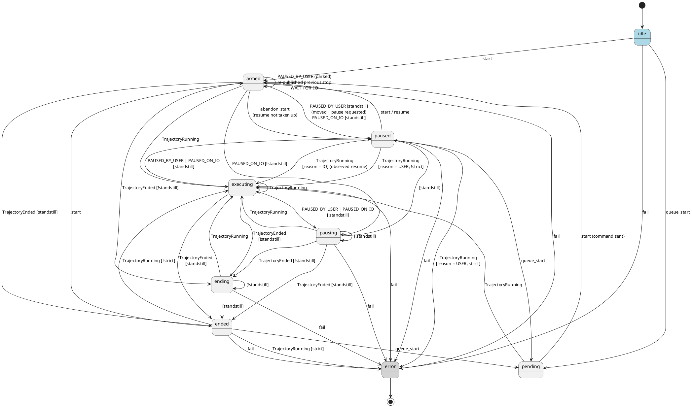
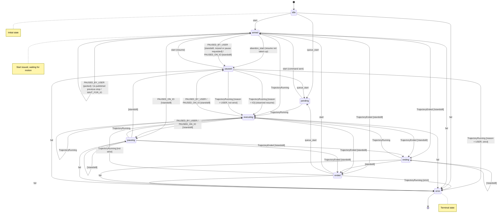

# Trajectory Execution State Machine

This module provides `TrajectoryExecutionMachine`, a finite-state machine that encapsulates the state handling logic for trajectory execution lifecycle, shared across movement controllers (`move_forward`, `TrajectoryCursor`, etc.).

## How the controller publishes execution state

Execution progress is **observed** on the `MotionGroupState` stream — the `executeTrajectory`
websocket only acknowledges requests and never delivers a completion message. The
`execute.details.state` discriminator (`RUNNING`, `END_OF_TRAJECTORY`, `PAUSED_BY_USER`,
`WAIT_FOR_IO`, `PAUSED_ON_IO`) together with the top-level `standstill` flag is the entire signal.

RAE publishes the execute state **level-based** (robotics/wbr!2262):

- The `execute` block is present from `InitializeMovementRequest` until the execution is stopped
  or its websocket is torn down — its mere presence does **not** mean the robot is moving.
- Terminal and paused states are **re-published every controller step** while they hold:
  `END_OF_TRAJECTORY` after the motion ends, `PAUSED_BY_USER` for as long as a pause holds.
  Completion and pause are durable, re-observable conditions — no consumer has to catch a
  single-step event, so any state-stream rate detects them.
- Between `InitializeMovementRequest` and the actual motion start the state is
  `PAUSED_BY_USER` at standstill: the *parked* shape. On the wire it is indistinguishable
  from a pause; the machine models it as its own phase (`armed`, below) instead.
- At motion start the two fields do not flip in the same step: `standstill` drops to `false`
  one control cycle **before** the discriminator changes from `PAUSED_BY_USER` to `RUNNING`
  (measured 2026-09-16). `standstill` can also flicker back to `true` for a few cycles while
  `RUNNING` and the location advance — an upstream defect; the SDK must not read it as a stop.
- A stopped execution also reports `PAUSED_BY_USER` (there is no separate wire kind); after
  stop/teardown the `execute` block disappears.
- `PAUSED_ON_IO` is published while the controller holds a `pause_on_io` pause. The controller
  never resumes it by itself: a new `StartMovementRequest` (honoured once the condition has
  cleared) resumes, re-arms the pause and re-attaches the IO overlay. A condition that already
  holds at the start yields `PAUSED_ON_IO` at the start location without any motion; after a
  resume the pause is re-published for a few control cycles before `RUNNING` appears
  (measured, see `docs/architecture/incoming/pause-on-signal-evaluation.md` and ADR 002).
  `END_OF_TRAJECTORY` is re-published the same way after a restart out of `ended`.

Controllers **older than wbr!2262** instead drop the `execute` block the instant the robot
settles: `END_OF_TRAJECTORY` / `PAUSED_BY_USER` are visible at standstill for only one or two
control cycles, after which nothing but bare standstill frames arrive. Since every stream between
the control loop and a client may drop frames, the machine treats a bare standstill frame as the
completion of an already-observed `ending`/`pausing` — the discriminator was seen on the way in,
the standstill concludes it.

## Standstill estimation and the execution policy

`standstill` is an **observed** property ("NOVA treats measured joint velocities as 0"), and its
threshold is currently unreliable: the flag drops to `false` for single frames while the robot is
at rest (seen on the real cell 2026-09-29/30; the virtual controller never does it). A flicker on
the parked frame before the controller took up a start made the machine conclude a user pause, and
the `RUNNING` that followed failed the execution. The location in `execute.details` is
**commanded**, not observed: it proves the controller executes a command, not that the robot moved.

Every rule below that says "standstill" therefore reads the decision of `StandstillEstimator`
(`standstill.py`), not the raw flag. It combines:

- consecutive raw flags: `motion_votes` frames of `standstill=false`, `rest_votes` of `true`;
- the commanded location moving between two frames of the same trajectory — corroborates a
  `standstill=false` frame at once;
- the measured joints moving more than their threshold — corroborates `standstill=false` and
  vetoes a rest vote. Thresholds are per unit: `joint_epsilon` in rad for revolute joints,
  `prismatic_joint_epsilon` in mm for prismatic ones (the joint types come from the motion
  group's DH parameters, read once per `MotionGroup`; without them joint evidence is off). A single
  `1e-3` for both made a rail's encoder noise count as motion (combined_loop, 2026-09-30).

`StandstillConfig.passthrough()` (one vote each, no corroboration) returns the raw flag on the same
frame: the behaviour before the estimator, for when upstream fixes the flag. A flicker the
estimator ignored is reported as `jitter` on the reading and logged (or fails the execution when
`StandstillConfig.strict`). The cursor's DEBUG frame line shows `standstill=` (raw) next to
`at_rest=` (decision), `evidence=` and `jitter=`.

`ExecutionPolicy` (`policy.py`) bundles this with the other knobs, set process-wide from the
environment or per cursor / `MovementControllerContext.execution_policy`:

| preset (`NOVA_EXECUTION_POLICY`) | standstill | contradictions | ignored resume |
|---|---|---|---|
| `robust` (default) | debounced (`motion_votes=3`, `rest_votes=2`, location, joints `1e-3` rad / `0.1` mm) | warn, follow the controller | one more start within the window, then wait for a new edge |
| `strict` | raw flag | `UnexpectedTrajectoryState` | `ResumeNotTakenUp` |
| `diagnose` | debounced, every jitter fails | `UnexpectedTrajectoryState` | `ResumeNotTakenUp` |

Each knob can be overridden: `NOVA_STANDSTILL_MOTION_VOTES`, `NOVA_STANDSTILL_REST_VOTES`,
`NOVA_STANDSTILL_LOCATION_EPSILON`, `NOVA_STANDSTILL_JOINT_EPSILON`,
`NOVA_STANDSTILL_PRISMATIC_JOINT_EPSILON` (`none` disables),
`NOVA_RESUME_DETECT_MS`, `NOVA_RESUME_WINDOW_MS`. The unit tests run under `strict`
(`tests/conftest.py`), which pins that the policy changes nothing for the old rules.

## States

| State | Description |
|-------|-------------|
| `idle` | Initial state — no trajectory active, waiting for `start` |
| `pending` | An operation is queued but its command is not on the wire yet (`expect_start()`). Frames only update the location; nothing concludes. `RUNNING` is followed to `executing` with a warning |
| `armed` | `start` issued, robot not yet moving. The parked `PAUSED_BY_USER` and the re-published terminal state of the stop a resume leaves (same kind, same location) change nothing here |
| `executing` | Robot is moving (`TrajectoryRunning`) |
| `ending` | `TrajectoryEnded` received but robot not yet at standstill |
| `pausing` | `TrajectoryPausedByUser` or `TrajectoryPausedOnIO` received, not yet at standstill |
| `paused` | Robot paused and at standstill — may `start` again to resume; `pause_reason` is `USER` or `IO` |
| `ended` | Trajectory finished **and** robot at standstill |
| `error` | A frame contradicted the tracked execution (`failure_reason`, `failed_frame`), or `fail` was called — terminal |

Three regimes decide how a frame is read (ADR 003):

- **armed** expects the parked shape and waits for `RUNNING`;
- **transient** (`ending`, `pausing`) follows the discriminator — the robot is still moving, so a
  `RUNNING` frame returns to `executing` rather than waiting for a standstill that may be jitter;
- **rest** (`paused`, `ended`) enforces it — `RUNNING` without a `start` from this machine is an
  error for a user pause or a finished trajectory (strict), or a warning after which the machine
  follows the controller to `executing` (not strict); for an IO pause it is an observed resume.

## Transitions

### External Commands
- `expect_start()` (event `queue_start`) — an operation is queued; → `pending` until its command
  was sent. Takes the same context as `arm()`; a later `arm()` keeps it.
- `arm()` (event `start`) — begin or resume execution (from `idle`, `paused`, or `ended`) →
  `armed`. A start out of `ended`/`paused` (a resume, or stepping on after `forward_to`) ignores
  frames that repeat the terminal state it leaves — same kind at the same location — until any
  different frame arrives. The controller keeps re-publishing the previous stop until it has
  taken up the new command; concluding the new operation from those frames reported it finished
  at its own start location (observed on the virtual controller: `forward_to(1.0)` then
  `forward()` resolved at 1.0 while the robot ran on to the end). A genuine new terminal state
  is always preceded by `WAIT_FOR_IO` or `RUNNING`, which lifts the filter — including a start
  issued at the very end of the trajectory. A pause requested on the resume is concluded by the
  very `PAUSED_BY_USER` frame the filter would otherwise ignore. When the cursor is *certain* the
  new movement has nowhere to go (`forward()` at the end, `backward()` at the start, a target equal
  to the current location) it arms with `accept_repeated_terminal=True` and the repeated stop
  concludes the operation at once, without waiting for the controller's `WAIT_FOR_IO`; with an
  unknown trajectory length the cursor makes no such claim.
- `arm(pause_on_io_armed=...)` — whether the start carries a `pause_on_io` condition. With `False`,
  a `PAUSED_ON_IO` frame is a contradiction (strict: `error`, otherwise followed with a warning);
  `None` (unknown) accepts it.
- `abandon_start()` — a resume out of an IO pause that is still `armed` on the old `PAUSED_ON_IO`
  frames returns to `paused` (`IO`); the next `arm()` filters them again.
- `request_pause()` — the owner sent a `PauseMovementRequest`; the next `PAUSED_BY_USER` at
  standstill is a real pause even while `armed`.
- `fail` — signal an error from any non-error state

The owner must send `start` for a new movement command **before** processing the frames that
follow it; the rest-state rules rely on it.

### Internal Transitions (via `process_motion_state`)

`armed`:
- `TrajectoryRunning` → `executing`
- `TrajectoryPausedByUser` + standstill → stay (parked); → `paused` (`USER`) if the **commanded
  location** has left the one the start found (same trajectory), or `request_pause()` was called.
  The commanded location only advances once the controller executes the start, so before that
  the frame is the parked shape whatever the standstill flag says — a flicker can no longer
  conclude a pause here, with any standstill configuration. A frame of another trajectory (a
  stale frame of the previous execution on a shared stream) re-anchors instead of counting.
- `TrajectoryPausedByUser` (no standstill) → stay
- `TrajectoryPausedOnIO` → `paused` / `pausing` (`IO`)
- `TrajectoryEnded` + standstill → `ended` (a zero-length trajectory may never show motion);
  (no standstill) → `ending`
- a frame repeating the stop the start left (see `arm()`) → stay
- `TrajectoryWaitForIO`, bare frames → stay

`executing`:
- `TrajectoryRunning` / `TrajectoryWaitForIO` → stay (also with `standstill=true`)
- `TrajectoryEnded` + standstill → `ended`; (no standstill) → `ending`
- `TrajectoryPausedByUser` / `TrajectoryPausedOnIO` + standstill → `paused`; (no standstill) → `pausing`

`ending` / `pausing`:
- standstill (with or without an `execute` block) → `ended` / `paused`
- `TrajectoryRunning` → `executing` (the end / pause never settled)
- `pausing` + `TrajectoryEnded` → `ended` / `ending` (a pause requested just before the end)

`paused` / `ended`:
- `TrajectoryRunning` while `paused` with `pause_reason = IO` → `executing` (observed resume)
- `TrajectoryRunning` while `paused` with `pause_reason = USER`, or while `ended` → `error`
- `TrajectoryPausedByUser` / `TrajectoryPausedOnIO` while `paused` → `pause_reason` follows the wire
- anything else → stay (logged)

The standstill that completes `ending → ended` and `pausing → paused` counts **with or without an
`execute` block on the frame**: pre-!2262 controllers drop the block at settle, so a bare
standstill frame can be the only completion signal that ever arrives. A bare standstill never
concludes anything from `armed` or `executing` — without a terminal discriminator there is
nothing to conclude.

## Completion rules in `TrajectoryCursor`

The cursor derives *operation* completion from the machine:

- The cursor moves the machine to `pending` on the first frame after a movement was requested
  and arms it on the first frame after the command was handed to the wire, both before that frame
  is processed. A pause requested before that (`pause()` right after `forward()`)
  arms the machine for the pause, so the parked frame concludes it.
- An operation is only marked running on **evidence of motion** (`standstill` false or a
  `RUNNING` detail) — never on the mere presence of an `execute` block.
- `ended` and `paused` conclude any **commanded** operation. A `paused` machine with
  `pause_reason = IO` completes it with `OperationResult.paused_on_io = True`
  (`final_location` is the pause location); the cursor stays attached so the movement can be
  resumed with another start. `move_forward` (the `execute()` path) waits for the signal to clear
  and starts again (ADR 002); without a release waiter it ends the execution early, with a warning.
- One-shot mode (`detach_on_standstill`, i.e. `move_forward`): `ended` detaches the cursor,
  which closes the execution websocket. A `paused` with `pause_reason = USER` that this cursor
  did not request (pendant, another client) fails the operation and the protocol loop with
  `UnexpectedTrajectoryState` — there is no resume path, and waiting would never end.
- A machine in `error` fails the current operation and raises `UnexpectedTrajectoryState`
  (`nova.exceptions`) from the protocol loop, so `execute()` raises instead of hanging.
- A resume out of an IO pause that shows nothing but the old `PAUSED_ON_IO` for
  `ExecutionPolicy.resume_detect_s` (0.5 s) after its start went out completes with
  `OperationResult.resume_not_taken_up` (and `paused_on_io`); the machine returns to `paused(IO)`.
  The check runs on each frame (the pause is re-published level-based), not on a timer task.
- `move_forward` on `resume_not_taken_up`: if the condition holds again (pushed, since the release
  edge) it is an ordinary pause. Otherwise strict mode raises `ResumeNotTakenUp`; else it sends
  one more start if still within `resume_window_s` (1 s) of the release edge, and after that waits
  for a new edge (signal pausing, then released) — it never starts a robot later than the window
  after the operator released the signal. A late take-up by the controller itself is followed.

---

## PlantUML Diagram


```plantuml
@startuml TrajectoryExecutionMachine
skinparam state {
    BackgroundColor<<initial>> LightBlue
    BackgroundColor<<final>> LightGray
}

[*] --> idle

state idle <<initial>>
state error <<final>>

idle --> armed : start
paused --> armed : start / resume
ended --> armed : start
idle --> pending : queue_start
paused --> pending : queue_start
ended --> pending : queue_start
pending --> armed : start (command sent)
pending --> executing : TrajectoryRunning
armed --> paused : abandon_start\n(resume not taken up)

armed --> armed : PAUSED_BY_USER (parked)\nre-published previous stop\nWAIT_FOR_IO
armed --> executing : TrajectoryRunning
armed --> paused : PAUSED_BY_USER [standstill]\n(moved | pause requested)\nPAUSED_ON_IO [standstill]
armed --> pausing : PAUSED_ON_IO [!standstill]
armed --> ended : TrajectoryEnded [standstill]
armed --> ending : TrajectoryEnded [!standstill]

executing --> executing : TrajectoryRunning
executing --> ended : TrajectoryEnded\n[standstill]
executing --> ending : TrajectoryEnded\n[!standstill]
executing --> paused : PAUSED_BY_USER | PAUSED_ON_IO\n[standstill]
executing --> pausing : PAUSED_BY_USER | PAUSED_ON_IO\n[!standstill]

ending --> ending : [!standstill]
ending --> ended : [standstill]
ending --> executing : TrajectoryRunning

pausing --> pausing : [!standstill]
pausing --> paused : [standstill]
pausing --> executing : TrajectoryRunning
pausing --> ended : TrajectoryEnded [standstill]
pausing --> ending : TrajectoryEnded [!standstill]

paused --> executing : TrajectoryRunning\n[reason = IO] (observed resume)
paused --> error : TrajectoryRunning\n[reason = USER, strict]
paused --> executing : TrajectoryRunning\n[reason = USER, !strict]
ended --> error : TrajectoryRunning [strict]
ended --> executing : TrajectoryRunning [!strict]

idle --> error : fail
armed --> error : fail
executing --> error : fail
ending --> error : fail
pausing --> error : fail
paused --> error : fail
ended --> error : fail

error --> [*]

@enduml
```

---

## Mermaid Diagram


```mermaid
stateDiagram-v2
    [*] --> idle

    idle --> armed : start
    paused --> armed : start (resume)
    ended --> armed : start
    idle --> pending : queue_start
    paused --> pending : queue_start
    ended --> pending : queue_start
    pending --> armed : start (command sent)
    pending --> executing : TrajectoryRunning
    armed --> paused : abandon_start (resume not taken up)

    armed --> armed : PAUSED_BY_USER (parked) / re-published previous stop / WAIT_FOR_IO
    armed --> executing : TrajectoryRunning
    armed --> paused : PAUSED_BY_USER [standstill, moved or pause requested] / PAUSED_ON_IO [standstill]
    armed --> pausing : PAUSED_ON_IO [!standstill]
    armed --> ended : TrajectoryEnded [standstill]
    armed --> ending : TrajectoryEnded [!standstill]

    executing --> executing : TrajectoryRunning
    executing --> ended : TrajectoryEnded [standstill]
    executing --> ending : TrajectoryEnded [!standstill]
    executing --> paused : PAUSED_BY_USER / PAUSED_ON_IO [standstill]
    executing --> pausing : PAUSED_BY_USER / PAUSED_ON_IO [!standstill]

    ending --> ending : [!standstill]
    ending --> ended : [standstill]
    ending --> executing : TrajectoryRunning

    pausing --> pausing : [!standstill]
    pausing --> paused : [standstill]
    pausing --> executing : TrajectoryRunning
    pausing --> ended : TrajectoryEnded [standstill]
    pausing --> ending : TrajectoryEnded [!standstill]

    paused --> executing : TrajectoryRunning [reason = IO] (observed resume)
    paused --> error : TrajectoryRunning [reason = USER, strict]
    paused --> executing : TrajectoryRunning [reason = USER, not strict]
    ended --> error : TrajectoryRunning [strict]
    ended --> executing : TrajectoryRunning [not strict]

    idle --> error : fail
    armed --> error : fail
    executing --> error : fail
    ending --> error : fail
    pausing --> error : fail
    paused --> error : fail
    ended --> error : fail

    error --> [*]

    note right of idle : Initial state
    note right of armed : Start issued, waiting for motion
    note right of error : Terminal state
```

---

## Usage Example

```python
machine = TrajectoryExecutionMachine()
machine.arm()

async for state in motion_group_states:
    result = machine.process_motion_state(state)

    if result.location is not None:
        update_location(result.location)

    if machine.is_error:
        raise RuntimeError(machine.failure_reason)
    if machine.is_ended:
        break
    if machine.is_paused:
        handle_pause(machine.pause_reason)
```
