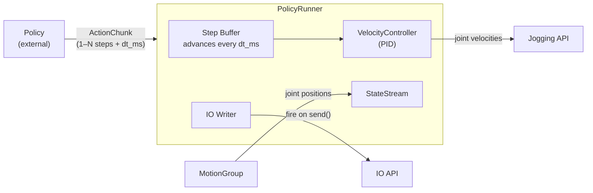
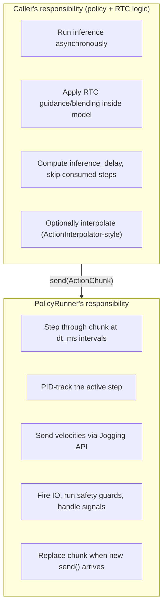
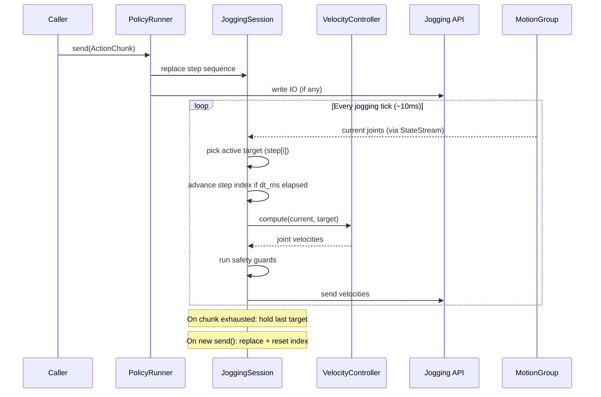
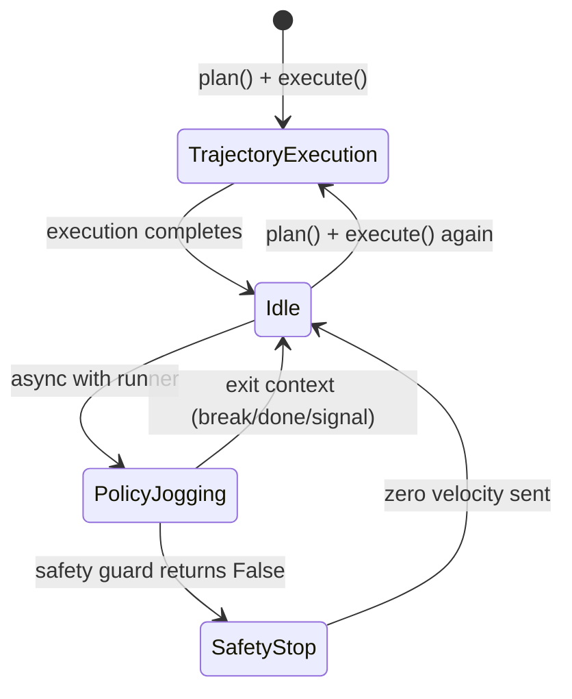
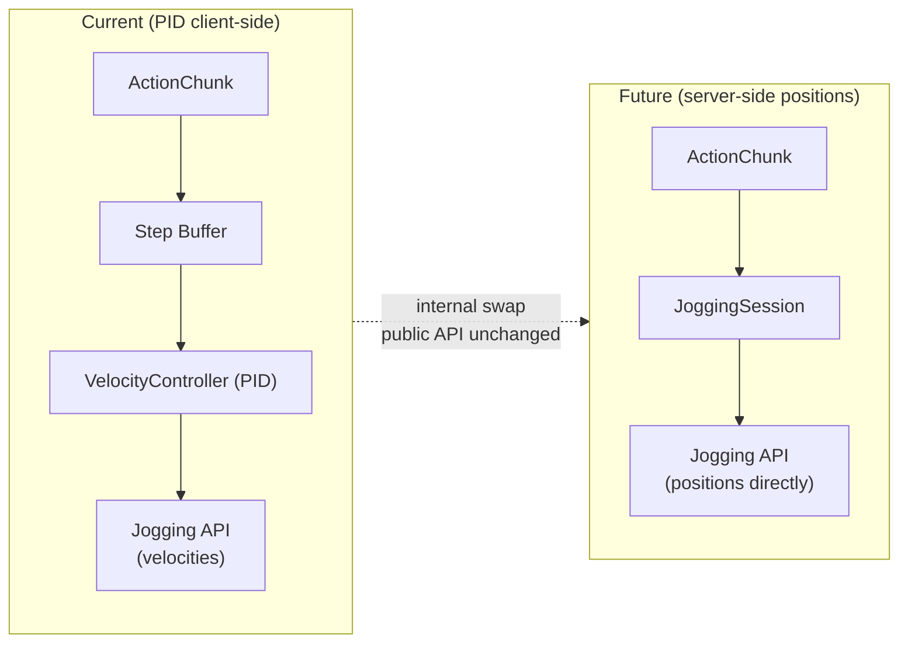

# Nova Policy Package — Design Document

## Goal

Provide a compact SDK module (`nova.policy`) that enables AI policy inference loops to stream **action chunks** (joint positions + IO values) to one or more motion groups and have them executed in real-time via PID-controlled jogging.

The package bridges the gap between an AI policy (which outputs discrete joint/gripper targets at ~10–50 Hz) and NOVA's velocity-based jogging API (which requires continuous joint velocity commands).

> **Scope:** This is the essential first building block. The NOVA API will eventually provide
> native position streaming (JoggingChunkRequest) which makes the client-side PID obsolete.
> Until then, this package provides the simplest correct implementation.
> When the server API lands, only the internal transport changes — the public API stays the same.

---

## Low-Hanging Fruit Improvements (over current lerobot PID)

The existing PID in `lerobot_robot_nova` works but has known issues. These are cheap fixes:

### 1. Feedforward from target velocity estimation

When targets arrive at a steady rate, we can estimate target velocity and add it to the PID output. This is just math — no API changes.

```
Current:  velocity = P * error - D * current_velocity
With FF:  velocity = P * error - D * current_velocity + FF * target_velocity_estimate
```

The FF term "leads" the PID so it doesn't always play catch-up. The lerobot code has this infrastructure but it's disabled (`ff_coefficient=0.0`) because tuning it is tricky — a bad FF value can cause overshoot/oscillation.

**Decision:** Port the FF code over but leave it disabled (`ff_gain=0.0`) in the first iteration. It's there for future tuning experiments.

### 2. Monotonic clock instead of `time.time()`

The current code uses `time.time()` which can jump (NTP sync, suspend/resume). Use `time.monotonic()` for stable dt computation in the derivative term.

### 3. ~~Target smoothing (exponential filter)~~ — REJECTED

Considered adding an exponential moving average on the target to soften step-jumps. However this introduces extra delay/phase lag into the control loop — the robot always lags behind the actual target by a fraction of a tick. For a system that's already fighting latency (network + PID loop timing), adding more delay is counterproductive.

The PID's velocity limit already prevents dangerous jumps. If targets are noisy, that's a policy problem, not a controller problem.

### 4. Anti-windup on integral term

If `i_gain > 0` is ever used, clamp the integral accumulator to prevent windup during large errors (e.g. first few ticks after start, or after e-stop recovery).

---

## Core Concept



**Semantics:** `send()` provides the chunk. The jogging session steps through the targets every `dt_ms`. The PID continuously drives toward the active step. When the sequence is exhausted, holds last target. New chunk replaces old immediately.

---

## Data Model

```python
@dataclass
class ActionChunk:
    """Policy output: one or more timed joint targets per motion group.

    Single-step (teleoperation at 30 Hz):
        ActionChunk(joints={"0@ur5e": [[0.1, -1.5, ...]]})

    Multi-step (policy inference, e.g. ACT outputs 16 steps at 33ms):
        ActionChunk(
            joints={"0@ur5e": [[...], [...], [...], ...]},  # 16 targets
            dt_ms=33.0,  # spacing between steps
        )
    """
    joints: dict[str, list[list[float]]]                   # motion group id → sequence of joint targets
    ios: dict[str, dict[str, ValueType]] | None = None     # motion group id → {io_key: value} (fired once on send)
    dt_ms: float = 0.0                                     # time spacing between steps (0 = single-step)
    timestamp: float | None = None

    @classmethod
    def from_dict(cls, data: dict) -> ActionChunk: ...
```

**Semantics:**
- `dt_ms = 0` (or `len(joints[group]) == 1`): single target, same as before
- `dt_ms > 0` with N targets: the runner advances through them every `dt_ms` milliseconds, updating the active PID target
- IO fires once on `send()` (not per-step — that's the server's job later)
- When a new chunk arrives mid-sequence, the old sequence is replaced immediately (no blending)

Reuses `ValueType` from the existing SDK for IO values. No interpolation/blending — that complexity lives in the future server API.

### Alignment with LeRobot RTC (Real-Time Chunking)

Investigating how LeRobot handles multi-step chunks confirms our design is correct:

**How RTC works in LeRobot:**
1. A background thread runs `predict_action_chunk()` asynchronously, producing 50-step chunks
2. `ActionQueue` holds the current chunk; the main loop calls `.get()` once per tick to pop the next step
3. When a new chunk arrives, it **replaces** the queue (skipping the first N steps that elapsed during inference — the `inference_delay`)
4. Blending/guidance happens **inside the policy model** during denoising — not in the execution layer
5. `ActionInterpolator` optionally linear-interpolates between consecutive steps for smoother motion at higher control rates

**What this means for us:**
- Chunk blending is a **policy-side concern** (done during inference via RTC guidance). Our `PolicyRunner` does NOT need to implement blending.
- The execution layer just steps through the chunk — one target per tick. This is exactly what we do.
- The `inference_delay` offset (how many steps to skip because inference took time) is computed by the caller and accounted for before calling `send()`. The runner doesn't decide this.
- Our "new chunk replaces old immediately" behavior matches `ActionQueue._replace_actions_queue()`.

**Boundary:**



---

## Public API

### `PolicyRunner`

```python
from nova import Nova
from nova.policy import PolicyRunner, PolicyRunnerConfig, ActionChunk

async with Nova() as nova:
    cell = nova.cell()
    controller = await cell.controller("ur5e")
    motion_group = controller[0]

    runner = PolicyRunner(motion_groups=[motion_group])

    async with runner:
        while True:
            obs = await runner.observe()
            action = my_policy.predict(obs)
            await runner.send(ActionChunk(
                joints={motion_group.id: [action["joints"]]},  # single-step
                ios={motion_group.id: {"digital_out[0]": action["gripper"]}},
            ))
            await asyncio.sleep(0.033)  # 30 Hz
```

### Stopping the Policy / Giving Back Control

The `PolicyRunner` doesn't own the control flow — the user does. Exiting the `async with runner:` block (by any means) stops jogging and returns control to the program. Several patterns:

**1. Source exhaustion — the iterator ends naturally**

```python
async with runner:
    async for chunk in source:  # when source is done, loop ends
        await runner.send(chunk)
    # ← jogging stops here, program continues
print("Policy finished, robot holds position.")
```

**2. Break on a condition (policy signals done)**

The policy's output can include a `done` signal. The user checks it:

```python
async with runner:
    while True:
        obs = await runner.observe()
        result = my_policy.predict(obs)
        if result.done:  # policy says task is complete
            break
        await runner.send(result.chunk)
# ← back in normal program flow
await motion_group.execute(...)  # can do trajectory execution again
```

**3. Step limit — run for N steps**

```python
async with runner:
    for step in range(500):  # run 500 steps then stop
        obs = await runner.observe()
        chunk = my_policy.predict(obs)
        await runner.send(chunk)
        await asyncio.sleep(0.033)
```

**4. Timeout — stop if no progress / too much time elapsed**

```python
import asyncio

async with runner:
    deadline = asyncio.get_event_loop().time() + 30.0  # 30 seconds max
    while asyncio.get_event_loop().time() < deadline:
        obs = await runner.observe()
        chunk = my_policy.predict(obs)
        await runner.send(chunk)
        await asyncio.sleep(0.033)
```

**5. External cancellation — another task or signal stops it**

```python
stop_event = asyncio.Event()

async with runner:
    while not stop_event.is_set():
        obs = await runner.observe()
        chunk = my_policy.predict(obs)
        await runner.send(chunk)
        await asyncio.sleep(0.033)

# stop_event.set() can be called from a WebSocket handler, UI button, etc.
```

**Key principle:** The runner doesn't decide when to stop — the user's code does. This keeps the runner simple and composable. On exit from `async with runner:`, the runner:
1. Sends zero velocity to all groups
2. Closes jogging sessions
3. Returns — the motion group is now idle and available for trajectory execution again

### `PolicyRunnerConfig`

Defaults match what was used during training in the lerobot pipeline. Most users should not change these — the PID parameters must be consistent between recording and inference.

```python
@dataclass
class PolicyRunnerConfig:
    # PID gains (advanced — must match training-time values)
    velocity_limit: float = 1.5       # rad/s per joint
    tolerance: float = 0.01           # rad — within this, output is zero
    p_gain: float = 3.0
    i_gain: float = 0.0
    d_gain: float = 0.1
    ff_gain: float = 0.0              # feedforward (disabled; available for tuning)

    # Anti-windup (only relevant if i_gain > 0)
    integral_limit: float = 2.0       # max abs value of integral accumulator per joint

    # State stream rate
    state_rate_ms: int = 10
```

### Safety Guard Callback

Users can attach a safety callback that is invoked on every jogging tick with the current and previous TCP pose. If the callback returns `False`, jogging is immediately stopped (zero velocity).

This enables user-defined safeguards like:
- Workspace boundary checks (stop if TCP leaves a box/sphere)
- Velocity limiting (stop if TCP moves too fast)
- Collision avoidance with external sensors

The callback receives the current and previous `RobotState` (from `nova.types`) which already carries TCP pose, joints, and TCP name:

```python
from nova.types import RobotState

@dataclass
class SafetyContext:
    """State passed to the safety guard on each tick."""
    state: RobotState              # current state (pose + joints + tcp)
    prev_state: RobotState | None  # previous tick's state (None on first tick)
    dt: float                      # seconds since last tick
    motion_group_id: str           # which group this is for

# Type alias for the callback
SafetyGuard = Callable[[SafetyContext], bool]  # return False to stop

# Usage:
def workspace_guard(ctx: SafetyContext) -> bool:
    """Stop if TCP leaves a safe box."""
    pos = ctx.state.pose.position
    if abs(pos[0]) > 0.8 or abs(pos[1]) > 0.8 or pos[2] < 0.05:
        return False  # STOP
    return True

def speed_guard(ctx: SafetyContext) -> bool:
    """Stop if TCP is moving too fast."""
    if ctx.prev_state is None:
        return True
    distance = (ctx.state.pose @ ctx.prev_state.pose.inverse()).position
    speed = (distance[0]**2 + distance[1]**2 + distance[2]**2)**0.5 / ctx.dt
    return speed < 0.5  # max 0.5 m/s

runner = PolicyRunner(
    motion_groups=[motion_group],
    safety_guards=[workspace_guard, speed_guard],  # all must return True
)
```

If **any** guard returns `False`, the runner sends zero velocities and raises `GuardStopError`.

### Graceful Shutdown on SIGTERM / Unhandled Exit

The `PolicyRunner` registers signal handlers (`SIGTERM`, `SIGINT`) and an `atexit` hook. On any unclean exit:
1. Zero velocity is sent immediately to all motion groups
2. Jogging sessions are closed
3. Then the process terminates

This ensures the robot stops even if the Python process is killed externally.

```python
async with runner:  # ← registers signal handlers on enter, deregisters on exit
    ...             # if killed here, robot stops cleanly
```

### `Observation`

`observe()` returns a dict of motion group ID → `RobotState` (reuses `nova.types.RobotState` directly — no new type needed):

```python
# runner.observe() returns:
dict[str, RobotState]   # motion group id → RobotState(pose, tcp, joints)

# Usage:
obs = await runner.observe()
current_joints = obs["0@ur5e"].joints
current_pose = obs["0@ur5e"].pose
```

### `MockActionSource`

```python
from nova.policy import MockActionSource

source = MockActionSource(
    motion_group_ids=["0@ur5e"],
    num_joints=6,
    home_joints=[0.0, -1.57, 1.57, 0.0, 1.57, 0.0],
    interval_ms=100,       # emit at 10 Hz
    amplitude=0.2,         # ±0.2 rad sinusoidal oscillation
    io_toggle_key="digital_out[0]",   # optional
    io_toggle_interval_ms=2000,
)

async with runner:
    async for chunk in source:
        await runner.send(chunk)
```

---

## Internal Architecture

### `VelocityController`

Pure math, no I/O:

```python
class VelocityController:
    def compute(self, current: list[float], target: list[float]) -> list[float]:
        """Returns clamped joint velocities."""
```

Improvements over lerobot version:
- `time.monotonic()` for stable dt
- Feedforward infrastructure ported (disabled by default, available for tuning)
- Anti-windup clamp on integral accumulator

### `JoggingSession`

Per-motion-group lifecycle:
- Holds the current chunk's step sequence and a step index
- Advances the step index every `dt_ms` (wall-clock). If single-step (`dt_ms=0`), just holds the one target.
- When a new chunk arrives via `send()`, replaces the sequence immediately (resets step index to 0)
- Fires IO writes immediately when a new chunk is received with IO commands
- When step sequence is exhausted: holds last target (PID drives error to zero)



### `PolicyRunner`

Orchestrator:
- `async with runner:` — starts state streams + jogging sessions, registers signal handlers
- `send(chunk)` — updates target per group, fires IO
- `observe()` — returns `dict[str, RobotState]` (current state per motion group)
- `stop()` — zero velocities, close sessions
- On `SIGTERM`/`SIGINT`/unhandled exception: sends zero velocity to all groups before exit

---

## Package Structure

```
nova/policy/
├── __init__.py              # Public exports
├── types.py                 # ActionChunk, PolicyRunnerConfig, SafetyContext
├── velocity_controller.py   # PID+FF velocity controller (pure math)
├── jogging_session.py       # Per-motion-group jogging lifecycle
├── mock_source.py           # MockActionSource for testing
└── runner.py                # PolicyRunner orchestrator
```

Reused from existing SDK (no new types needed):
- `nova.types.RobotState` — observation state (pose + joints + tcp)
- `nova.types.Pose` — TCP pose in safety guards
- `nova.cell.robot_cell.ValueType` — IO value types

---

## Usage Examples

### Move to Home, Then Run Policy (Normal Program Context)

This is the typical flow: plan & execute a trajectory to a safe start position, then hand off to the policy runner. Both use the same `motion_group` — trajectory execution completes fully (it's a normal `await`) before the policy runner opens its jogging session. No conflict.

```python
import asyncio

import nova
from nova import run_program
from nova.actions import joint_ptp
from nova.policy import PolicyRunner, ActionChunk, MockActionSource
from nova.cell import virtual_controller
from nova.api import models


HOME_JOINTS = (0.0, -1.57, 1.57, -1.57, -1.57, 0.0)


@nova.program(
    name="Policy with Home",
    preconditions=nova.ProgramPreconditions(
        controllers=[
            virtual_controller(
                name="ur5e",
                manufacturer=models.Manufacturer.UNIVERSALROBOTS,
                type="universalrobots-ur5e",
            )
        ],
    ),
)
async def policy_with_home(ctx: nova.ProgramContext):
    cell = ctx.cell
    controller = await cell.controller("ur5e")
    motion_group = controller[0]

    tcp_names = await motion_group.tcp_names()
    tcp = tcp_names[0]

    # ---- Step 1: Move to home using normal trajectory execution ----
    # This is a blocking await — it completes when the robot reaches home.
    actions = [joint_ptp(HOME_JOINTS)]
    trajectory = await motion_group.plan(actions, tcp)
    await motion_group.execute(trajectory, tcp, actions=actions)
    print("Robot is at home position.")

    # ---- Step 2: Start policy execution via jogging ----
    # PolicyRunner opens a jogging session on the same motion group.
    # No conflict — trajectory execution already finished.
    runner = PolicyRunner(motion_groups=[motion_group])

    source = MockActionSource(
        motion_group_ids=[motion_group.id],
        num_joints=6,
        home_joints=list(HOME_JOINTS),
        interval_ms=100,
        amplitude=0.1,
    )

    async with runner:
        print("Policy running...")
        async for chunk in source:
            await runner.send(chunk)
    # ← runner exits: jogging stopped, motion group is idle again

    # ---- Step 3: Back to normal trajectory execution ----
    # The motion group is free again — plan and execute as usual.
    print("Policy done. Moving back to home...")
    trajectory = await motion_group.plan(actions, tcp)
    await motion_group.execute(trajectory, tcp, actions=actions)
    print("Done.")


if __name__ == "__main__":
    run_program(policy_with_home)
```

**Why this works:** `motion_group.execute()` uses the Trajectory Execution API (loads a planned path, plays it back). Once it returns, the motion group is idle. `PolicyRunner` then opens a Jogging API session on the same motion group — these are independent API modes and don't conflict.



### Dual-Arm Policy

```python
async with runner:
    while True:
        obs = await runner.observe()
        action = my_policy.predict(obs)
        await runner.send(ActionChunk(
            joints={
                left_mg.id: action["left"],     # list of list[float] — could be 1 or N steps
                right_mg.id: action["right"],
            },
            ios={
                left_mg.id: {"digital_out[0]": action["left_grip"]},
                right_mg.id: {"digital_out[0]": action["right_grip"]},
            },
            dt_ms=33.0,  # if multi-step, advance every 33ms
        ))
        await asyncio.sleep(0.033)
```

### WebSocket Sink

```python
@app.websocket("/actions")
async def action_sink(ws: WebSocket):
    await ws.accept()
    async with Nova() as nova:
        controller = await nova.cell().controller("robot")
        runner = PolicyRunner(motion_groups=[controller[0]])
        async with runner:
            async for msg in ws.iter_json():
                await runner.send(ActionChunk.from_dict(msg))
```

### Mock Source (Development)

```python
async with runner:
    async for chunk in MockActionSource(motion_group_ids=[mg.id], num_joints=6, home_joints=home):
        await runner.send(chunk)
```

---

## Relationship to Existing SDK

| Existing SDK concept | Policy package usage |
|---|---|
| `MotionGroup.stream_state()` | Real-time joint feedback |
| `ApiGateway.jogging_api` | Velocity streaming |
| `Controller.write()` | IO commands |
| `MotionGroup.joints()` | Initial state |

---

## Migration Path

When the server-side `JoggingChunkRequest` API lands:



1. `VelocityController` → removed (server accepts positions directly)
2. `JoggingSession` → sends position chunks instead of velocities
3. `PolicyRunner.send()` → unchanged
4. `ActionChunk` → unchanged (already maps to server format with multi-step + `dt_ms`)

---

## Code Quality: Ultra-Strict Python

The `nova/policy/` package uses stricter tooling than the rest of the SDK (which uses `mypy` + basic `ruff`). This is enforced via a dedicated config section in `pyproject.toml`.

Based on: [PyStrict template](https://github.com/Ranteck/PyStrict-strict-python)

### What's different from the existing SDK

| Tool | Existing SDK | Policy package |
|---|---|---|
| Type checker | `mypy` (lenient, `ignore_missing_imports=true`) | `basedpyright` strict mode |
| Linter | `ruff` (basic rules) | `ruff` with full rule set (ANN, FBT, BLE, S, PLR, etc.) |
| Complexity | Not enforced | Max cyclomatic complexity 10, max nesting 3 |
| Coverage | Not enforced | 80% minimum |
| Annotations | Optional | Required on all functions (`ANN` rules) |
| Boolean traps | Allowed | Banned (`FBT` rules) |
| Bare exceptions | Allowed | Banned (`BLE` rules) |

### Required additions to `pyproject.toml`

```toml
# Add to [project.optional-dependencies]
[project.optional-dependencies]
policy-dev = [
    "basedpyright>=1.39",
    "poethepoet>=0.44",
    "radon>=6.0",
]

# ============================================================
# BASEDPYRIGHT - STRICT MODE (for nova/policy/ only)
# ============================================================
[tool.basedpyright]
pythonVersion = "3.11"
typeCheckingMode = "strict"
include = ["nova/policy"]
exclude = [
    "**/__pycache__",
    ".venv",
    "wandelscript/grammar",
]

# Strict null safety
reportOptionalSubscript = true
reportOptionalMemberAccess = true
reportOptionalCall = true
reportOptionalIterable = true

# Type completeness
reportMissingParameterType = true
reportMissingTypeArgument = true
reportUnknownParameterType = true
reportUnknownVariableType = true
reportUnknownMemberType = true
reportUntypedFunctionDecorator = true

# Code quality
reportUnusedClass = "error"
reportUnusedFunction = "error"
reportUnusedVariable = "error"
reportUnusedImport = "error"
reportUnnecessaryIsInstance = "error"
reportUnnecessaryCast = "error"
reportUnnecessaryTypeIgnoreComment = "error"

# Class checks
reportIncompatibleMethodOverride = true
reportUninitializedInstanceVariable = true
reportImplicitOverride = true
```

```toml
# ============================================================
# RUFF - STRICT RULES (override for nova/policy/ files)
# ============================================================
[tool.ruff.lint.per-file-ignores]
"nova/policy/**/*.py" = []  # No ignores — full strictness
"nova/policy/tests/**/*.py" = [
    "S101",    # Allow assert in tests
    "PLR2004", # Allow magic values in tests
    "ANN",     # Don't require annotations in tests
    "FBT",     # Allow boolean args in tests
]
```

```toml
# Add these rules to the existing [tool.ruff.lint] select list:
# (or use extend-select if ruff supports it per-path)
#
# For the policy package, code must pass ALL of:
#   ANN  - flake8-annotations (require type hints)
#   FBT  - flake8-boolean-trap (no boolean positional args)
#   BLE  - flake8-blind-except (no bare except)
#   S    - flake8-bandit (security)
#   PLR  - pylint refactoring (complexity, nesting)
#   C90  - mccabe complexity (max 10)
#   RET  - flake8-return (consistent returns)
#   TCH  - flake8-type-checking (proper TYPE_CHECKING imports)
#   ARG  - flake8-unused-arguments

[tool.ruff.lint.mccabe]
max-complexity = 10

[tool.ruff.lint.pylint]
max-nested-blocks = 3
```

### Poe tasks for the policy package

```toml
[tool.poe.tasks]
policy-check = [
    {cmd = "ruff format nova/policy"},
    {cmd = "ruff check nova/policy --fix"},
    {cmd = "basedpyright nova/policy --level error"},
]
policy-test = {cmd = "pytest tests/policy -v --cov=nova/policy --cov-fail-under=80"}
```

### Coding rules for the policy package

1. **All functions must have full type annotations** (parameters + return type)
2. **No `dict` or `list` without type params** — use `dict[str, list[float]]` not `dict`
3. **No bare `except:`** — catch specific exceptions
4. **No boolean positional args** — use keyword-only (`*,`) or enums
5. **No `# type: ignore`** without a specific error code
6. **No print statements** — use `logging`
7. **Max function complexity: 10** — extract helpers
8. **Max nesting depth: 3** — use early returns
9. **Use `from __future__ import annotations`** in every file
10. **Pydantic models for config** — `PolicyRunnerConfig` should be a `pydantic.BaseModel`

---

## Reference Files

All source files an implementation agent needs to build this package:

### SDK Core (this repo: `nova/`)

| File | What it provides |
|---|---|
| `nova/core/nova.py` | `Nova` client — async context manager, `cell()` entry point |
| `nova/core/gateway.py` | `ApiGateway` — all API instances incl. `jogging_api`, `controller_ios_api` |
| `nova/cell/motion_group.py` | `MotionGroup` — `joints()`, `stream_state()`, `tcp_pose()`, `active_tcp_name()` |
| `nova/cell/controller.py` | `Controller` — `write(key, value)`, `read(key)`, `__getitem__` for motion groups |
| `nova/cell/cell.py` | `Cell` — `controller(name)` |
| `nova/cell/robot_cell.py` | `ValueType` alias, `AbstractRobot`, IO protocols |
| `nova/types/state.py` | `RobotState(pose, tcp, joints)`, `MotionState` |
| `nova/types/pose.py` | `Pose` class with `@` composition, `.position`, `.inverse()` |
| `nova/types/__init__.py` | Public type exports |
| `nova/__init__.py` | SDK public API surface |
| `nova/actions/__init__.py` | Motion action constructors (`joint_ptp`, `linear`, etc.) |
| `nova/program/__init__.py` | `@program` decorator, `ProgramContext`, `run_program` |
| `nova/config.py` | `NovaConfig`, env var loading |
| `nova/exceptions.py` | SDK exception hierarchy |

### PID Controller Reference (lerobot plugin)

Source repo: `git@code.wabo.run:ai/physical-ai/wandelbots-lerobot.git`  
Path: `lerobot_robot_nova/lerobot_robot_nova/`

| File | What it provides |
|---|---|
| `velocity_controller.py` | `VelocityController` — PID+FF math, the code to port |
| `jogging_controller.py` | `JoggingController` — jogging websocket lifecycle (threading-based) |
| `state_stream.py` | `StateStream` — motion group state streaming (threading-based) |
| `io_controller.py` | `IOController` — digital IO read/write with caching |
| `nova_client.py` | `NovaClient` — coordinator tying it all together |
| `nova.py` | `NovaRobot` — LeRobot Robot interface, `send_action()` / `get_observation()` |
| `safety_monitor.py` | `SafetyMonitor` — e-stop detection via polling |

### LeRobot RTC Reference

Source repo: `https://github.com/huggingface/lerobot`  
Path: `src/lerobot/policies/rtc/`

| File | What it provides |
|---|---|
| `action_queue.py` | `ActionQueue` — thread-safe chunk queue with replace/append semantics |
| `configuration_rtc.py` | `RTCConfig` — execution_horizon, guidance_weight |
| `src/lerobot/utils/action_interpolator.py` | `ActionInterpolator` — linear interpolation between steps |
| `src/lerobot/rollout/inference/rtc.py` | `RTCInferenceEngine` — async background inference thread |
| `src/lerobot/rollout/strategies/core.py` | `send_next_action()` — how actions flow to robot |

### SDK Examples (usage patterns)

Source repo: `https://github.com/wandelbotsgmbh/wandelbots-nova`  
Path: `examples/`

| File | What it shows |
|---|---|
| `start_here.py` | Basic plan + execute flow with `@nova.program` |
| `plan_and_execute.py` | `TrajectoryBuilder`, IO read/write, `stream_execute` |
| `multi_motion_group.py` | Synchronized multi-group execution with IO triggers |
| `state_stream.py` | Streaming robot state |

### Key API Models (from `wandelbots_api_client`)

Used internally by the jogging session:

| Model | Usage |
|---|---|
| `ExecuteJoggingRequest` | Wrapper for jogging commands |
| `ExecuteJoggingResponse` | Jogging API response stream |
| `InitializeJoggingRequest` | First message: sets motion group + TCP |
| `JointVelocityRequest` | Subsequent messages: joint velocity vector |
| `MotionGroupState` | State stream response: `joint_position`, `tcp_pose` |

### Code Quality Template

Source repo: `https://github.com/Ranteck/PyStrict-strict-python`

| File | What it provides |
|---|---|
| `pyproject.toml` | Full `basedpyright` strict config, `ruff` rule set, `poe` tasks, coverage settings |
