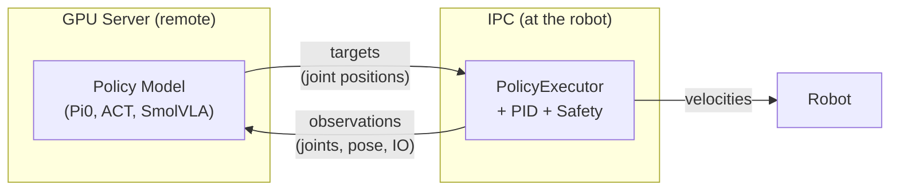
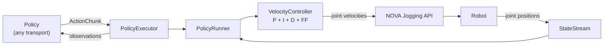
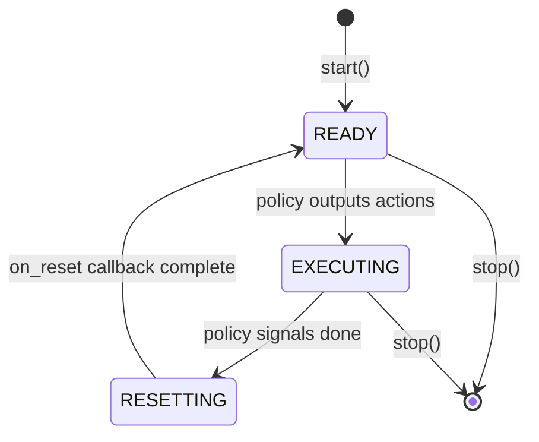
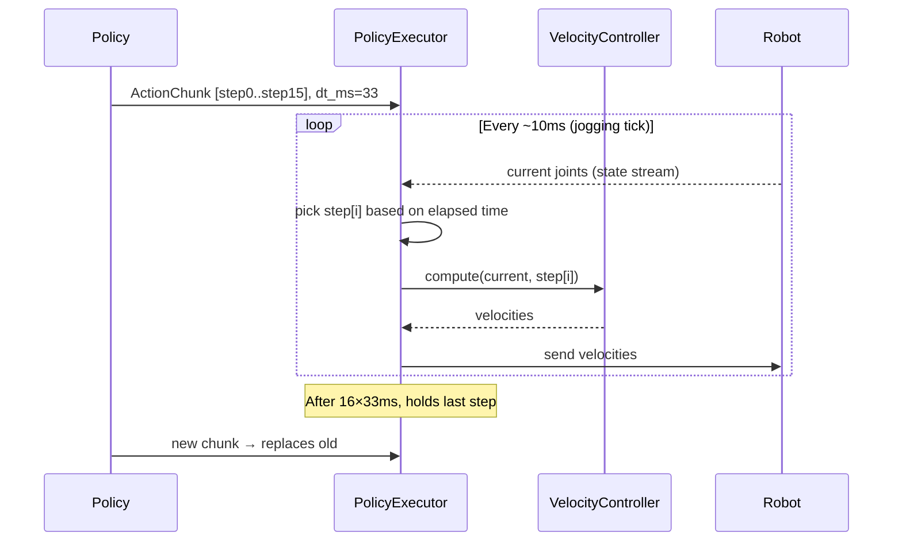
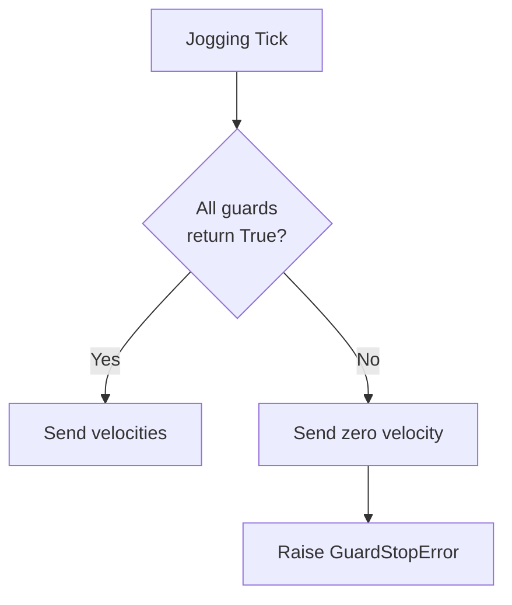
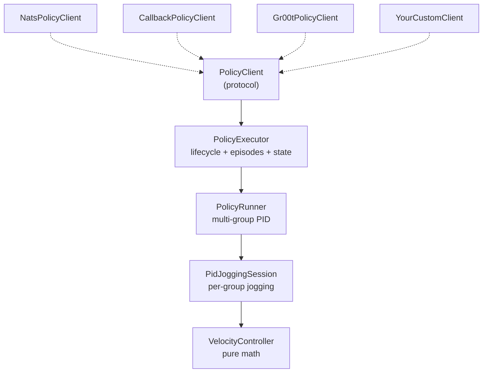

# nova_policy

Real-time PID-controlled jogging for AI policy execution on industrial robots via [Wandelbots NOVA](https://wandelbots.com).

Converts joint position targets and IO commands from a policy into velocity commands streamed through the NOVA Jogging API.

## Why This Architecture

The core design principle: **robot control lives in the application code on the machine attached to the robot (IPC), not on the remote GPU server running the policy.**



The policy decides **what** to do (target positions, IO). The local executor handles **how** (PID control, velocity limits, safety guards, emergency stop).

Tradeoffs of this split:

- **Higher Latency.** The policy sends data over the network to the executor which introduces latency.
- **Local kill switch.** SIGTERM/SIGINT on the IPC sends zero velocity within milliseconds. A remote process can't guarantee this.
- **Safety guard..** Workspace limits, speed checks, and custom guards execute on every PID tick without network dependency.

## How It Works



### Multi-Episode Lifecycle

The executor stays alive across multiple policy episodes. The policy controls when robots move.



### Multi-Step Chunks

Policies like ACT/Pi0 output multiple timesteps at once. The runner steps through them at the correct rate:



## Install

```bash
pip install wandelbots-nova[policy]
```

## Quick Start

```python
import asyncio
import math
import time

from nova import Nova
from nova.actions import joint_ptp
from nova.cell.motion_group import MotionGroup
from nova.types import RobotState
from nova_policy import ActionChunk, CallbackPolicyClient, Phase, PolicyExecutor

HOME = (0.0, -1.571, 1.571, -1.571, -1.571, 0.0)
start_time = [0.0]

async def my_policy(obs: dict[str, RobotState]) -> ActionChunk | None:
    """Your policy: receives observation per motion group, returns targets or None."""
    t = time.monotonic() - start_time[0]
    if t > 10:
        return None  # episode done

    joints = {}
    ios = {}
    for mg_id, state in obs.items():
        # state.joints = current joint positions (radians)
        # state.pose   = current TCP pose (position + orientation)
        # state.tcp    = TCP name
        target = [HOME[i] + 0.08 * math.sin(0.3 * t + i * 0.4) for i in range(len(state.joints))]
        joints[mg_id] = [target]
        ios[mg_id] = {"digital_out[0]": t > 5}  # close gripper after 5s

    return ActionChunk(joints=joints, ios=ios)

async def on_reset(motion_groups: list[MotionGroup]) -> None:
    """Called between episodes - move to home, open grippers, etc."""
    mg = motion_groups[0]
    tcp = (await mg.tcp_names())[0]
    current = await mg.joints()
    traj = await mg.plan([joint_ptp(HOME)], tcp, start_joint_position=current)
    await mg.execute(traj, tcp, actions=[joint_ptp(HOME)])
    start_time[0] = time.monotonic()

async def main():
    async with Nova() as nova:
        cell = nova.cell()
        ctrl = await cell.controller("ur10e")
        mg = ctrl[0]

        executor = PolicyExecutor(
            motion_groups=[mg],
            policy=CallbackPolicyClient(my_policy),
            on_reset=on_reset,
        )

        # start() launches a background task that:
        #   1. Calls on_reset() (moves robot to home)
        #   2. Opens PID jogging sessions on all motion groups
        #   3. Connects to the policy (calls policy.connect())
        #   4. Enters the control loop (runs until stop()):
        #      - Calls policy.get_actions(obs) every tick (~30 Hz)
        #      - get_actions() returns ActionChunk → PID tracks targets (EXECUTING)
        #      - get_actions() returns None → episode done → on_reset() → loop again (READY)
        #
        # The policy is NOT called until jogging is fully connected.
        # start() returns once the executor reaches READY or EXECUTING.
        await executor.start()

        # The executor runs in the background. Your code continues here.
        # Use executor.status to monitor, or just wait:
        while executor.phase != Phase.IDLE:
            await asyncio.sleep(1)
            print(f"phase={executor.phase} step={executor.status.step} ep={executor.status.episode}")

        # stop() can be called from anywhere (another task, signal handler, FastAPI endpoint).
        # It cancels the loop, sends zero velocity, and closes connections.
        await executor.stop()

asyncio.run(main())
```

### Control Flow

| What happens                  | Trigger                              | Result                                               |
| ----------------------------- | ------------------------------------ | ---------------------------------------------------- |
| Policy returns action targets | `{"joints": {...}}` or `ActionChunk` | PID tracks them (EXECUTING)                          |
| Policy signals episode done   | `{"done": true}` or `None`           | `on_reset()` called → READY → waits for next episode |
| Policy not ready              | `{"waiting": true}`                  | Robot holds position, keeps polling                  |
| `executor.stop()` called      | Your code (endpoint, signal, etc.)   | Zero velocity → connections closed → IDLE            |
| Safety guard returns `False`  | Guard check on PID tick              | Zero velocity → executor stops → IDLE                |
| SIGTERM/SIGINT                | OS signal                            | Zero velocity → executor stops                       |
| `timeout_s` expires           | Wall clock                           | Episode ends → `on_reset()` → READY                  |

The policy **cannot** directly stop the executor or the jogging. It can only signal "episode done" (`{"done": true}` or return `None`), which triggers `on_reset()` and puts the executor back in READY. To fully stop, call `executor.stop()` from your application code.

When the executor stops (for any reason), it calls `notify_stopped(reason)` on the policy client before closing. For `NatsPolicyClient`, this publishes `{"executor_stopped": true, "reason": "estop"}` to the NATS subject. The policy can use this to clean up state. This is optional — policies that don't handle it can ignore the message.

## Policy Client (Transport Layer)

The `PolicyClient` protocol decouples the executor from how actions are obtained. Any transport works - implement `connect`, `get_actions`, `close`:

```python
class PolicyClient(Protocol):
    async def connect(self, motion_group_ids: list[str]) -> None: ...
    async def get_actions(self, obs: dict[str, Any]) -> ActionChunk | None: ...
    async def close(self) -> None: ...
```

Built-in implementations:

```python
# NATS (app-to-app on Nova platform — preferred)
import nats
nc = await nats.connect("nats://localhost:4222")
policy = NatsPolicyClient(nc, subject="nova.v2.cells.cell.apps.mock-policy-service.predict")

# Local Python function (testing, local model)
policy = CallbackPolicyClient(my_model.predict)  # returns ActionChunk | None

# GR00T ZeroMQ server (GR00T observation/action format, custom decoder required)
policy = Gr00tPolicyClient(
    host="gpu-server",
    port=5555,
    decode_action=my_gr00t_decoder,
)
```

### Wire Protocol

The `PolicyResponse` pydantic model defines the wire format. Policy servers in any language can use the JSON schema:

```python
from nova_policy import PolicyResponse

# Get JSON schema for code generation in other languages
schema = PolicyResponse.model_json_schema()
```

```
→ Client sends (observation):
  {"joints": [0.1, -1.5, ...], "pose": [x, y, z, rx, ry, rz], "motion_group_id": "0@ur10e"}

← Server responds with PolicyResponse:

  Execute targets:
  {
    "joints": {"0@ur10e": [[j1, j2, j3, j4, j5, j6]]},
    "ios": {"0@ur10e": {"digital_out[0]": true, "analog_out[1]": 0.5}},
    "dt_ms": 0
  }

  Execute multi-step chunk (ACT/Pi0):
  {
    "joints": {"0@ur10e": [[step0], [step1], ..., [step15]]},
    "dt_ms": 33.0
  }

  Episode done:
  {"done": true}

  Not ready:
  {"waiting": true}
```

All fields except `joints` are optional. A Python policy server can use `PolicyResponse` directly for validation. A C++/Rust/Julia server just needs the JSON schema.

````

Custom implementations for any transport:

```python
# NATS (NOVA's built-in message bus)
class NatsPolicyClient:
    async def connect(self, mg_ids): ...
    async def get_actions(self, obs): ...
    async def close(self): ...

# gRPC
class GrpcPolicyClient:
    async def connect(self, mg_ids): ...
    async def get_actions(self, obs): ...
    async def close(self): ...

# ROS2 action server, ZMQ, HTTP polling, shared memory, etc.
````

The executor doesn't know or care about the transport - it just calls `get_actions()`.

## Observations (What the Policy Sees)

By default, the executor sends `RobotState` (joints + TCP pose) per motion group. For policies that need more (IO states, cameras, custom data), provide a `build_obs` callback:

```python
async def build_obs(states: dict[str, RobotState], mgs: list[MotionGroup]) -> dict[str, Any]:
    """Build custom observation for the policy."""
    obs = {}
    for mg in mgs:
        state = states[mg.id]
        obs[mg.id] = {
            "joints": list(state.joints),
            "tcp_pose": list(state.pose.position) + list(state.pose.orientation),
            "gripper_closed": await ctrl.read("digital_out[0]"),
            "force_torque": await read_ft_sensor(),
            "camera": get_camera_frame(),
        }
    return obs

executor = PolicyExecutor(
    motion_groups=[mg],
    policy=my_policy_client,
    build_obs=build_obs,
)
```

Without `build_obs`, the default observation is `dict[str, RobotState]`.

## Safety Guards



```python
def workspace_guard(ctx: GuardState) -> bool:
    return ctx.state.pose.position[2] > 100  # stop if Z < 100mm

executor = PolicyExecutor(..., safety_guards=[workspace_guard])
```

## Examples

| Example | What it shows |
|---|---|
| [`dual_robot_policy.py`](examples/dual_robot_policy.py) | PolicyExecutor: two robots, safety guards, on_reset, CallbackPolicyClient |
| [`low_level_pid_jogging.py`](examples/low_level_pid_jogging.py) | PolicyRunner: manual send()/observe() loop, direct PID control |
| [`apps/`](examples/apps/) | Deployed: mock policy service + robot controller as Nova apps (NATS) |

```bash
NOVA_API=http://your-instance PYTHONPATH=. python nova_policy/examples/dual_robot_policy.py
```

## Configuration

PID defaults match training-time values. Only change if you know what you're doing:

```python
PolicyRunnerConfig(
    velocity_limit=1.5, p_gain=3.0, d_gain=0.1,
    i_gain=0.0, ff_gain=0.0, tolerance=0.01, state_rate_ms=10,
)
```

## Architecture

```
nova_policy/
├── executor.py              # PolicyExecutor (lifecycle, episodes, state machine)
├── policy_client.py         # PolicyClient protocol + Callback impl
├── runner.py                # PolicyRunner (low-level PID orchestrator)
├── pid_jogging_session.py   # Per-group jogging websocket + PID
├── velocity_controller.py   # PID+FF (pure math, no I/O)
├── types.py                 # ActionChunk, GuardState, PolicyRunnerConfig
├── examples/                # Standalone examples + deployable apps
└── tests/                   # Unit + integration tests
```

**Layering:**



`PolicyRunner` + `send()` remains available for users who want manual control without the executor.

When the NOVA API gains native position streaming, the PID layer gets removed - the public API stays the same.

## Development

```bash
PYTHONPATH=. uv run pytest nova_policy/tests/test_policy.py -v
uv run ruff check nova_policy/ --config nova_policy/ruff.toml
uv run ruff format nova_policy/
```
