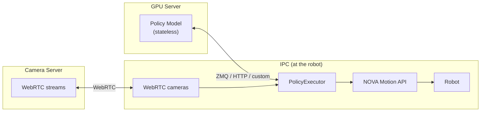

# policy

> **⚠️ EXPERIMENTAL** — This package is under active development and not ready for production use. Expect breaking changes between releases.

Execute learned policies (imitation learning, reinforcement learning) on industrial robots via [Wandelbots NOVA](https://wandelbots.com).

https://github.com/user-attachments/assets/de8a1bb6-9f35-4953-aa32-a8792d2b8244

## Overview

**Robot control lives on the IPC, not on the (potentially remote) GPU server running the policy.**



The policy is a **stateless pure function**: `obs → actions`. It never controls lifecycle.
The executor decides **when** to start and **when** to stop, and runs the software guards.

## Install

```bash
uv add wandelbots-nova --extra novapolicy
```

## Quick Start

A policy is just an async function: observations in, an action chunk out.

```python
import asyncio
from nova import Nova
from novapolicy import ActionChunk, Observation, PolicyExecutor, PolicySchema


async def my_policy(obs) -> ActionChunk:
    """Nudge each joint by a small offset (two steps, 50ms apart)."""
    arm = [obs[f"arm_{i}"] for i in range(1, 7)]
    return ActionChunk(
        joints={"0@ur10e": [[j + 0.01 for j in arm], [j + 0.02 for j in arm]]},
        dt_ms=50.0,
    )


async def main():
    async with Nova() as nova:
        cell = nova.cell()
        ctrl = await cell.controller("ur10e")
        mg = ctrl[0]

        schema = PolicySchema(observations=[
            Observation.joint_positions("arm", source=mg),
        ])

        executor = PolicyExecutor(schema, my_policy, timeout_s=10.0)
        result = await executor.run()
        print(f"Done: {result.reason}, {result.steps} steps, {result.duration_s:.1f}s")


asyncio.run(main())
```

Any async callable that maps a feature `dict` to an `ActionChunk` works — call a remote GPU server, run a local model, or replay a trajectory. An `ActionChunk` carries one or more future steps per motion group (with `dt_ms`, and an optional `first_timestamp_ms` anchor for overlapping chunks). The executor owns all complexity (motion control, safety, IO streaming, e-stop detection).

## PolicySchema

Decouples the policy's **observations** from hardware topology. The policy sees a flat dictionary of named features built from the schema — it doesn't read motion groups, controllers, or hardware IO keys to interpret its inputs.

```python
from novapolicy import BoolMapping, Observation, PolicySchema

schema = PolicySchema(observations=[
    Observation.joint_positions("left", source=mg_left),
    Observation.joint_positions("right", source=mg_right),
    Observation.io("left_gripper", source=mg_left, io="digital_out[0]",
                   mapping=BoolMapping(on=100.0)),
    Observation.io("right_gripper", source=mg_right, io="digital_out[0]",
                   mapping=BoolMapping(on=100.0)),
])
```

This produces observations like:

```python
{
    "left_1": 0.1, "left_2": -1.5, ..., "left_6": 0.3,
    "right_1": 0.2, ..., "right_6": -0.1,
    "left_gripper": 0.0,      # closed
    "right_gripper": 100.0,   # open
}
```

The policy returns an `ActionChunk` keyed by motion-group id. Joint targets are sent as `JointWaypointsRequest`, TCP targets as `PoseWaypointsRequest`, and IO values get written to hardware (use `BoolMapping`/`Mapping` on the matching observation so a learned policy's scaled outputs map back to hardware values).

### Cameras

Cameras are managed by the **Camera App** on the NOVA instance — the user starts and stops camera streams via the Camera App UI. The policy client only opens a WebRTC session to receive frames from an already-running stream. Pass `resize=(width, height)` to scale every frame to the size your policy expects on read.

```python
from novapolicy import Observation, WebRTCCameras

# Point to the camera server running on your NOVA instance.
# Frames are resized to the policy's expected input size on read.
cameras = WebRTCCameras(api_url="http://<nova-host>:8011/webrtc-streamer", resize=(224, 224))

schema = PolicySchema(observations=[
    Observation.joint_positions("arm", source=mg),
    Observation.image("flange", source=cameras.device("315122271048")),
    Observation.image("left", source=cameras.device("314522065367")),
])
```

Images arrive as `numpy.ndarray` (H×W×3, uint8, RGB) in the observation dict.

### Stop conditions

Policies run open-ended — they don't signal "finished". A stop condition is a fast,
synchronous check that runs on every tick; returning `True` ends the run normally
(its name appears in `result.reason`). The typical use in an industrial cell is an
IO stop signal — end the episode when an operator button or PLC sets an input:

```python
from novapolicy import StopContext

def stop_on_io(ctx: StopContext) -> bool:
    """Stop the policy when digital_in[3] goes high."""
    return bool(ctx.io_values and ctx.io_values.get("digital_in[3]"))

executor = PolicyExecutor(schema, policy, stop_conditions=[stop_on_io])
result = await executor.run()
# result.reason == "stop condition: stop_on_io"
```

Stop conditions must be fast (no network calls). Use `Observation.computed()` for async data.

> These are **software** stop conditions running in the executor loop — not a safety system. The robot can still move fast and a stop condition has no notion of its braking distance. For production, rely on the safety zones and protective stops configured on the robot controller.

## Teleoperation

There's no built-in teleop device, but the standalone jogging layer is the
building block: feed `set_target(...)` from whatever input you have — a leader
arm, keyboard, gamepad, spacemouse — in your own script. See
[docs/jogging.md](docs/jogging.md).

## Further reading

| Doc                                | Covers                                                                                                                                                                     |
| ---------------------------------- | -------------------------------------------------------------------------------------------------------------------------------------------------------------------------- |
| [docs/jogging.md](docs/jogging.md) | Standalone jogging: `jog_joints` / `jog_tcp`, joint/TCP modes, chunked targets, dual-arm, and error handling |
| [docs/executor.md](docs/executor.md) | Advanced: the `PolicyExecutor` loop (`policy_rate_hz`, RTC) and the client/server timestamp protocol |
| [docs/schema.md](docs/schema.md)   | Advanced schema: IO mappings, relative actions, TCP actions, computed observations/actions                                                                                 |
| [docs/gr00t.md](docs/gr00t.md)     | `Gr00tPolicyClient` for [NVIDIA Isaac GR00T](https://github.com/NVIDIA/Isaac-GR00T) inference servers over ZMQ (and [docs/rtc.md](docs/rtc.md) for real-time chunking)     |
| [docs/rerun.md](docs/rerun.md)     | Optional real-time 3D visualization of execution                                                                                                                           |

### Examples

▶ [`execute_custom_policy_on_dual_arm.py`](examples/execute_custom_policy_on_dual_arm.py) — two UR5e robots with cameras, IOs, and stop conditions\
▶ [`execute_gr00t_dual_arm.py`](examples/execute_gr00t_dual_arm.py) — dual arm with GR00T ZMQ + 4 cameras\
▶ [`jogging/`](examples/jogging/) — standalone jogging (single/dual arm, joint/TCP, chunked), no policy
