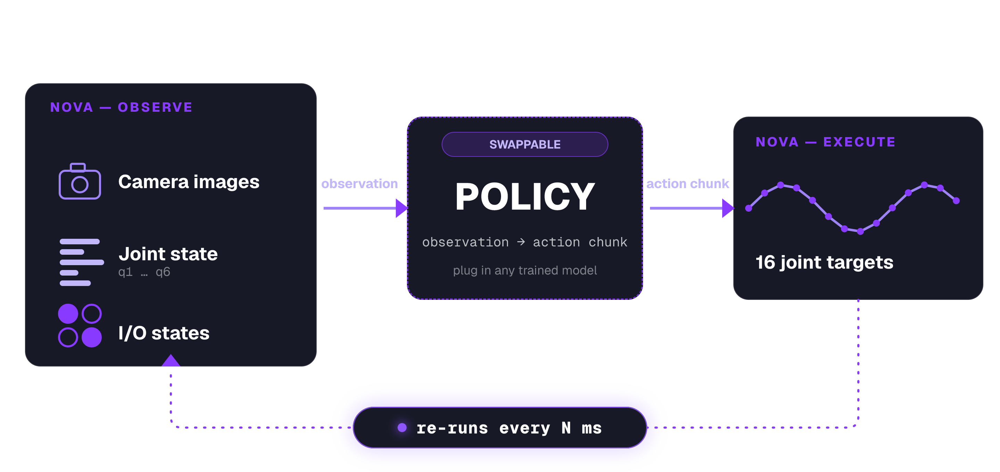
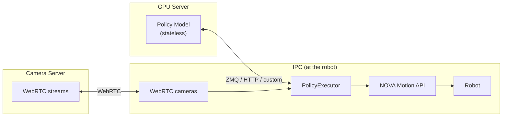

# policy

> **⚠️ EXPERIMENTAL**: This package is under active development and not ready for production use. Expect breaking changes between releases.

Execute learned policies (imitation learning, reinforcement learning) on industrial robots via [Wandelbots NOVA](https://wandelbots.com).

https://github.com/user-attachments/assets/de8a1bb6-9f35-4953-aa32-a8792d2b8244

## Overview

NOVA owns everything physical. Each cycle it assembles one **observation**, the camera
images, the current joint configuration, and the relevant I/O states, and hands it to the
policy. The policy returns an **action chunk** (joint targets), which NOVA streams to the
jogging interface and servos onto the robot. NOVA handles cameras, robot state, execution,
safety, and closing the loop every cycle; the policy only maps observation → action chunk.

That interface is the same whether the policy is an imitation-learning model, a VLA like
GR00T, or a world model, so any trained model is a swappable module.



**Robot control lives on the IPC, not on the (potentially remote) GPU server running the policy.**


```mermaid
flowchart LR
    subgraph GPU["GPU Server"]
        Policy["Policy Model\n(stateless)"]
    end

    subgraph IPC["IPC (at the robot)"]
        Executor["PolicyExecutor"]
        Motion["NOVA Motion API"]
        Cameras["WebRTC cameras"]
        Robot["Robot"]
    end

    subgraph CamServer["Camera Server"]
        WebRTC["WebRTC streams"]
    end

    Policy <-->|"ZMQ / HTTP / custom"| Executor
    WebRTC <-->|"WebRTC"| Cameras
    Executor --> Motion --> Robot
    Cameras --> Executor
```

The policy is a **stateless pure function**: `obs → actions`. It never controls lifecycle.
The executor decides **when** to start and **when** to stop, and runs the software guards.

## Install

`novapolicy` is split into optional extras so users only install the policy transport they need.

| Extra | Use when you need | Adds |
| --- | --- | --- |
| `novapolicy` | core `PolicyExecutor`, schema, waypoint jogging, WebRTC cameras, custom callback policies | `aiortc`, `Pillow`, `requests` |
| `novapolicy-gr00t` | NVIDIA GR00T ZeroMQ policy client | core policy deps + `msgpack`, `pyzmq` |
| `novapolicy-lerobot` | LeRobot async gRPC inference client/server integration | core policy deps + `lerobot[async]` |

Install exactly one policy-client extra if you know which backend you use:

```bash
# Core policy execution + WebRTC cameras only
uv add wandelbots-nova --extra novapolicy

# GR00T client support
uv add wandelbots-nova --extra novapolicy-gr00t

# LeRobot async-inference client support
uv add wandelbots-nova --extra novapolicy-lerobot
```

Extras can also be combined, for example when developing or testing multiple policy backends:

```bash
uv add wandelbots-nova --extra novapolicy-gr00t --extra novapolicy-lerobot
```

The GR00T and LeRobot clients keep their heavy transport dependencies optional. If a missing-extra
error is raised at runtime, install the matching backend extra above.

## Quick Start

A local policy callback is an async function wrapped by `CallbackPolicyClient`: observations in, an action chunk out.

```python
import asyncio
from nova import Nova
from novapolicy import (
    ActionChunk,
    CallbackPolicyClient,
    Observation,
    PolicyExecutor,
    PolicySchema,
    SequentialExecution,
)


async def my_policy(obs) -> ActionChunk:
    """Nudge each joint by a small offset (two steps, 50ms apart)."""
    arm = [obs[f"arm_{i}"] for i in range(1, 7)]
    return ActionChunk(
        joints={"0@ur10e": [[j + 0.01 for j in arm], [j + 0.02 for j in arm]]},
        dt_ms=50.0,
    )


async def main():
    async with Nova() as nova:
        cell = nova.cell()
        ctrl = await cell.controller("ur10e")
        mg = ctrl[0]

        schema = PolicySchema(
            observations=[
                Observation.joint_positions("arm", source=mg),
            ]
        )

        executor = PolicyExecutor(
            schema,
            CallbackPolicyClient(my_policy),
            execution=SequentialExecution(),
            timeout_s=10.0,
        )
        result = await executor.run()
        print(f"Done: {result.reason}, {result.steps} steps, {result.duration_s:.1f}s")


asyncio.run(main())
```

Use `CallbackPolicyClient` to adapt an async callable that maps a feature `dict` to an `ActionChunk`; service integrations implement `PolicyClient` directly. An `ActionChunk` carries one or more future steps per motion group (with `dt_ms`, and an optional `first_timestamp_ms` anchor for overlapping chunks). The executor owns all complexity (motion control, safety, IO streaming, e-stop detection).

## PolicySchema

Decouples the policy's **observations** from hardware topology. The policy sees a flat dictionary of named features built from the schema; it doesn't read motion groups, controllers, or hardware IO keys to interpret its inputs.

```python
from novapolicy import BoolMapping, Observation, PolicySchema

schema = PolicySchema(
    observations=[
        Observation.joint_positions("left", source=mg_left),
        Observation.joint_positions("right", source=mg_right),
        Observation.io(
            "left_gripper", source=mg_left, io="digital_out[0]", mapping=BoolMapping(on=100.0)
        ),
        Observation.io(
            "right_gripper", source=mg_right, io="digital_out[0]", mapping=BoolMapping(on=100.0)
        ),
    ]
)
```

This produces observations like:

```python
{
    "left_1": 0.1, "left_2": -1.5, ..., "left_6": 0.3,
    "right_1": 0.2, ..., "right_6": -0.1,
    "left_gripper": 0.0,      # closed
    "right_gripper": 100.0,   # open
}
```

The policy returns an `ActionChunk` keyed by motion-group id. Targets are sent as an `ActionChunkRequest` — joint targets as `JOINTS` waypoints, TCP targets as `POSE` waypoints — and IO values get written to hardware (use `BoolMapping`/`Mapping` on the matching observation so a learned policy's scaled outputs map back to hardware values).

### Cameras

Cameras are managed by the **Camera App** on the NOVA instance: the user starts and stops camera streams via the Camera App UI. The policy client only opens a WebRTC session to receive frames from an already-running stream. Pass `resize=(width, height)` to scale every frame to the size your policy expects on read.

```python
from novapolicy import Observation, WebRTCCameras

# Point to the camera server running on your NOVA instance.
# Frames are resized to the policy's expected input size on read.
cameras = WebRTCCameras(api_url="http://<nova-host>:8011/webrtc-streamer", resize=(224, 224))

schema = PolicySchema(
    observations=[
        Observation.joint_positions("arm", source=mg),
        Observation.image("flange", source=cameras.device("315122271048")),
        Observation.image("left", source=cameras.device("314522065367")),
    ]
)
```

Images arrive as `numpy.ndarray` (H×W×3, uint8, RGB) in the observation dict.

### Units

NOVA speaks radians and millimetres. A dataset does not necessarily. LeRobot's policy server
applies the checkpoint's own normalization, so **do not** normalize here — but those statistics are
in the *recording* robot's units, so a dataset captured in degrees normalizes perfectly cleanly and
moves the arm to the wrong place.

Declare the conversion once and it applies in both directions: forward on the observation,
inverted on the action.

```python
from novapolicy import Clamp, Observation, Rad2Deg, Scale

schema = PolicySchema(
    observations=[
        # Dataset recorded in degrees; NOVA reports radians.
        Observation.joint_positions("arm", source=mg, ops=[Rad2Deg()]),
        # Position is millimetres and orientation radians, so they convert apart.
        Observation.tcp(
            "eef",
            source=mg,
            action=True,
            position_ops=[Scale(0.001)],  # mm -> m
            orientation_ops=[Rad2Deg()],
        ),
    ]
)
```

| Operator | Direction | Notes |
| --- | --- | --- |
| `Rad2Deg()` | bijective | Exact both ways. |
| `Scale(factor)` | bijective | `Scale(0.001)` is mm → m. A zero or non-finite factor is rejected at construction. |
| `Clamp(low, high)` | bidirectional | Bounds the observation forward *and* the command on the way back — limiting a command is the safety-relevant direction. |

Operators run front-to-back on the observation and back-to-front on the action, so
`[Scale(0.001), Clamp(-1, 1)]` clamps in metres in both directions. They are element-wise, apply to
joints and TCP but not to `computed` or `constant` observations, and an operator that declares
itself forward-only is rejected on a channel the policy writes — the executor would have nothing to
send back.

The inversion happens in the executor, **before** relative targets resolve: a delta in degrees
added to a state in radians is exactly the error this exists to prevent.

> Rotation-representation conversion — rotation vector to quaternion or Euler — is out of scope.
> These operators are element-wise scalars.

### Checking units against the checkpoint

Declared units are an assertion by whoever wrote the schema. When the client can read the
checkpoint's normalization statistics (`policy_preprocessor.json` and its safetensors, alongside
`config.json`), it holds the first live observation against them and reports what it finds:

- **Far outside** the training range — ten spans or more — raises before the robot moves. That is
  what a unit mismatch looks like; a pose does not land there.
- **Somewhat outside** warns. Starting from a pose the demonstrations never visited is normal.

A checkpoint shipped as `config.json` alone simply skips the check. One asymmetry worth knowing:
bounds catch values that are too *large* for the training range — degrees where radians were
expected. The reverse sits comfortably inside a degree range and cannot be caught this way.

### Stale inputs

A camera can freeze and a policy service can hang. Both mean the same thing to the executor —
the data needed for this tick did not arrive — and what happens next is declared, not implicit.

Freshness is declared per channel; the response is declared once, because one policy drives the
whole cell and holding one arm while aborting another is incoherent.

```python
from novapolicy import Observation, OnStale, PolicyExecutor

schema = PolicySchema(
    observations=[
        Observation.joint_positions("arm", source=mg),
        # This camera runs slower than the rest, so it declares its own bound.
        Observation.image("wrist", source=cameras.device(DEVICE), max_age_s=0.5),
    ]
)

executor = PolicyExecutor(
    schema,
    policy,
    camera_max_age_s=1.0,  # default bound for channels that declare none
    inference_timeout_s=30.0,  # liveness guard on one get_actions call
    on_stale=OnStale.CONTROLLED_STOP,
)
```

| `on_stale` | What happens |
| --- | --- |
| `ABORT` (default) | Raises. What the executor did before this was declared. |
| `CONTROLLED_STOP` | Runs out the waypoints already accepted, then ends the run with `result.reason == "stale: ..."`. |
| `HOLD` | Skips the tick and retries, so the robot decelerates against its last target. Escalates to `CONTROLLED_STOP` after `hold_budget_s`. |

`HOLD` applies to **camera staleness only**. An inference that misses its deadline always ends the
run: the timed-out call is still running on a worker thread, and re-entering the policy client
while it may still complete would corrupt the policy's timestep sequence.

There is no `zeros` option. It is standard in ROS-side equivalents and suits velocity or effort
channels, but NOVA streams absolute joint positions — where zero commands the arm to its zero pose.

Under `SequentialExecution` the robot is already at a measured standstill while inference runs, so
the inference deadline mostly changes the error message. The declared response earns its keep under
`ContinuousExecution`, where the lookahead is live.

### How a run ends

How the run ended decides what happens to motion the controller already accepted:

- **Normal end** — a stop condition, the execution timeout, an external `stop()`, or stale data
  under `CONTROLLED_STOP` — drains the accepted waypoints before the sessions close. They were
  owed to the caller.
- **Error or e-stop** drops them. Cancelling immediately is the point on a failure path.

> These are **software** guards running in the executor loop, not a safety system.

### Stop conditions

Policies run open-ended: they don't signal "finished". A stop condition is a fast,
synchronous check that runs on every tick; returning `True` ends the run normally
(its name appears in `result.reason`). The typical use in an industrial cell is an
IO stop signal: end the episode when an operator button or PLC sets an input:

```python
from novapolicy import SequentialExecution, StopContext


def stop_on_io(ctx: StopContext) -> bool:
    """Stop the policy when digital_in[3] goes high."""
    return bool(ctx.io_values and ctx.io_values.get("digital_in[3]"))


executor = PolicyExecutor(
    schema,
    policy,
    execution=SequentialExecution(),
    stop_conditions=[stop_on_io],
)
result = await executor.run()
# result.reason == "stop condition: stop_on_io"
```

Stop conditions must be fast (no network calls). Use `Observation.computed()` for async data.

> These are **software** stop conditions running in the executor loop, not a safety system. The robot can still move fast and a stop condition has no notion of its braking distance. For production, rely on the safety zones and protective stops configured on the robot controller.

## Teleoperation

There's no built-in teleop device, but the standalone jogging layer is the
building block: feed `set_target(...)` from whatever input you have (a leader
arm, keyboard, gamepad, spacemouse) in your own script. See
[docs/jogging.md](docs/jogging.md).

## Further reading

| Doc                                  | Covers                                                                                                                                                                 |
| ------------------------------------ | ---------------------------------------------------------------------------------------------------------------------------------------------------------------------- |
| [docs/jogging.md](docs/jogging.md)   | Standalone jogging: `jog_joints` / `jog_tcp`, joint/TCP modes, chunked targets, dual-arm, and error handling                                                           |
| [docs/executor.md](docs/executor.md) | Advanced: explicit sequential/continuous execution modes, asynchronous inference, RTC, and the client/server timestamp protocol                                |
| [docs/schema.md](docs/schema.md)     | Advanced schema: IO mappings, relative actions, TCP actions, computed observations/actions                                                                             |
| [docs/gr00t.md](docs/gr00t.md)       | `Gr00tPolicyClient` for [NVIDIA Isaac GR00T](https://github.com/NVIDIA/Isaac-GR00T) inference servers over ZMQ (and [docs/rtc.md](docs/rtc.md) for real-time chunking) |
| [lerobot/README.md](lerobot/README.md) | LeRobot async inference, checkpoint-derived `chunk_size` / `n_action_steps`, and remote-checkpoint configuration                                                        |
| [docs/rerun.md](docs/rerun.md)       | Optional real-time 3D visualization of execution                                                                                                                       |

### Examples

▶ [`execute_custom_policy_on_dual_arm.py`](examples/execute_custom_policy_on_dual_arm.py): two UR5e robots with cameras, IOs, and stop conditions\
▶ [`execute_gr00t_dual_arm.py`](examples/execute_gr00t_dual_arm.py): dual arm with GR00T ZMQ + 4 cameras\
▶ [`jogging/`](examples/jogging/): standalone jogging (single/dual arm, joint/TCP, chunked), no policy
