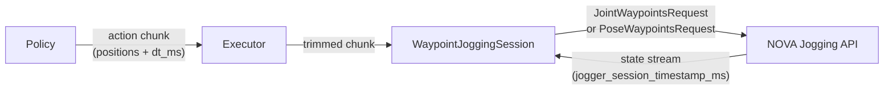

# PolicyExecutor & Timestamp Protocol

Advanced internals: how `PolicyExecutor` drives the jogging layer, and how
client and server keep their clocks aligned. For the simple standalone jogging
API (`jog_joints` / `jog_tcp`), see [jogging.md](jogging.md).

## Pipeline



## Execution Loop

### `SequentialExecution` (default)

```
1. Observe robot state
2. Query policy → get action chunk
3. Bridge from the observed state when the first target is farther than normal waypoint spacing
4. Send bridge + policy waypoints as one continuous request
5. Wait for the exact final NOVA timestamp and standstill
6. Go to 1
```

### `ContinuousExecution`

In continuous mode the executor runs as a **receding horizon controller**: at
each tick it queries the policy for a fresh chunk and sends it, overlapping the
previous one. The server replaces waypoints older than the new chunk's first
timestamp. This mode supports asynchronous action queues such as ACT as well as
policies that implement model-side Real-Time Chunking (RTC).

```
1. Observe robot state
2. Query policy → get action chunk
3. Send waypoints to server (overrides previous chunk)
4. If `rate_hz` is set, sleep until the next fixed-rate tick
5. Go to 1
```


The overlap is a **hard replace, not a mathematical blend**: from the new chunk's
first timestamp onward, the previous chunk's still-buffered targets are discarded
(the faded dashed tail) and the new chunk's values are used verbatim. The robot does
not teleport — the servo aims from the robot's actual position toward the new targets
and catches up bounded by the jogger's velocity/acceleration limits (the white line).
A client must therefore preserve or smooth the retained overlap. This can come
from an asynchronous action queue or from model-side [Real-Time Chunking](rtc.md).

## Configuration

Execution behavior is selected with an explicit mode object:

```python
from novapolicy import (
    ContinuousExecution,
    PolicyExecutor,
    SequentialExecution,
    WaypointConfig,
)

config = WaypointConfig(state_rate_ms=10)

# Complete and settle every chunk before the next inference.
sequential = PolicyExecutor(
    schema,
    policy,
    motion=config,
    execution=SequentialExecution(),
    n_action_steps=8,
)

# Replace lookaheads continuously at 20 Hz.
continuous_fixed = PolicyExecutor(
    schema,
    policy,
    motion=config,
    execution=ContinuousExecution(rate_hz=20),
    n_action_steps=8,
)

# Replace lookaheads as fast as inference allows.
continuous_asap = PolicyExecutor(
    schema,
    policy,
    execution=ContinuousExecution(),
)
```

`PolicyExecutor` accepts `PolicyClient` instances only. Wrap local async callbacks with
`CallbackPolicyClient`; backend clients such as GR00T and LeRobot implement the interface directly.

| Mode | Behavior | Use case |
|---|---|---|
| `SequentialExecution()` | Wait for exact chunk completion and standstill, bridge to the next prediction, then replan | Settled sequential inference |
| `ContinuousExecution()` | Replace chunks as fast as inference allows | Asynchronous inference or RTC |
| `ContinuousExecution(rate_hz=20)` | Replace chunks at a positive fixed rate | Rate-controlled asynchronous inference or RTC |

The mode owns every setting that is meaningful to it. In particular, endpoint ramps belong to
`SequentialExecution`; a continuously replaced chunk has no final endpoint to brake at.

### Bridging a distant first waypoint

When a policy's first waypoint is far from the robot, sequential execution automatically connects
the current state to the predicted motion. The bridge and policy chunk are sent as one continuous
request, so NOVA does not stop at the boundary and IO or computed actions remain aligned with policy
waypoint zero.

Continuous policies may use this bridge for their initial lookahead only. Later lookaheads replace
the active trajectory without re-anchoring it to the measured state. The same behavior is available
through `novapolicy.connect_action_chunk(...)` and `novapolicy.create_bridge_chunk(...)`.

### Sequential endpoint ramps

A settled executor intentionally lets every submitted waypoint request end, so every request starts
and finishes at zero velocity. `SequentialExecution` replaces the first and final waypoint
intervals with three same-`dt_ms` intervals by default. Customize or disable this mode-owned setting:

```python
from novapolicy import EndpointRamp, PolicyExecutor, SequentialExecution

custom = PolicyExecutor(
    schema,
    policy,
    execution=SequentialExecution(
        endpoint_ramp=EndpointRamp(interpolation_steps=4),
    ),
)

disabled = PolicyExecutor(
    schema,
    policy,
    execution=SequentialExecution(endpoint_ramp=None),
)
```

The interpolation behaves as follows:

- the first interval uses quadratic ease-in (increasing displacement),
- the final interval uses quadratic ease-out (decreasing displacement),
- a single interval uses smoothstep so both endpoint velocities approach zero.

All original waypoints remain in the request. The generic
`novapolicy.interpolate_action_chunk_ramps(...)` helper returns both the interpolated motion and an
original-index → interpolated-index mapping. The executor uses that mapping to keep deferred IO and
computed actions aligned with policy waypoint zero after a bridge. Each added point retains the
original `dt_ms`, intentionally increasing request duration. Continuous execution does not expose
this setting because every chunk tail is provisional. Its policy client must provide a coherent
initial lookahead and preserve continuity across replacement seams.

### Mutable lookahead smoothing

`novapolicy.smooth_action_chunk(...)` applies a reusable temporal `[1, 2, 1] / 4` filter to joint
and TCP target sequences. Two passes, the default, are equivalent to `[1, 4, 6, 4, 1] / 16` away
from chunk boundaries. Use `retained_prefix_steps` to restore the portion of a replacement that
NOVA is already executing. TCP position and rotation-vector components are filtered independently;
IO actions, timing, and action-timestep metadata remain unchanged. Unlike endpoint interpolation,
smoothing does not add waypoints or change chunk duration.

The policy API currently has no episode-final signal. Consequently, settled execution brakes every
request endpoint rather than trying to guess which prediction will be the episode's final chunk.

Higher rates give smoother overlapping but require faster inference.
The server requires continuous waypoint updates — if the buffer empties
(no new chunk arrives before the previous one finishes), the robot pauses.
With 20 Hz and 1s lookahead chunks, there is ~95% overlap between
consecutive chunks, providing ample buffer.

## Timestamp Protocol

Each waypoint carries a timestamp (milliseconds since session start). The server
maintains an internal clock that starts when the first `JointWaypointsRequest`
or `PoseWaypointsRequest` is received.

The server exposes its current clock as `jogger_session_timestamp_ms` in the
state stream (`JoggingDetails`). The client uses this to compute a **speed ratio**
(server_time / client_time) and scales outgoing timestamps accordingly.

```
client sends:    timestamps = [start_ms * ratio, start_ms * ratio + dt * ratio, ...]
server receives: timestamps aligned with its internal clock
```

This auto-synchronization applies to relative/``now``-anchored jogging. An
asynchronous policy queue is different: its first bridge assigns an exact raw
controller timestamp to action zero, and every replacement uses
``origin + action_timestep * policy_dt``. Queue timestamps therefore do not use
client wall time or speed-ratio scaling.

### Trajectory-absolute timestamps

For overlapping chunks, timestamps are **trajectory-absolute**: the chunk is
anchored at an explicit point on the server's session timeline rather than at
"now". This is what lets consecutive overlapping chunks line up — identical
steps land at identical timestamps, so the server stitches them into one
trajectory instead of restarting at every resend.

A policy can set an explicit anchor via `ActionChunk.first_timestamp_ms`:

```python
ActionChunk(
    joints={"0@ur10e": chunk_steps},
    dt_ms=10.0,
    first_timestamp_ms=int(step_idx * 10.0),  # explicit absolute anchor
)
```

When left at `-1`, the executor anchors automatically (see
`novapolicy/chunking.py::placement`): step 0 is placed at an absolute anchor with an
offset measured in whole `dt` steps —

| case | anchor | offset |
|------|--------|--------|
| explicit `first_timestamp_ms >= 0` | that value | `0` (exact) |
| `SequentialExecution` | `now` | `+1` step (one dt ahead) |
| `ContinuousExecution` | `now` | `-seam_backdate_steps` (backdated) |

The `now` anchor is resolved at *yield time* (right before the websocket send)
so it cannot go stale while the chunk waits in the session queue.
