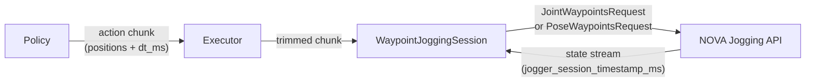
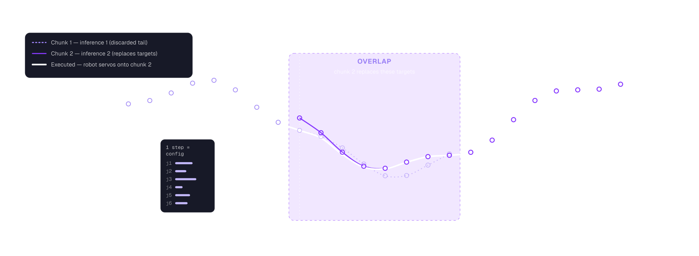

# PolicyExecutor & Timestamp Protocol

Advanced internals: how `PolicyExecutor` drives the jogging layer, and how
client and server keep their clocks aligned. For the simple standalone jogging
API (`jog_joints` / `jog_tcp`), see [jogging.md](jogging.md).

## Pipeline



## Execution Loop

### Sequential mode (`policy_rate_hz=-1`, default)

```
1. Observe robot state
2. Query policy → get action chunk
3. Bridge from the observed state when the first target is farther than normal waypoint spacing
4. Send bridge + policy waypoints as one continuous request
5. Wait for the exact final NOVA timestamp and standstill
6. Go to 1
```

### RTC mode (`policy_rate_hz=20`)

In RTC mode the executor runs as a **receding horizon controller**: at each tick
it queries the policy for a fresh chunk and sends it, overlapping the previous
one. The server replaces waypoints older than the new chunk's first timestamp,
giving smooth, continuous motion even with variable inference latency.

```
1. Observe robot state
2. Query policy → get action chunk
3. Send waypoints to server (overrides previous chunk)
4. Sleep until next tick (1/policy_rate_hz)
5. Go to 1
```



The overlap is a **hard replace, not a mathematical blend**: from the new chunk's
first timestamp onward, the previous chunk's still-buffered targets are discarded
(the faded dashed tail) and the new chunk's values are used verbatim. The robot does
not teleport — the servo aims from the robot's actual position toward the new targets
and catches up bounded by the jogger's velocity/acceleration limits (the white line).
The smoothness comes entirely from those limits, which is why a large jump between
chunks is dangerous — the problem [Real-Time Chunking](rtc.md) solves on the policy side.

## Configuration

```python
from novapolicy import PolicyExecutor, WaypointConfig

# WaypointConfig: how waypoints are sent to the robot
config = WaypointConfig(
    state_rate_ms=10,       # state stream update rate
)

# PolicyExecutor: controls timing and chunk transforms
executor = PolicyExecutor(
    schema, policy,
    motion=config,
    # Omit policy_rate_hz for sequential execution.
    # Set 0 for continuous ASAP replacement or >0 for fixed-rate replacement.
    n_action_steps=8,       # send only first N policy steps (0 = all)
)
```

### policy_rate_hz

| Value | Behavior | Use case |
|---|---|---|
| `-1` (default) | Wait for exact chunk completion and standstill, bridge to the next prediction, then replan | Sequential policies without RTC |
| `0` | Continuously replace chunks as fast as inference allows | Continuous/RTC-capable policies |
| `>0` (e.g. `20`) | Continuously replace chunks at a fixed rate | RTC-capable policies (e.g. GR00T) |

```python
# Sequential (non-RTC policy, e.g. GR00T without RTC)
executor = PolicyExecutor(
    schema, policy,
    motion=WaypointConfig(),
    n_action_steps=8,
)

# RTC-capable policy (overlapping chunks at 20 Hz)
executor = PolicyExecutor(
    schema, policy,
    policy_rate_hz=20,
    motion=WaypointConfig(),
    n_action_steps=8,
)
```

For a sequential policy there is no reason to specify `policy_rate_hz`: its default already means
“execute the chunk, reach standstill, observe, and infer again.” Set a non-negative value only when
chunks are intentionally replaced continuously. The execution mode also controls bridging; there
are no separate `wait_for_settle` or `bridge_to_first_waypoint` switches.

### Bridging a distant first waypoint

Sequential policies can predict a first waypoint farther from the stopped robot than the spacing
inside the predicted chunk. With the default `policy_rate_hz=-1`, the executor automatically
prepends an interpolated bridge to the policy motion. Genuine RTC clients do not bridge because
they align overlapping chunks model-side. An asynchronous action-queue client can explicitly
request a measured-state bridge for its initial lookahead; bridge and policy remain one continuous
request and NOVA does not stop at their boundary. The initial connector always prepends the measured
state; when interpolation is unnecessary, it is exactly ``[current, policy waypoint zero]``. The
executor preserves the exact NOVA timestamp already assigned to policy waypoint zero at the first
bridge boundary. That timestamp is the immutable action-timestep origin; sampling controller
``now`` after reaching the boundary would shift and replay the trajectory. Later lookaheads replace
waypoints at ``origin + action_timestep * policy_dt`` without another measured-state bridge or a new
hold at ``now``. Policy queue timestamps use the raw controller timer and policy spacing directly;
they never use client wall time or a client/server clock-rate estimate. Each replacement prepends
the preceding published action and retains the selected action plus its immutable successor,
creating an explicit past/current/future overlap before newly aggregated targets. Queue consumption
uses the latest acknowledged raw controller timestamp, so actions elapsed during a delayed local
tick are dropped. Rerun renders the three-point retained seam in Nova Violet; it is a view of the
active overlap, not a measured-state re-anchoring request.

```python
executor = PolicyExecutor(
    schema,
    policy,
    interpolate_chunk_ramps=True,
)
```

The generic `novapolicy.connect_action_chunk(chunk, states)` transform measures the largest spatial
interval between consecutive policy waypoints. If the robot-to-first-waypoint distance exceeds that
interval, it creates enough interpolated waypoints that every bridge interval is no larger. The
first bridge waypoint holds the observed current state; interpolation starts at the following
timestamp so request transport cannot shorten the first movement interval.

Bridge and policy motion are submitted as one continuous waypoint request using the policy chunk's
`dt_ms`. Policy waypoint zero appears once at the boundary, so NOVA does not enter standstill there.
The connected motion carries no IO actions; the executor uses the exact scheduled NOVA timestamp of
policy waypoint zero to fire the original IO and computed actions at the boundary. It then waits for
the combined request's final timestamp and standstill. In Rerun, the bridge is a persistent Nova
Violet line with an endpoint marker; policy output remains orange and the measured TCP trail remains
green. `novapolicy.create_bridge_chunk` remains available when only the interpolated prefix is
needed. Joint distance
is measured in joint space; TCP translation and rotation-vector spacing are handled separately.
Chunks with fewer than two motion waypoints provide no spacing reference and are not bridged unless
the client explicitly requires the initial queue anchor. Bridging is part of sequential mode and is
disabled for overlapping RTC execution after its initial timeline has been established.

### Acceleration and braking interpolation

A settled executor intentionally lets every submitted waypoint request end, so every request starts
and finishes at zero velocity. `interpolate_chunk_ramps=True` replaces the first and final waypoint
intervals with three same-`dt_ms` intervals by default:

- the first interval uses quadratic ease-in (increasing displacement),
- the final interval uses quadratic ease-out (decreasing displacement),
- a single interval uses smoothstep so both endpoint velocities approach zero.

All original waypoints remain in the request. The generic
`novapolicy.interpolate_action_chunk_ramps(...)` helper returns both the interpolated motion and an
original-index → interpolated-index mapping. The executor uses that mapping to keep deferred IO and
computed actions aligned with policy waypoint zero after a bridge. Configure the subdivision count
with `ramp_interpolation_steps`; each added point retains the original `dt_ms`, intentionally
increasing request duration. This is for settled chunks only and must not be combined with
fixed-rate/RTC overlap.

The policy API currently has no episode-final signal. Consequently, settled execution brakes every
request endpoint rather than trying to guess which prediction will be the episode's final chunk.

Higher rates give smoother overlapping but require faster inference.
The server requires continuous waypoint updates — if the buffer empties
(no new chunk arrives before the previous one finishes), the robot pauses.
With 20 Hz and 1s lookahead chunks, there is ~95% overlap between
consecutive chunks, providing ample buffer.

## Timestamp Protocol

Each waypoint carries a timestamp (milliseconds since session start). The server
maintains an internal clock that starts when the first `JointWaypointsRequest`
or `PoseWaypointsRequest` is received.

The server exposes its current clock as `jogger_session_timestamp_ms` in the
state stream (`JoggingDetails`). The client uses this to compute a **speed ratio**
(server_time / client_time) and scales outgoing timestamps accordingly.

```
client sends:    timestamps = [start_ms * ratio, start_ms * ratio + dt * ratio, ...]
server receives: timestamps aligned with its internal clock
```

This auto-synchronization applies to relative/``now``-anchored jogging. An
asynchronous policy queue is different: its first bridge assigns an exact raw
controller timestamp to action zero, and every replacement uses
``origin + action_timestep * policy_dt``. Queue timestamps therefore do not use
client wall time or speed-ratio scaling.

### Trajectory-absolute timestamps

For overlapping chunks, timestamps are **trajectory-absolute**: the chunk is
anchored at an explicit point on the server's session timeline rather than at
"now". This is what lets consecutive overlapping chunks line up — identical
steps land at identical timestamps, so the server stitches them into one
trajectory instead of restarting at every resend.

A policy can set an explicit anchor via `ActionChunk.first_timestamp_ms`:

```python
ActionChunk(
    joints={"0@ur10e": chunk_steps},
    dt_ms=10.0,
    first_timestamp_ms=int(step_idx * 10.0),  # explicit absolute anchor
)
```

When left at `-1`, the executor anchors automatically (see
`novapolicy/chunking.py::placement`): step 0 is placed at an absolute anchor with an
offset measured in whole `dt` steps —

| case | anchor | offset |
|------|--------|--------|
| explicit `first_timestamp_ms >= 0` | that value | `0` (exact) |
| wait-for-chunk (`policy_rate_hz < 0`) | `now` | `+1` step (one dt ahead) |
| overlapping / RTC (`policy_rate_hz >= 0`) | `now` | `-seam_backdate_steps` (backdated) |

The `now` anchor is resolved at *yield time* (right before the websocket send)
so it cannot go stale while the chunk waits in the session queue.
