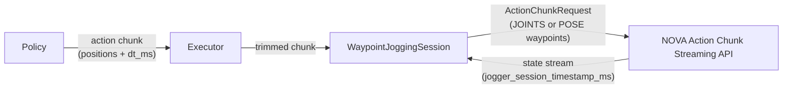
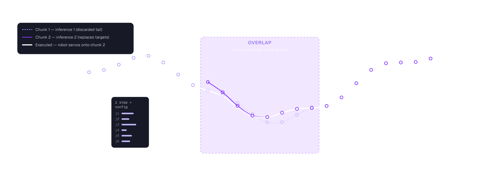

# PolicyExecutor & Timestamp Protocol

Advanced internals: how `PolicyExecutor` drives the jogging layer, and how
client and server keep their clocks aligned. For the simple standalone jogging
API (`jog_joints` / `jog_tcp`), see [jogging.md](jogging.md).

## Pipeline


```mermaid
flowchart LR
    Policy["Policy"] -->|"action chunk\n(positions + dt_ms)"| Executor
    Executor -->|"trimmed chunk"| Session["WaypointJoggingSession"]
    Session -->|"ActionChunkRequest\n(JOINTS or POSE waypoints)"| NOVA["NOVA Action Chunk Streaming API"]
    NOVA -->|"state stream\n(jogger_session_timestamp_ms)"| Session
```

## Execution Loop

### `SequentialExecution` (default)

```
1. Observe robot state
2. Query policy → get action chunk
3. Bridge from the observed state when the first target is farther than normal waypoint spacing
4. Send bridge + policy waypoints as one continuous request
5. Wait for the exact final NOVA timestamp *and* a measured standstill
6. Go to 1
```

### `ContinuousExecution`

In continuous mode the executor runs as a **receding horizon controller**: at
each tick it queries the policy for a fresh chunk and sends it, overlapping the
previous one. The server replaces waypoints older than the new chunk's first
timestamp. This mode supports asynchronous action queues such as ACT as well as
policies that implement model-side Real-Time Chunking (RTC).

```
1. Observe robot state
2. Query policy → get action chunk
3. Send waypoints to server (overrides previous chunk)
4. If `rate_hz` is set, sleep until the next fixed-rate tick
5. Go to 1
```



The overlap is a **hard replace, not a mathematical blend**: from the new chunk's
first timestamp onward, the previous chunk's still-buffered targets are discarded
(the faded dashed tail) and the new chunk's values are used verbatim. The robot does
not teleport — the servo aims from the robot's actual position toward the new targets
and catches up bounded by the jogger's velocity/acceleration limits (the white line).
A client must therefore preserve or smooth the retained overlap. This can come
from an asynchronous action queue or from model-side [Real-Time Chunking](rtc.md).

## Configuration

Execution behavior is selected with an explicit mode object. Note `n_action_steps`: it defaults to
`None`, meaning "use the horizon the policy declares" — a `LeRobotPolicyClient` reports its
checkpoint's `n_action_steps`. Pass `0` to execute every returned step regardless, which is what
the continuous asynchronous-queue setup wants, or a positive number to trim explicitly.

```python
from novapolicy import (
    ContinuousExecution,
    PolicyExecutor,
    SequentialExecution,
    WaypointConfig,
)

config = WaypointConfig(state_rate_ms=10)

# Complete and settle every chunk before the next inference.
sequential = PolicyExecutor(
    schema,
    policy,
    motion=config,
    execution=SequentialExecution(),
    n_action_steps=8,
)

# Replace lookaheads continuously at 20 Hz.
continuous_fixed = PolicyExecutor(
    schema,
    policy,
    motion=config,
    execution=ContinuousExecution(rate_hz=20),
    n_action_steps=8,
)

# Replace lookaheads as fast as inference allows.
continuous_asap = PolicyExecutor(
    schema,
    policy,
    execution=ContinuousExecution(),
)
```

`PolicyExecutor` accepts `PolicyClient` instances only. Wrap local async callbacks with
`CallbackPolicyClient`; backend clients such as GR00T and LeRobot implement the interface directly.

| Mode | Behavior | Use case |
|---|---|---|
| `SequentialExecution()` | Wait for exact chunk completion and standstill, bridge to the next prediction, then replan | Settled sequential inference |
| `ContinuousExecution()` | Replace chunks as fast as inference allows | Asynchronous inference or RTC |
| `ContinuousExecution(rate_hz=20)` | Replace chunks at a positive fixed rate | Rate-controlled asynchronous inference or RTC |

The mode owns every setting that is meaningful to it. In particular, endpoint ramps belong to
`SequentialExecution`; a continuously replaced chunk has no final endpoint to brake at.

### Bridging a distant first waypoint

When a policy's first waypoint is far from the robot, sequential execution automatically connects
the current state to the predicted motion. The bridge and policy chunk are sent as one continuous
request, so NOVA does not stop at the boundary and IO or computed actions remain aligned with policy
waypoint zero.

Continuous policies may use this bridge for their initial lookahead only. Later lookaheads replace
the active trajectory without re-anchoring it to the measured state. The same behavior is available
through `novapolicy.connect_action_chunk(...)` and `novapolicy.create_bridge_chunk(...)`.

### Sequential endpoint ramps

A settled executor intentionally lets every submitted waypoint request end, so every request starts
and finishes at zero velocity. `SequentialExecution` replaces the first and final waypoint
intervals with three same-`dt_ms` intervals by default. Customize or disable this mode-owned setting:

```python
from novapolicy import EndpointRamp, PolicyExecutor, SequentialExecution

custom = PolicyExecutor(
    schema,
    policy,
    execution=SequentialExecution(
        endpoint_ramp=EndpointRamp(interpolation_steps=4),
    ),
)

disabled = PolicyExecutor(
    schema,
    policy,
    execution=SequentialExecution(endpoint_ramp=None),
)
```

The interpolation behaves as follows:

- the first interval uses quadratic ease-in (increasing displacement),
- the final interval uses quadratic ease-out (decreasing displacement),
- a single interval uses smoothstep so both endpoint velocities approach zero.

All original waypoints remain in the request. The generic
`novapolicy.interpolate_action_chunk_ramps(...)` helper returns both the interpolated motion and an
original-index → interpolated-index mapping. The executor uses that mapping to keep deferred IO and
computed actions aligned with policy waypoint zero after a bridge. Each added point retains the
original `dt_ms`, intentionally increasing request duration. Continuous execution does not expose
this setting because every chunk tail is provisional. Its policy client must provide a coherent
initial lookahead and preserve continuity across replacement seams.

### Mutable lookahead smoothing

`novapolicy.smooth_action_chunk(...)` applies a reusable temporal `[1, 2, 1] / 4` filter to joint
and TCP target sequences. Two passes, the default, are equivalent to `[1, 4, 6, 4, 1] / 16` away
from chunk boundaries. Use `retained_prefix_steps` to restore the portion of a replacement that
NOVA is already executing. TCP position and rotation-vector components are filtered independently;
IO actions, timing, and action-timestep metadata remain unchanged. Unlike endpoint interpolation,
smoothing does not add waypoints or change chunk duration.

The policy API currently has no episode-final signal. Consequently, settled execution brakes every
request endpoint rather than trying to guess which prediction will be the episode's final chunk.

Higher rates give smoother overlapping but require faster inference.
The server requires continuous waypoint updates — if the buffer empties
(no new chunk arrives before the previous one finishes), the robot pauses.
Chunks shorter than `WaypointConfig.min_chunk_horizon_ms` are padded by repeating
their final target so the server always has a horizon it can brake within. That
padding is excluded from `scheduled_until_server_ms`, so waits for a chunk to
finish end at the last waypoint the caller asked for rather than sitting through
the hold.
With 20 Hz and 1s lookahead chunks, there is ~95% overlap between
consecutive chunks, providing ample buffer.

## Stale inputs and how a run ends

A camera can freeze and a policy service can hang. Both mean the same thing to the executor — the
data this tick needs did not arrive — and what happens next is declared rather than implicit.

Freshness is declared **per channel**; the response is declared **once**. One policy drives the
whole cell, so holding one arm while aborting another is incoherent.

```python
from novapolicy import Observation, OnStale, PolicyExecutor

schema = PolicySchema(
    observations=[
        Observation.joint_positions("arm", source=mg),
        # This camera runs slower than the rest, so it declares its own bound.
        Observation.image("wrist", source=cameras.device(DEVICE), max_age_s=0.5),
    ]
)

executor = PolicyExecutor(
    schema,
    policy,
    camera_max_age_s=1.0,      # default bound for channels declaring none
    inference_timeout_s=30.0,  # liveness guard on one get_actions call; 0 disables
    on_stale=OnStale.CONTROLLED_STOP,
    hold_budget_s=2.0,         # how long HOLD may retry before escalating
)
```

| `on_stale` | Behaviour |
| --- | --- |
| `ABORT` (default) | Raises `RuntimeError`. What the executor did before this was declared. |
| `CONTROLLED_STOP` | Runs out the waypoints already accepted, then ends with `result.reason == "stale: ..."`. |
| `HOLD` | Skips the tick and retries; the session holds its last target while the robot decelerates. Escalates to `CONTROLLED_STOP` after `hold_budget_s`. |

`HOLD` applies to **camera staleness only**. An inference that misses its deadline always ends the
run: the timed-out call is still running on a worker thread, and re-entering the policy client
while it may still complete would corrupt the policy's timestep sequence.

There is no `zeros` option. It is standard in ROS-side equivalents and suits velocity or effort
channels, but NOVA streams absolute joint positions — where zero commands the arm to its zero pose.

Under `SequentialExecution` the robot is already at a measured standstill while inference runs, so
the inference deadline mostly changes the error message. The declared response earns its keep under
`ContinuousExecution`, where the lookahead is live.

### Teardown follows the reason

How a run ended decides what happens to motion the controller already accepted:

- **A normal end** — a stop condition, the execution timeout, an external `stop()`, or stale data
  under `CONTROLLED_STOP` — drains the accepted waypoints before the sessions close. They were owed
  to the caller.
- **An error or e-stop** drops them. `session.stop()` cancels immediately, which is the point on a
  failure path.

> These are **software** guards running in the executor loop, not a safety system. Rely on the
> safety zones and protective stops configured on the robot controller.

## Detecting standstill

`SequentialExecution` promises to observe the robot at rest, so it has to know
when the robot has actually stopped. Two conditions are needed and neither
suffices alone:

1. **The schedule ran out** — the server clock has reached
   `scheduled_until_server_ms`, the timestamp of the last waypoint the caller
   asked for. This says the deadline elapsed, not that the robot stopped: it is
   still braking through the hold padding that follows.
2. **The joints stopped moving** — `WaypointJoggingSession.is_at_standstill`.
   Before a chunk's waypoints are reached the robot is legitimately still, so
   this on its own would end the wait before any motion began.

Standstill is measured client-side, from the joint positions in the state
stream, because NOVA reports no "the commanded waypoints ran out" state. Since
26.6 `PAUSED_BY_USER` follows a Pause/Stop *request* only — and the executor
never sends one, since pausing also pauses the session clock the fixed timeline
is anchored on — so a drained queue reports `RUNNING` indefinitely. Relying on
that state instead made every episode execute exactly one chunk and then hang
until the timeout. It is still accepted when it does appear.

`StandstillDetector` holds a *reference* posture and replaces it only once some
joint leaves a small band around it (`_STANDSTILL_EPS_RAD`, ~0.06°); the robot
counts as settled after `_STANDSTILL_HOLD_MS` of server time inside the band.
Holding the reference rather than differencing consecutive samples is what makes
a slow crawl detectable — a creep of less than one epsilon per sample would
otherwise read as standstill forever — while bounded encoder noise never
accumulates out of the band. The hold is measured in server milliseconds, not
sample counts, because state packets arrive in bursts on some deployments.

## Timestamp Protocol

Each waypoint carries a timestamp (milliseconds since session start). The server
maintains an internal clock that starts when the first `ActionChunkRequest` is
received.

The server exposes that clock as `jogger_session_timestamp_ms` in the state
stream (`JoggingDetails`). One server millisecond is one millisecond of motion:
outgoing intervals are **never rescaled**. Deriving a server/client rate ratio and
scaling timestamps by it is the tempting alternative and it is wrong — on a UR10e
the ratio settles near 1.09 and stretches the timeline, slowing all motion by that
proportion.

`JoggingTimeClock` uses the readings only to estimate where the server clock is
now, so that a `now`-anchored chunk can be placed on it:

```
server "now" = last acknowledged jogger_session_timestamp_ms
             + (monotonic now - the instant that state was generated)
```

The elapsed term is measured from when the state was *generated*
(`MotionGroupState.timestamp`), not from when its packet arrived. Packets can be
delivered in bursts, and treating arrival as generation drags the estimate
backwards by the delivery delay. Server/client wall-clock skew is calibrated over
the first state packets of a session and then held fixed; the per-packet delay
correction derived from it is bounded, so a wall-clock step cannot shunt the
estimate far into the future.

The extrapolation itself is deliberately **uncapped**. The jogger timer only
advances once waypoints execute, and waypoints can only be placed once the
estimate advances, so capping it deadlocks startup. A stalled link is warned
about, not clamped — `JoggingTimeClock.max_lookahead_ms` is that warning
threshold, not a limit on the estimate.

An asynchronous policy queue does not use `now` at all: its first bridge assigns
an exact raw controller timestamp to action zero, and every replacement uses
``origin + action_timestep * policy_dt``.

### Unreachable waypoints are trimmed

A chunk is timestamped when it is built and sent a moment later. Waypoints whose
timestamp has already passed — plus a small minimum lead
(`waypoint_session.MIN_LEAD_MS`) — cannot be reached, and commanding them makes
the server jump to catch the trajectory. The session drops those leading
waypoints at send time and sends the still-reachable tail. A chunk whose every
waypoint has elapsed is dropped entirely.

Trimming does not move the surviving waypoints: the absolute time-to-position
mapping stays exactly as the caller defined it. It does change which index of the
*sent* request holds the caller's step zero, so code that needs the timestamp of
a particular caller step must use
`WaypointJoggingSession.scheduled_timestamp_for_step(step)` rather than indexing
`scheduled_waypoint_timestamps`, which describes the request on the wire.

A dropped chunk still advances `scheduled_chunk_count` and still reports its step
timestamps (all of them in the past). Both are required: the executor waits for
`scheduled_chunk_count` to reach what it queued, so a silently skipped chunk
would leave that wait unsatisfiable for the rest of the run.

### Trajectory-absolute timestamps

For overlapping chunks, timestamps are **trajectory-absolute**: the chunk is
anchored at an explicit point on the server's session timeline rather than at
"now". This is what lets consecutive overlapping chunks line up — identical
steps land at identical timestamps, so the server stitches them into one
trajectory instead of restarting at every resend.

A policy can set an explicit anchor via `ActionChunk.first_timestamp_ms`:

```python
ActionChunk(
    joints={"0@ur10e": chunk_steps},
    dt_ms=10.0,
    first_timestamp_ms=int(step_idx * 10.0),  # explicit absolute anchor
)
```

When left at `-1`, the executor anchors automatically (see
`novapolicy/chunking.py::placement`): step 0 is placed at an absolute anchor with an
offset measured in whole `dt` steps —

| case | anchor | offset |
|------|--------|--------|
| explicit `first_timestamp_ms >= 0` | that value | `0` (exact) |
| `SequentialExecution` | `now` | `+1` step (one dt ahead) |
| `ContinuousExecution` | `now` | `-seam_backdate_steps` (backdated) |

The `now` anchor is resolved at *yield time* (right before the websocket send)
so it cannot go stale while the chunk waits in the session queue.
