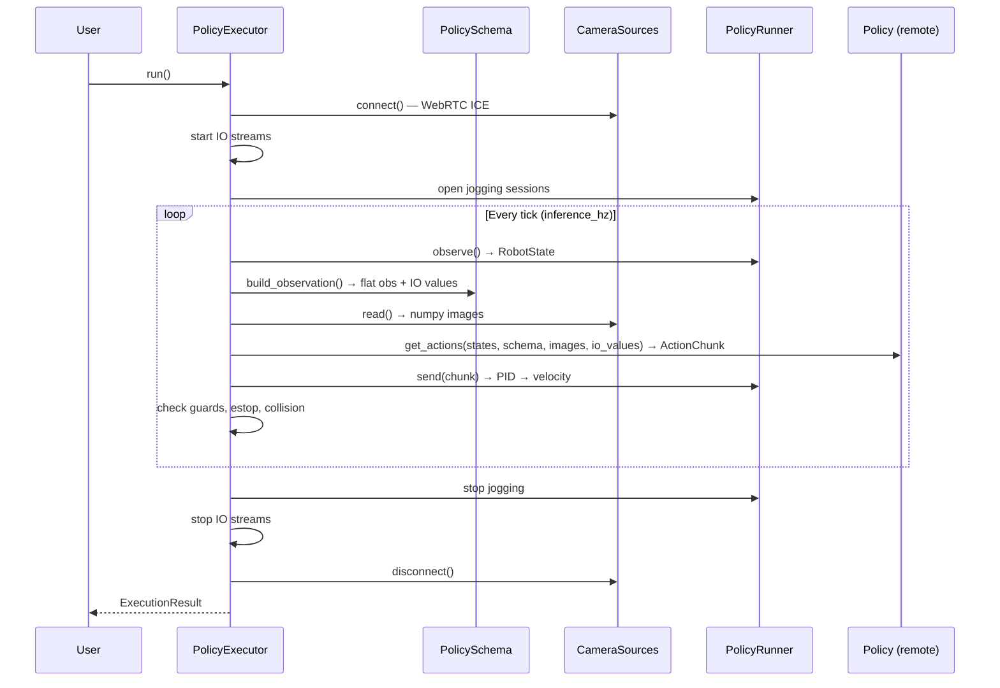
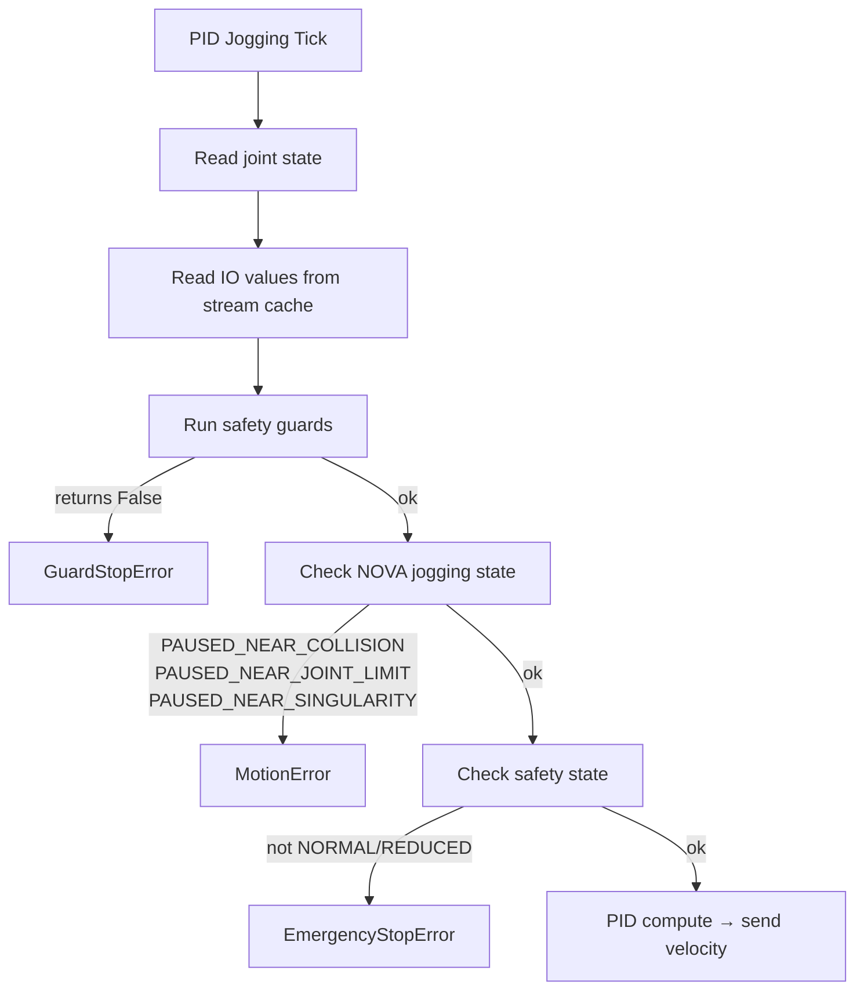

# Design Internals

> Internal architecture documentation for contributors. For usage, see [README.md](README.md).

## Design Principles

1. **Policy is stateless**: `obs → actions`. No lifecycle, no "done" signal, no episode state.
2. **Executor owns everything**: start, stop, safety, timeout, camera connection.
3. **Robot control stays on IPC**: Never on the remote GPU server.
4. **Single episode**: `run()` executes one episode. Caller handles multi-episode loops.
5. **Exceptions for abnormal stops**: `GuardStopError`, `EmergencyStopError`, `MotionError`.
6. **Normal returns for expected stops**: timeout, explicit stop.

## Wire Format (PolicyResponse)

Policy services return msgpack-encoded responses:

```python
# Single-step action:
{"joints": {"0@ur10e": [[j1, j2, j3, j4, j5, j6]]}, "ios": {"0@ur10e": {"digital_out[0]": True}}, "dt_ms": 33.0}

# Multi-step chunk (ACT, Diffusion Policy, RTC):
{"joints": {"0@ur10e": [[step0], [step1], ..., [step15]]}, "dt_ms": 33.0}

# Flat features (PolicySchema mode):
{"left_joints_1": 0.1, "left_gripper": 50.0, ...}
```

When the response contains a `joints` key, it is parsed as structured. Otherwise the entire dict is treated as flat features and converted via `PolicySchema.parse_action()`.

## PolicySchema Observations

```python
Observation.joint_positions("key", source=mg)        # joint positions (writable by default)
Observation.tcp("key", source=mg, format=TcpFormat)   # TCP pose (read-only)
Observation.io("key", source=mg, io="hw_key",
               mapping=BoolMapping(on=100.0))          # IO with value mapping
Observation.image("key", source=camera_device)         # camera image
Observation.constant("key", value="...")               # static value
Observation.joint_torques("key", source=mg)            # torques (read-only)
Observation.joint_currents("key", source=mg)           # currents (read-only)
```

Key resolution for flat features:
- **Joints**: `{key}_{i}` → e.g. `left_joints_1`, `left_joints_2`, ...
- **TCP**: `{key}_{i}` (only if format is set)
- **IOs**: key used directly as feature name

## IO Handling

- **Reads**: Executor opens one WebSocket stream per controller (`IOStreamCache`). Values update at controller rate. Guards and observations read from this shared cache.
- **Writes**: Fire-and-forget with deduplication (only writes on value change to avoid 429s).
- **Mappings**: `BoolMapping`, `ScaleMapping`, `EnumMapping`, `IdentityMapping` for bidirectional hardware↔policy conversion.

## Collision & Limit Detection

The executor uses NOVA's jogging state signals to detect when the robot is blocked:

- **Self-collision** → raises `MotionError("Jogging paused: PAUSED_NEAR_COLLISION")`
- **Joint limit** → raises `MotionError("Jogging paused: PAUSED_NEAR_JOINT_LIMIT")`
- **Singularity** → raises `MotionError("Jogging paused: PAUSED_NEAR_SINGULARITY")`

No heuristics — uses the actual controller state reported by NOVA.

## Data Flow



## Safety Architecture



## PID Controller

Pure math, no I/O:

- P-gain: 3.0 (must match training recording)
- D-gain: 0.1
- I-gain: 0.0 (disabled)
- Anti-windup: clamp integral at ±2.0
- Velocity limit: 1.5 rad/s per joint

## File Structure

```
policy/
├── executor.py              # PolicyExecutor: run(), stop(), safety orchestration
├── runner.py                # PolicyRunner: manages multiple PidJoggingSessions
├── pid_jogging_session.py   # Per-group: jogging + PID + IO write + standstill
├── velocity_controller.py   # PID math (P, I, D, FF, anti-windup, velocity clamp)
├── schema.py                # PolicySchema, Observation, Action, mappings
├── io.py                    # IOStreamCache + IOWriter
├── cameras/                 # CameraSource protocol, WebRTC, WebRTCCameras factory
├── policy_client.py         # PolicyClient base + CallbackPolicyClient
├── nats/                    # NatsPolicyClient + msgpack/PNG wire format
├── groot/                   # Gr00tPolicyClient + ZMQ transport
├── pose.py                  # TCP pose conversion (rotation vector → quat/rot6d)
├── types.py                 # ActionChunk, PolicyResponse, GuardState, errors
├── _sdk.py                  # Adapter for Nova SDK private attributes
└── tests/
```
