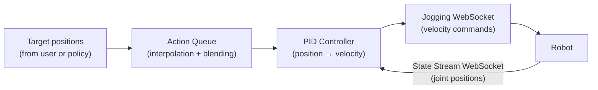
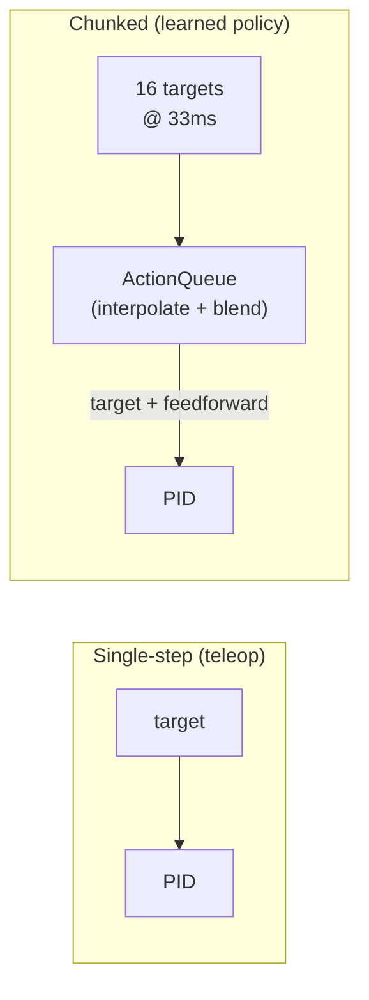

# PID Jogging

Position-controlled jogging for industrial robots via the NOVA Jogging API. A PID controller
converts joint/TCP position targets into velocity commands streamed at the controller's cycle rate.

Used both directly (teleoperation, scripted motion) and internally by `PolicyExecutor` when
`motion=PidConfig()` is selected.

## Motion Modes

Three approaches for converting position targets to velocity commands:

### ProfileConfig

Precomputes the entire velocity trajectory for each chunk upfront. Velocities are derived from position differences between steps and shaped by a trapezoidal envelope that ramps down to zero at the last step. This guarantees the robot never overshoots the chunk boundary.

For single-position targets (teleop), it falls back to a P-controller: `velocity = p_gain × (target - current)`.

When a new chunk arrives mid-execution, the first 3 steps of the new profile are linearly blended with the robot's current velocity to avoid jerk. This doesn't correct position drift — it only smooths the velocity transition.

Tradeoff: cannot track faster than the chunk prescribes. On fast overlapping chunks the PID approach achieves ~40% more displacement because the P-term adds corrective velocity.

```python
ProfileConfig(
    velocity_limit=2.0,   # rad/s max per joint
    ramp_steps=3,         # steps for ramp-up/ramp-down envelope
    p_gain=3.0,           # for single-position teleop targets
    state_rate_ms=10,     # state stream update rate
)
```

### PidConfig

PID controller with feedforward velocity from chunk trajectory. The ActionQueue interpolates between waypoints, computes feedforward via central differences, and blends overlapping chunks with exponential weights (temporal ensembling).

Gives higher tracking accuracy when properly tuned. But wrong parameters cause overshoot (`lookahead_ms > 0`), oscillation (high `p_gain`), or stalling (high `tolerance` with tiny chunks, or `ff_gain=0`).

The D-term opposes all velocity including feedforward. On very small chunks (<0.001 rad/step), this can reduce motion to near zero. Requires `tolerance` smaller than the per-step delta.

```python
PidConfig(
    p_gain=1.5,           # tracking stiffness
    d_gain=0.2,           # velocity damping
    ff_gain=1.0,          # feedforward from chunk trajectory
    lookahead_ms=0.0,     # 0 = safe; >0 risks overshoot
    velocity_limit=2.0,   # rad/s max
    tolerance=0.001,      # dead zone (rad)
)
```

### TrajectoryConfig

Plans each chunk as a multi-waypoint trajectory via NOVA's motion planner. Gets collision avoidance and proper acceleration profiles, but planning takes 100–500ms per chunk (non-realtime). Cannot be interrupted mid-trajectory.

```python
TrajectoryConfig(
    velocity=500.0,       # TCP velocity limit in mm/s
)
```

---

The rest of this document covers the PID approach in detail (interpolation, feedforward, blending, tuning).

## How It Works

The NOVA Jogging API accepts **velocity commands**, not positions. This package bridges the gap:



The PID velocity command on every tick is:

```
velocity = feedforward + P × error − D × measured_velocity
```

Where **feedforward** is the velocity the trajectory *wants* at this moment, **P × error** corrects
for any drift, and **D** damps oscillation. The feedforward does the heavy lifting; P and D just
clean up the residual.

> **Two WebSockets, two rates:**
> - **State stream** (`state_rate_ms`, default 10ms) — how often joint positions are read. Configurable.
> - **Jogging socket** — how often velocity commands are sent. Locked to the robot controller's internal cycle rate (typically 4–8ms, varies by brand). Not user-configurable. Per the NOVA API: *"Commands can only be processed in the cycle rate of the controller."*

## Joint Jogging

```python
from policy import jog_joints

async with jog_joints(mg) as jogger:
    async for state in jogger:
        jogger.set_target(compute_joints(state))
```

`state` is a `RobotState` with `.joints`, `.pose`, and `.tcp`. Pass a `list[float]` of joint positions (radians). Use `break` to stop.

For smoother tracking, pass a chunk of future targets with `dt_ms`:

```python
async with jog_joints(mg) as jogger:
    async for state in jogger:
        future_targets = predict_trajectory(state)  # list[list[float]]
        jogger.set_target(future_targets, dt_ms=33.0)
```

See [Action Chunks](#action-chunks-multi-step-targets) below.

## TCP Jogging

```python
from nova.types import Pose
from policy import jog_tcp

async with jog_tcp(mg, tcp="Flange") as jogger:
    async for state in jogger:
        jogger.set_target(Pose(500, 200, 300, 0, 3.14, 0))
```

Target is a `Pose` (position in mm, orientation as rotation vector in radians).

## Multiple Motion Groups

Both functions accept a list (joints) or dict (TCP) for multi-robot control:

```python
async with jog_joints([mg1, mg2]) as jogger:
    async for states in jogger:            # dict[MotionGroup, RobotState]
        jogger.set_target({
            mg1: [0.1, -1.5, 1.0, -0.5, 0.0, 0.0],
            mg2: [0.0, -1.5, -1.0, -0.5, 0.0, 0.0],
        })
```

Chunks work for multiple motion groups too:

```python
async with jog_joints([mg1, mg2]) as jogger:
    async for states in jogger:
        jogger.set_target(
            {
                mg1: [[step0], [step1], ..., [step15]],
                mg2: [[step0], [step1], ..., [step15]],
            },
            dt_ms=33.0,
        )
```

## Error Handling

Errors are detected automatically and raised through the `async for` loop:

- **`MotionError`** — joint limit or self-collision detected by the controller
- **`EmergencyStopError`** — e-stop, protective stop, or safety violation
- **`RuntimeError`** — jogging connection lost

```python
from policy import EmergencyStopError, MotionError, jog_joints

try:
    async with jog_joints(mg) as jogger:
        async for state in jogger:
            jogger.set_target(compute_joints(state))
except MotionError as e:
    print(f"Hit a limit: {e}")
except EmergencyStopError as e:
    print(f"E-stop on controller '{e.controller_id}': {e.safety_state}")
```

▶ Full example: [`examples/jogging_dual_arm.py`](examples/jogging_dual_arm.py)

---

## Action Chunks (Multi-Step Targets)

Policies output either **one target** per call (teleoperation) or a **chunk of future targets**
(learned policies like ACT/Diffusion/GR00T, typically 4–50 steps).



| Mode | `dt_ms` | Behavior |
|------|---------|----------|
| Single-step | `0` | Target held constant until next update |
| Chunked | `> 0` | Targets interpolated; feedforward velocity computed; chunks blended |

The ActionQueue applies three techniques to turn discrete waypoints into smooth, accurate motion:

### 1. Interpolation

Between waypoints, the queue interpolates based on elapsed time so the PID always has a
smooth target — not a staircase of jumps.

### 2. Feedforward Velocity

The queue computes the trajectory's intended velocity from surrounding waypoints (central
difference). This tells the PID *how fast the robot should be moving* at each moment, not
just *where it should be*.

Without feedforward, the PID can only react to error — it sees the target moving away and
chases it, always lagging behind. With feedforward, the PID commands the right velocity
*proactively* and only uses the P-term to correct small residual errors.

Think of it like driving: without feedforward you're steering by looking at where the road
was. With feedforward you're looking at where the road *is going*.

### 3. Temporal Ensembling (Chunk Blending)

When a new chunk arrives while the old one is still executing, naive replacement causes a
velocity jump — the target snaps to a different position. This is the biggest source of
tracking error and overshoot.

The ActionQueue blends the overlap region between old and new chunks using exponential
weights (the same technique used by ACT and Diffusion Policy):

```
For each overlapping step i:
    w_new = 1 − exp(−i / temperature)    ← starts at 0, rises toward 1
    w_old = 1 − w_new                    ← starts at 1, decays toward 0
    target[i] = w_old × old_step + w_new × new_step
```

At the boundary (i=0), the old chunk fully dominates — no jump. Over the next few steps,
the new chunk smoothly takes over. The `temperature` parameter (default 3.0) controls how
quickly the transition happens.

```
Step:    0    1    2    3    4    5    6    ...
w_old:  1.0  0.72 0.51 0.37 0.26 0.19 0.14 ...
w_new:  0.0  0.28 0.49 0.63 0.74 0.81 0.86 ...
```

This eliminates the velocity discontinuity at chunk boundaries and reduces overshoot.

### 4. Lookahead

Network latency between your machine and the robot controller adds ~50–150ms of phase lag.
The target the PID computes a velocity for has already moved on by the time the command
reaches the robot.

Lookahead compensates by evaluating the trajectory slightly *in the future*:

```
target = interpolate(time = now + lookahead_ms)
```

With the default `lookahead_ms=50`, the PID aims for where the trajectory will be 50ms
from now, not where it is now. This reduces the phase lag from ~140ms to ~10ms.

### When a Chunk Finishes

If the chunk runs out and no new chunk has arrived, the queue:
- Returns the **last waypoint** as the target (hold position)
- Returns **zero feedforward** (no velocity — just hold still via P-term)
- The robot decelerates smoothly and holds position until the next chunk arrives

---

## PID Tuning

Defaults work for most cases but require care with tiny action chunks. Pass a `PidConfig` to adjust:

```python
from policy import PidConfig, jog_joints

config = PidConfig(
    p_gain=1.5,           # tracking stiffness
    d_gain=0.2,           # damping (opposes all velocity)
    ff_gain=1.0,          # feedforward scale (1.0 = full trajectory velocity)
    lookahead_ms=0.0,     # phase lag compensation (0 = no overshoot)
    velocity_limit=2.0,   # max joint velocity (rad/s)
    tolerance=0.001,      # dead zone (rad)
    state_rate_ms=10,     # state stream rate (ms)
)

async with jog_joints(mg, config=config) as jogger:
    ...
```

| Parameter | Default | Effect |
|-----------|---------|--------|
| `p_gain` | 1.5 | Tracking stiffness. Higher = faster convergence, risk of overshoot on overlapping chunks. |
| `d_gain` | 0.2 | Velocity damping. Opposes ALL velocity including feedforward — set lower for tiny chunks. |
| `ff_gain` | 1.0 | Feedforward scale. 0 = PID only (will stall on tiny chunks). 1.0 = use full trajectory velocity. |
| `lookahead_ms` | 0.0 | Phase lag compensation (ms). Non-zero causes overshoot on overlapping chunks. |
| `velocity_limit` | 2.0 rad/s | Clamps output velocity per axis. |
| `tolerance` | 0.001 rad | Below this error, velocity is zero (if no feedforward). Must be smaller than per-step deltas. |
| `i_gain` | 0.0 | Integral correction. Rarely needed — targets update continuously. |
| `state_rate_ms` | 10 | How often robot reports state (ms). Lower = smoother but more CPU. |
