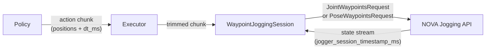

# Jogging Protocol

How the `policy` package streams waypoints to the NOVA Jogging API.

## Overview



The NOVA Jogging API accepts **timestamped waypoints** - either joint positions
(`JointWaypointsRequest`) or TCP poses (`PoseWaypointsRequest`). The server
handles velocity profiling, interpolation, limits, and servo control internally.

## Execution Loop (PolicyExecutor)

### Sequential mode (`policy_rate_hz=-1`, default)

```
1. Observe robot state
2. Query policy → get action chunk
3. Send waypoints to server
4. Wait for chunk to finish (n_steps * dt_ms)
5. Go to 1
```

### RTC mode (`policy_rate_hz=20`)

```
1. Observe robot state
2. Query policy → get action chunk
3. Send waypoints to server (overrides previous chunk)
4. Sleep until next tick (1/policy_rate_hz)
5. Go to 1
```

## Waypoint Request Types

| Mode | Request | Steps format | Use case |
|------|---------|--------------|----------|
| `"joint"` | `JointWaypointsRequest` | Joint radians `[j1, j2, ..., j6]` | Joint-space policies (default) |
| `"cartesian"` | `PoseWaypointsRequest` | TCP pose `[x, y, z, rx, ry, rz]` (mm + rad) | Cartesian-space policies |

The mode is selected automatically based on whether the schema contains
`Observation.tcp(..., action=True)` entries.

## Timestamp Protocol

Each waypoint carries a timestamp (milliseconds since session start). The server
maintains an internal clock that starts when the first `JointWaypointsRequest`
or `PoseWaypointsRequest` is received.

The server exposes its current clock as `jogger_session_timestamp_ms` in the
state stream (`JoggingDetails`). The client uses this to compute a **speed ratio**
(server_time / client_time) and scales outgoing timestamps accordingly.

```
client sends:    timestamps = [start_ms * ratio, start_ms * ratio + dt * ratio, ...]
server receives: timestamps aligned with its internal clock
```

This auto-synchronization ensures the robot moves at real-time speed regardless
of any clock drift between client and server.

### Trajectory-absolute timestamps

For overlapping chunks, timestamps are **trajectory-absolute**: each chunk's
timestamps start from `step_index * dt_ms` scaled by the speed ratio. This means
timestamps are typically "in the past" by the time the server processes them,
which lets the server interpolate smoothly from its current position forward.

```python
ActionChunk(
    joints={"0@ur10e": chunk_steps},
    dt_ms=10.0,
    start_time_ms=int(step_idx * 10.0),  # trajectory-absolute
)
```

## Jogging API (standalone)

The `jog_joints()` and `jog_tcp()` functions provide a simple async context
manager for interactive jogging without a full policy setup.

Both accept an optional `start_joint_position` parameter that PTP-moves the
robot to a known position before starting the jogging session. This ensures
the robot begins at a safe, predictable location.

### Joint jogging

```python
from policy import jog_joints

HOME = [0, -1.57, 1.57, -1.57, -1.57, 0]

async with jog_joints(mg, start_joint_position=HOME) as jogger:
    async for state in jogger:
        # Single target (server interpolates from current position)
        jogger.set_target([0.0, -1.57, 1.57, -1.57, -1.57, 0.0])
```

### TCP jogging

```python
from policy import jog_tcp
from nova.types import Pose

START = [1.17, -0.73, 1.75, -3.05, 0.87, 2.09]

async with jog_tcp(mg, tcp="Flange", start_joint_position=START) as jogger:
    async for state in jogger:
        jogger.set_target(Pose(500, 200, 300, 0, 3.14, 0))
```

### Chunked targets

Sending multi-step chunks enables the server to plan smooth trajectories
with proper velocity profiling:

```python
async with jog_joints(mg) as jogger:
    async for state in jogger:
        # 8 future targets at 33ms spacing
        chunk = [compute_target(t + i * 0.033) for i in range(8)]
        jogger.set_target(chunk, dt_ms=33.0)
```

### Dual-arm

```python
from policy import jog_joints, jog_tcp

# Joint jogging - two arms
async with jog_joints([mg1, mg2]) as jogger:
    async for states in jogger:
        jogger.set_target({mg1: target1, mg2: target2})

# TCP jogging - two arms with different TCPs
async with jog_tcp({mg1: "Flange", mg2: "Gripper"}) as jogger:
    async for states in jogger:
        jogger.set_target({mg1: pose1, mg2: pose2})
```

## Error Detection

The session monitors the NOVA jogging state stream for pause conditions.
Three of them are **blocking faults** — after consecutive ticks in one of these
states, a `MotionError` is raised:

| State | Meaning |
|-------|---------|
| `PAUSED_NEAR_JOINT_LIMIT` | Joint reached its limit |
| `PAUSED_NEAR_COLLISION` | Self-collision detected |
| `PAUSED_NEAR_SINGULARITY` | Kinematic singularity |

One pause is **recoverable** and never raises — the robot resumes on its own
once a fresh chunk arrives:

| State | Meaning |
|-------|---------|
| `PAUSED_BY_USER` | Waypoint buffer exhausted (send chunks faster) |

## Configuration

```python
from policy import PolicyExecutor, WaypointConfig

# WaypointConfig: how waypoints are sent to the robot
config = WaypointConfig(
    n_action_steps=8,       # send only first N steps per chunk (0 = all)
    state_rate_ms=10,       # state stream update rate
)

# PolicyExecutor: controls timing
executor = PolicyExecutor(
    schema, policy,
    motion=config,
    policy_rate_hz=-1,      # -1 = wait, 0 = ASAP, >0 = fixed Hz
)
```

### policy_rate_hz

| Value | Behavior | Use case |
|---|---|---|
| `-1` (default) | Wait for chunk to finish, then replan | Policies without RTC |
| `0` | Call as fast as possible (no sleep) | Benchmarking / max throughput |
| `>0` (e.g. `20`) | Fixed-rate overlapping calls | RTC-capable policies (e.g. GR00T) |

```python
# Sequential (non-RTC policy, e.g. GR00T without RTC)
executor = PolicyExecutor(
    schema, policy,
    motion=WaypointConfig(n_action_steps=8),
)

# RTC-capable policy (overlapping chunks at 20 Hz)
executor = PolicyExecutor(
    schema, policy,
    policy_rate_hz=20,
    motion=WaypointConfig(n_action_steps=8),
)
```

Higher rates give smoother overlapping but require faster inference.
The server requires continuous waypoint updates — if the buffer empties
(no new chunk arrives before the previous one finishes), the robot pauses.
With 20 Hz and 1s lookahead chunks, there is ~95% overlap between
consecutive chunks, providing ample buffer.
