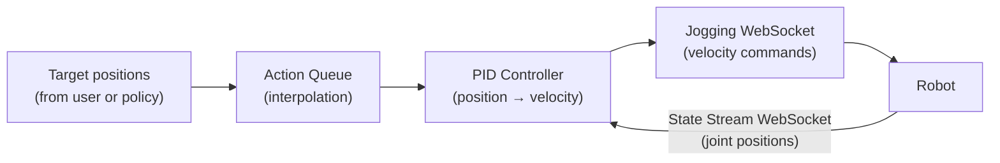
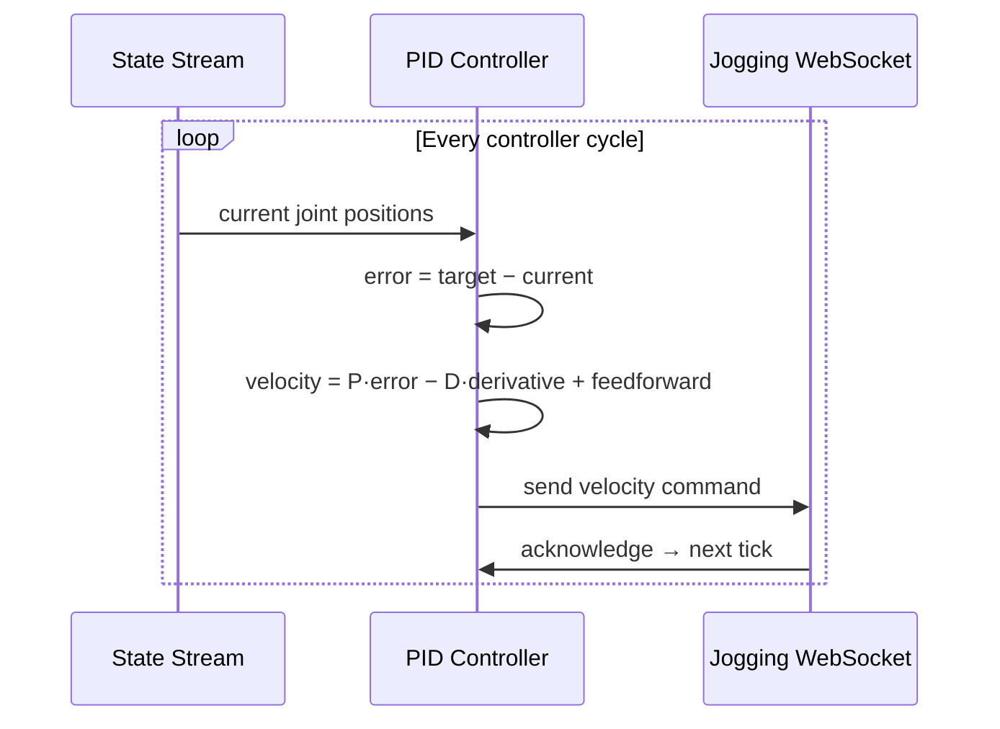
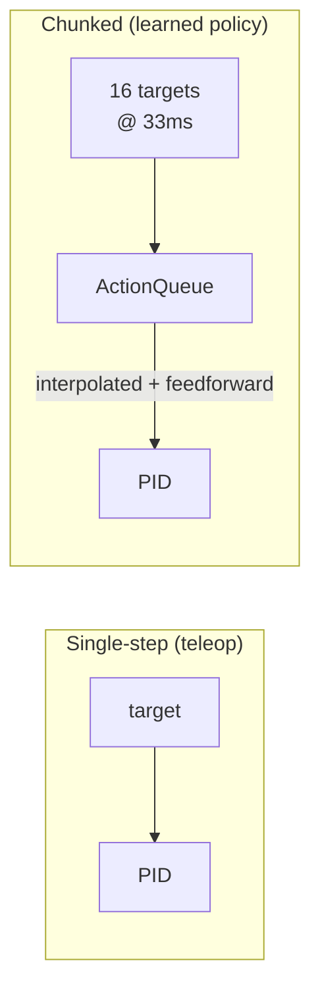
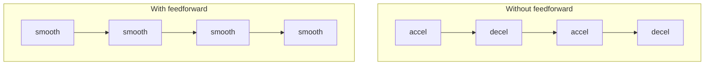
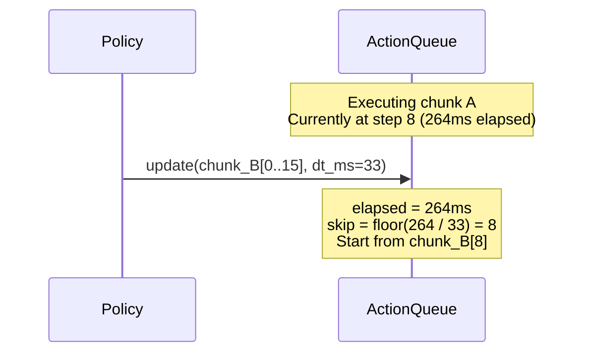
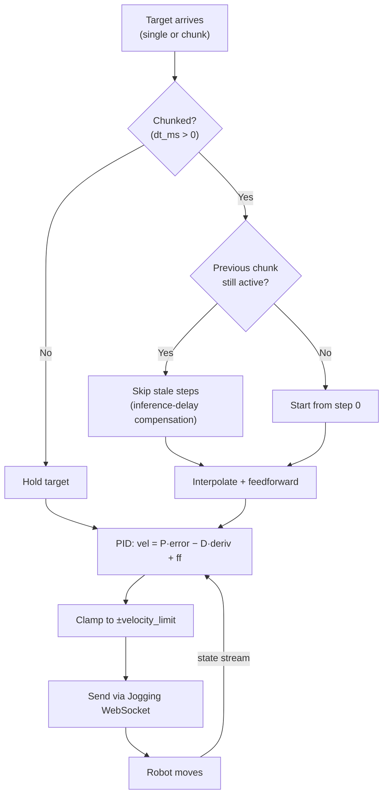

# PID Jogging

Position-controlled jogging for industrial robots via the NOVA Jogging API. A PID controller
converts joint/TCP position targets into velocity commands streamed at the controller's cycle rate.

Used both directly (teleoperation, scripted motion) and internally by `PolicyExecutor` for
learned policy execution.

## How It Works

The NOVA Jogging API accepts **velocity commands**, not positions. This package bridges the gap:



> **Two WebSockets, two rates:**
> - **State stream** (`state_rate_ms`, default 10ms) — how often joint positions are read. Configurable.
> - **Jogging socket** — how often velocity commands are sent. Locked to the robot controller's internal cycle rate (typically 4–8ms, varies by brand). Not user-configurable. Per the NOVA API: *"Commands can only be processed in the cycle rate of the controller."*

## Joint Jogging

```python
from policy import jog_joints

async with jog_joints(mg) as jogger:
    async for state in jogger:
        jogger.set_target(compute_joints(state))
```

`state` is a `RobotState` with `.joints`, `.pose`, and `.tcp`. Pass a `list[float]` of joint positions (radians). Use `break` to stop.

For smoother tracking, pass a chunk of future targets with `dt_ms`:

```python
async with jog_joints(mg) as jogger:
    async for state in jogger:
        future_targets = predict_trajectory(state)  # list[list[float]]
        jogger.set_target(future_targets, dt_ms=33.0)
```

See [Action Chunks](#action-chunks-multi-step-targets) below.

## TCP Jogging

```python
from nova.types import Pose
from policy import jog_tcp

async with jog_tcp(mg, tcp="Flange") as jogger:
    async for state in jogger:
        jogger.set_target(Pose(500, 200, 300, 0, 3.14, 0))
```

Target is a `Pose` (position in mm, orientation as rotation vector in radians).

## Multiple Motion Groups

Both functions accept a list (joints) or dict (TCP) for multi-robot control:

```python
async with jog_joints([mg1, mg2]) as jogger:
    async for states in jogger:            # dict[MotionGroup, RobotState]
        jogger.set_target({
            mg1: [0.1, -1.5, 1.0, -0.5, 0.0, 0.0],
            mg2: [0.0, -1.5, -1.0, -0.5, 0.0, 0.0],
        })
```

Chunks work for multiple motion groups too:

```python
async with jog_joints([mg1, mg2]) as jogger:
    async for states in jogger:
        jogger.set_target(
            {
                mg1: [[step0], [step1], ..., [step15]],
                mg2: [[step0], [step1], ..., [step15]],
            },
            dt_ms=33.0,
        )
```

## Error Handling

Errors are detected automatically and raised through the `async for` loop:

- **`MotionError`** — joint limit or self-collision detected by the controller
- **`EmergencyStopError`** — e-stop, protective stop, or safety violation
- **`RuntimeError`** — jogging connection lost

```python
from policy import EmergencyStopError, MotionError, jog_joints

try:
    async with jog_joints(mg) as jogger:
        async for state in jogger:
            jogger.set_target(compute_joints(state))
except MotionError as e:
    print(f"Hit a limit: {e}")
except EmergencyStopError as e:
    print(f"E-stop on controller '{e.controller_id}': {e.safety_state}")
```

▶ Full example: [`examples/jogging_dual_arm.py`](examples/jogging_dual_arm.py)

---

## PID Control Loop

On every jogging WebSocket response, the PID loop:

1. Reads the robot's current joint positions from the state stream
2. Gets the current target from the `ActionQueue` (interpolated if chunked)
3. Computes velocity using the PID formula
4. Sends the velocity command back on the jogging WebSocket



### PID Formula

For each joint independently:

```
velocity[i] = P × error − D × measured_velocity + I × ∫error + feedforward
```

| Term | Default | Role |
|------|---------|------|
| **P** (proportional) | `3.0` | Drives toward target — higher = stiffer |
| **D** (derivative) | `0.1` | Damps oscillation using measured joint velocity |
| **I** (integral) | `0.0` | Steady-state correction — disabled (policy handles this) |
| **Feedforward** | from chunk | Maintains velocity through waypoints (see below) |

### Tolerance & Clamping

- **Tolerance** (default 0.01 rad): when all joints are within this of the target, output is zero. Prevents micro-oscillation.
- **Velocity clamping** (default ±1.5 rad/s): `velocity[i] = clamp(output, -limit, +limit)`. If target jumps far, robot moves at max velocity until caught up.
- **Target change detection**: integral/derivative state resets when target changes by more than `tolerance`, preventing windup and derivative kick.

---

## Action Chunks (Multi-Step Targets)

Policies output either **one target** per call (teleoperation) or a **chunk of future targets**
(learned policies like ACT/Diffusion/GR00T, typically 4–16 steps).



| Mode | `dt_ms` | Behavior |
|------|---------|----------|
| Single-step | `0` | Target held constant until next update |
| Chunked | `> 0` | Targets interpolated; feedforward velocity computed |

### Linear Interpolation

Between waypoints, the ActionQueue linearly interpolates based on elapsed wall-clock time:

```
elapsed_ms = (now − chunk_start_time) × 1000
frac_index = elapsed_ms / dt_ms
idx = floor(frac_index)
alpha = frac_index − idx

target = steps[idx] × (1 − alpha) + steps[idx + 1] × alpha
```

This turns discrete waypoints into a smooth ramp.

### Central-Difference Feedforward

The queue computes the trajectory's intended velocity using the widest symmetric window
(up to ±3 steps):

```
k = min(current_index, max_index − current_index, 3)
velocity = (steps[idx + k] − steps[idx − k]) / (2k × dt_s)
```

Without feedforward, the PID decelerates to zero at every waypoint then accelerates again
(jerky stop-and-go). With feedforward, velocity is maintained through the trajectory:



### New Chunk Before Previous Finishes

Normal case for learned policies — inference takes time, next chunk arrives mid-execution.
The ActionQueue handles this with **inference-delay compensation**: it skips leading steps
that correspond to time already elapsed.



**Why skip?** Without it, the robot "rewinds" to the start of each chunk (sawtooth).
With skipping, the transition is seamless:

```mermaid
gantt
    title Chunk Execution Timeline
    dateFormat X
    axisFormat %L ms

    section Without skip (sawtooth)
    Chunk A (0→15)     :a1, 0, 528
    Chunk B (0→15)     :a2, 528, 1056

    section With skip (seamless)
    Chunk A (0→15)       :b1, 0, 528
    Chunk B (8→15)       :b2, 528, 792
```



**Skip calculation:**
```python
elapsed_ms = (now − previous_chunk_start_time) × 1000
skip = min(int(elapsed_ms / dt_ms), len(new_steps) - 1)  # keep at least 1 step
```

| Scenario | Behavior |
|----------|----------|
| Previous chunk finished | No skip — start from step 0 |
| Mid-execution | Skip steps matching elapsed time |
| Inference longer than chunk duration | Skip up to `len-1` (keep last step) |
| `dt_ms = 0` (single-step) | No interpolation, no skip — target replaced |


## PID Tuning

Defaults work for most cases. Pass a `PidConfig` to adjust:

```python
from policy import PidConfig, jog_joints

config = PidConfig(
    p_gain=3.0,           # tracking stiffness
    d_gain=0.1,           # damping
    i_gain=0.0,           # integral (usually leave at 0)
    velocity_limit=1.5,   # max joint velocity (rad/s)
    tolerance=0.01,       # dead zone (rad)
    state_rate_ms=10,     # state stream rate (ms)
)

async with jog_joints(mg, config=config) as jogger:
    ...
```

| Parameter | Joint default | TCP default | Effect |
|-----------|--------------|-------------|--------|
| `p_gain` | 3.0 | 3.0 | Tracking stiffness. Higher = faster convergence, can overshoot. |
| `d_gain` | 0.1 | 0.1 | Damping. Reduces oscillation around target. |
| `i_gain` | 0.0 | 0.0 | Integral correction. Rarely needed — targets update continuously. |
| `velocity_limit` | 1.5 rad/s | 250 mm/s | Clamps output velocity per axis. |
| `tolerance` | 0.01 rad | 1.0 mm | Below this error, velocity is zero. Prevents jitter. |
| `state_rate_ms` | 10 | 10 | How often robot reports state (ms). Lower = smoother. |

---

## Summary


