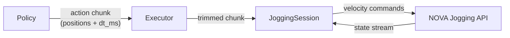

# Jogging Internals

How the `policy` package converts action chunks into robot motion via the NOVA Jogging API.

> **Temporary implementation.** This client-side velocity profile compensates for
> the fact that the NOVA Jogging API only accepts velocity commands. Once NOVA
> exposes a native waypoint jogging API (accepting position waypoints with timing
> directly), this entire module will be replaced by a thin client that forwards
> waypoints to the server. The `PolicyExecutor` and `MotionConfig` interfaces
> will remain stable.

## Overview



The NOVA Jogging API accepts **velocity commands** at the controller's cycle rate (~100-500 Hz).
The `JoggingSession` computes these velocities from the position waypoints in each action chunk
using a **trapezoidal velocity profile**.

## Velocity Profile

For each multi-step action chunk, velocities are computed upfront:

1. **Raw velocities** via central differences: `v[i] = (pos[i+1] - pos[i-1]) / (2 × dt)`
2. **Velocity scaling** — if any joint exceeds `velocity_limit`, stretch `dt` proportionally (preserves trajectory shape)
3. **Trapezoidal envelope** — `ramp_steps` controls acceleration/deceleration smoothing

```
velocity
    ▲
    │     ╭────────────╮
    │    ╱              ╲
    │   ╱                ╲
    │──╱──────────────────╲──► step
    │  ↑                  ↑
    │  ramp_up          ramp_down
```

The last step's velocity is always zero — the robot decelerates to a stop.

## Time-Based Advancement with P-Correction

The profile advances based on **elapsed time** since the chunk was received.
At each jogging tick (~100 Hz):

1. Compute the fractional index: `frac_idx = elapsed / dt_s`
2. Interpolate the **feedforward velocity** from the profile at `frac_idx`
3. Interpolate the **expected position** from the steps at `frac_idx`
4. Add a **P-correction** for tracking error: `v = feedforward + p_gain × (expected - actual)`
5. Clamp to `velocity_limit`

This approach:
- Works correctly for all trajectory shapes (circles, lines, arbitrary curves)
- Maintains timing fidelity — the robot follows the trajectory at the intended speed
- Corrects for tracking drift without affecting the trajectory shape

## Trajectory Splice on Chunk Arrival

When a new action chunk arrives, the same algorithm applies regardless of use case:

1. **Discard stale steps** — based on `observation_time`, compute how many steps are "in the past":
   `past_steps = (now - observation_time) / dt_s`
2. **Prepend current position** (only if steps were discarded) — creates a smooth transition from where the robot actually IS to where the trajectory continues
3. **Compute profile** on the resulting trajectory
4. **Blend initial velocities** — first 3 profile steps blend from the robot's current velocity to the new profile (smooth acceleration)

This unifies both use cases:

| Use case | observation_time | past_steps | Prepend? | Effect |
|----------|-----------------|------------|----------|--------|
| Jogger (continuous) | now (default) | 0 | No | Chunk used as-is, time-based execution |
| Policy (slow inference) | 300ms ago | ~4 | Yes | Skips stale prefix, starts from actual position |

No temporal ensembling between chunks — the fresh prediction from a new observation is always better than the tail of a stale prediction.

## Receding Horizon (`execute_and_wait=True`)

With `n_action_steps=8` on a 16-step chunk:

```
Policy predicts:  [0 1 2 3 4 5 6 7 | 8 9 10 11 12 13 14 15]
                  ├── executed ──┤   ├── discarded (uncertain) ──┤
```

The executor:
1. Trims the chunk to 8 steps
2. Sends to the session
3. Waits until the profile time expires (robot has had time to execute all steps)
4. Queries fresh inference with new observation
5. Repeat

This is the standard approach for slow inference (GR00T at ~2Hz, LeRobot).

## Continuous Mode (`execute_and_wait=False`)

Inference runs at `inference_hz`. Each new chunk replaces the old one immediately.
The profile resets to step 0 on each new chunk — the P-correction ensures
the robot smoothly transitions from where it is to where the new chunk starts.

Use for fast policies (>10 Hz) where the robot should always be tracking
the latest prediction.

## Single-Step Targets (Teleop)

When a chunk has 1 step or `dt_ms=0`, the session uses a P-controller:

```
velocity = p_gain × (target - current)
```

Clamped to `velocity_limit`. Used by the `jog_joints()` / `jog_tcp()` API for
real-time teleoperation without action chunks.

## Configuration

```python
from policy import MotionConfig

config = MotionConfig(
    velocity_limit=2.0,      # rad/s (or per-axis list)
    ramp_steps=3,            # trapezoidal ramp smoothing
    p_gain=3.0,              # P-gain for tracking correction + single-step targets
    n_action_steps=8,        # receding horizon (0 = execute all)
    execute_and_wait=True,   # wait for chunk done before next inference
    state_rate_ms=10,        # state stream update rate
)
```

## Error Detection

The session monitors the NOVA jogging state stream for blocking conditions:

| State | Meaning |
|-------|---------|
| `PAUSED_NEAR_JOINT_LIMIT` | Joint reached its limit |
| `PAUSED_NEAR_COLLISION` | Self-collision detected |
| `PAUSED_NEAR_SINGULARITY` | Kinematic singularity |

After 10 consecutive ticks (~100ms) in a blocking state, a `MotionError` is raised.

## Jogging Modes

| Mode | Velocity type | Use case |
|------|--------------|----------|
| `"joint"` | `JointVelocityRequest` | Joint-space policies (default) |
| `"cartesian"` | `TcpVelocityRequest` | Cartesian-space policies (TCP actions) |

The mode is selected automatically by the executor based on whether the schema
contains `Observation.tcp(..., action=True)` entries.
