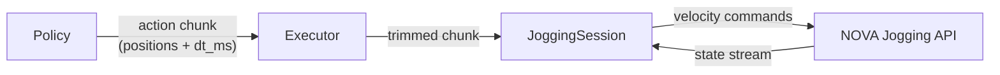

# Jogging Internals

How the `policy` package converts action chunks into robot motion via the NOVA Jogging API.

> **Temporary implementation.** This client-side velocity profile compensates for
> the fact that the NOVA Jogging API only accepts velocity commands. Once NOVA
> exposes a native waypoint jogging API (accepting position waypoints with timing
> directly), this entire module will be replaced by a thin client that forwards
> waypoints to the server. The `PolicyExecutor` and `MotionConfig` interfaces
> will remain stable.

## Overview



The NOVA Jogging API accepts **velocity commands** at the controller's cycle rate.
The `JoggingSession` computes these velocities from position waypoints using a
trapezoidal velocity profile.

## Execution Loop

```
1. Observe robot state
2. Query policy → get action chunk (N positions + dt_ms)
3. Trim to n_action_steps
4. Compute velocity profile for the trimmed chunk
5. Stream velocities until profile is done
6. Go to 1
```

The executor always waits for the current chunk to finish before querying
new inference. This is the receding horizon approach.

## Velocity Profile

For each multi-step chunk, velocities are computed upfront:

1. **Raw velocities** via central differences: `v[i] = (pos[i+1] - pos[i-1]) / (2 × dt)`
2. **Velocity scaling** — if any joint exceeds `velocity_limit`, stretch `dt` proportionally
3. **Trapezoidal ramp** — `ramp_steps` smooths acceleration at start and deceleration at end

```
velocity
    ▲
    │     ╭────────────╮
    │    ╱              ╲
    │   ╱                ╲
    │──╱──────────────────╲──► step
    │  ramp_up          ramp_down
```

Last step velocity is always zero (robot decelerates to a stop).

## Time-Based Advancement with P-Correction

Each jogging tick (~100 Hz):

1. Compute elapsed time since chunk started
2. Interpolate **expected position** from the steps at that time
3. Interpolate **feedforward velocity** from the profile at that time
4. Compute: `velocity = feedforward + p_gain × (expected - actual)`
5. Clamp to `velocity_limit`

When elapsed time exceeds the profile duration, velocity goes to zero
and the profile reports `done`.

## Single-Step Targets (Teleop)

When a chunk has 1 step or `dt_ms=0`, a simple P-controller is used:

```
velocity = p_gain × (target - current)
```

Clamped to `velocity_limit`. Used by the `jog_joints()` / `jog_tcp()` API.

## Configuration

```python
from policy import MotionConfig

config = MotionConfig(
    n_action_steps=8,        # receding horizon (0 = execute all)
    velocity_limit=2.0,      # rad/s (or per-axis list)
    ramp_steps=3,            # trapezoidal ramp smoothing
    p_gain=3.0,              # P-correction for tracking
    state_rate_ms=10,        # state stream update rate
)
```

## Error Detection

The session monitors the NOVA jogging state stream for blocking conditions:

| State | Meaning |
|-------|---------|
| `PAUSED_NEAR_JOINT_LIMIT` | Joint reached its limit |
| `PAUSED_NEAR_COLLISION` | Self-collision detected |
| `PAUSED_NEAR_SINGULARITY` | Kinematic singularity |

After 10 consecutive ticks in a blocking state, a `MotionError` is raised.

## Jogging Modes

| Mode | Velocity type | Use case |
|------|--------------|----------|
| `"joint"` | `JointVelocityRequest` | Joint-space policies (default) |
| `"cartesian"` | `TcpVelocityRequest` | Cartesian-space policies (TCP actions) |

The mode is selected automatically based on whether the schema contains
`Observation.tcp(..., action=True)` entries.
