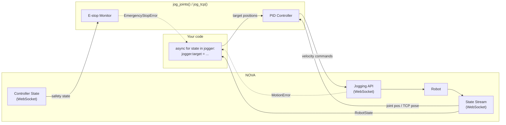

# PID Jogging

Position-controlled jogging for one or more motion groups. Set joint or TCP pose targets in a loop — a PID controller continuously streams velocity commands to track them via the NOVA Jogging API.



## Joint jogging

```python
from policy import jog_joints

async with jog_joints(mg) as jogger:
    async for state in jogger:
        jogger.target = compute_joints(state)
```

`state` is a `RobotState` with `.joints`, `.pose`, and `.tcp`. Set `jogger.target` to a `list[float]` of joint positions (radians). The PID controller drives the robot toward the target. Use `break` to stop.

## TCP jogging

```python
from nova.types import Pose
from policy import jog_tcp

async with jog_tcp(mg, tcp="Flange") as jogger:
    async for state in jogger:
        jogger.target = Pose(500, 200, 300, 0, 3.14, 0)
```

Target is a `Pose` (position in mm, orientation as rotation vector in radians). The PID controller computes cartesian velocities and the robot's internal IK handles the rest.

## Multiple motion groups

Both functions accept a list (joints) or dict (TCP) for multi-robot control:

```python
# Joint — list of motion groups
async with jog_joints([mg1, mg2]) as jogger:
    async for states in jogger:            # dict[MotionGroup, RobotState]
        jogger.target = {
            mg1: [0.1, -1.5, 1.0, -0.5, 0.0, 0.0],
            mg2: [0.0, -1.5, -1.0, -0.5, 0.0, 0.0],
        }

# TCP — dict maps each motion group to its TCP name
async with jog_tcp({mg1: "Flange", mg2: "Flange"}) as jogger:
    async for states in jogger:
        jogger.target = {
            mg1: Pose(500, 200, 300, 0, 3.14, 0),
            mg2: Pose(-500, 200, 300, 0, -3.14, 0),
        }
```

## Error handling

Errors are detected automatically and raised through the `async for` loop:

- **`MotionError`** — joint limit or self-collision detected by the controller
- **`EmergencyStopError`** — e-stop, protective stop, or safety violation
- **`RuntimeError`** — jogging connection lost

The `async with` block ensures clean shutdown regardless of how execution ends.

```python
from policy import EmergencyStopError, MotionError, jog_joints

try:
    async with jog_joints(mg) as jogger:
        async for state in jogger:
            jogger.target = compute_joints(state)
except MotionError as e:
    print(f"Hit a limit: {e}")
except EmergencyStopError as e:
    print(f"E-stop on controller '{e.controller_id}': {e.safety_state}")
```

## Full example

See [`examples/jogging_dual_arm.py`](examples/jogging_dual_arm.py) for all four modes
(single joint, single TCP, dual joint, dual TCP) on two UR10e robots with error handling.

Minimal single-arm example:

```python
import asyncio
import math

from nova import Nova
from policy import EmergencyStopError, MotionError, jog_joints


async def main():
    async with Nova() as nova:
        cell = nova.cell()
        mg = (await cell.controller("ur10e"))[0]

        home = [0.0, -1.571, 1.571, -1.571, -1.571, 0.0]
        t = 0.0

        try:
            async with jog_joints(mg) as jogger:
                async for state in jogger:
                    target = list(home)
                    target[3] = home[3] + 0.3 * math.sin(t)
                    jogger.target = target
                    t += 1 / 30
                    if t > 10:
                        break
            print("Done")
        except MotionError as e:
            print(f"Motion error: {e}")
        except EmergencyStopError as e:
            print(f"E-stop: {e}")


asyncio.run(main())
```

## PID tuning

The defaults work for most cases. If you need to adjust tracking behavior, pass a `PolicyRunnerConfig`:

```python
from policy import PolicyRunnerConfig, jog_joints

config = PolicyRunnerConfig(
    p_gain=3.0,           # proportional gain (higher = stiffer tracking)
    d_gain=0.1,           # derivative gain (higher = more damping)
    i_gain=0.0,           # integral gain (usually leave at 0)
    velocity_limit=1.5,   # max joint velocity in rad/s
    tolerance=0.01,       # position error below which velocity is zero (rad)
)

async with jog_joints(mg, config=config) as jogger:
    ...
```

`jog_tcp` uses cartesian-appropriate defaults automatically (`velocity_limit=250` mm/s, `tolerance=1.0` mm). Override with your own `PolicyRunnerConfig` if needed.

| Parameter | Joint default | TCP default | Effect |
|-----------|--------------|-------------|--------|
| `p_gain` | 3.0 | 3.0 | Tracking stiffness. Higher = faster convergence, but can overshoot. |
| `d_gain` | 0.1 | 0.1 | Damping. Reduces oscillation around the target. |
| `i_gain` | 0.0 | 0.0 | Integral correction. Rarely needed — targets update continuously. |
| `velocity_limit` | 1.5 rad/s | 250 mm/s | Clamps output velocity per axis. Safety bound. |
| `tolerance` | 0.01 rad | 1.0 mm | Dead zone. Below this error, velocity is zero. Prevents jitter. |
| `state_rate_ms` | 10 | 10 | How often the robot reports its state (ms). Lower = smoother PID. |
