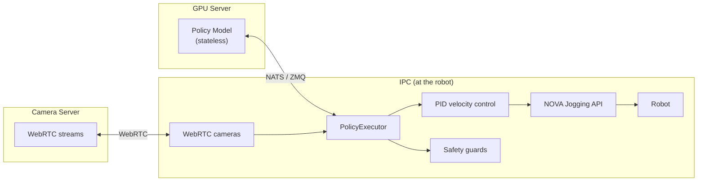

# policy

PID-controlled jogging for executing learned policies (imitation learning, reinforcement learning) on industrial robots via [Wandelbots NOVA](https://wandelbots.com).

Converts joint position targets from a policy into joint velocity commands streamed through the NOVA Jogging API.

## Architecture

The core design principle: **robot control lives on the IPC, not on the (potentially remote) GPU server running the policy.**



The policy is a **stateless pure function**: `obs → actions`. It never controls lifecycle.
The executor decides **when** to start, **when** to stop, and handles all safety.

## Install

```bash
pip install wandelbots-nova[policy]
```

## Quick Start

```python
import asyncio
import math
from typing import Any

from nova import Nova
from policy import ActionChunk, CallbackPolicyClient, PolicyExecutor


async def my_policy(obs: dict[str, Any]) -> ActionChunk:
    """Stateless policy: obs in → actions out."""
    joints = {}
    for mg_id, state in obs.items():
        current = list(state.joints)
        target = [j + 0.05 * math.sin(j * 3.0 + i * 0.4) for i, j in enumerate(current)]
        joints[mg_id] = [target]
    return ActionChunk(joints=joints)


async def main():
    async with Nova() as nova:
        cell = nova.cell()
        ctrl = await cell.controller("ur10e")
        mg = ctrl[0]

        executor = PolicyExecutor(
            motion_groups=[mg],
            policy=CallbackPolicyClient(my_policy),
            timeout_s=10.0,
        )

        result = await executor.run()
        print(f"Done: {result.reason}, {result.steps} steps, {result.duration_s:.1f}s")


asyncio.run(main())
```

## API

### PolicyExecutor

```python
executor = PolicyExecutor(
    motion_groups=[mg1, mg2],       # or feature_map=... for flat features
    policy=my_policy_client,
    cameras=camera_set,             # optional WebRTC cameras
    timeout_s=10.0,                 # 0 = run until stop()
    safety_guards=[guard_fn],
    rate_hz=30,
)

# Blocking — runs until timeout/stop/error:
result = await executor.run()

# Non-blocking stop (call from another task, signal handler, HTTP endpoint):
executor.stop()
```

### Execution terminates when

| Trigger | Behavior |
|---------|----------|
| `timeout_s` expires | Returns `ExecutionResult(reason="timeout")` |
| `executor.stop()` called | Returns `ExecutionResult(reason="stopped")` |
| Safety guard returns `False` | Raises `GuardStopError` |
| E-stop / protective stop | Raises `EmergencyStopError` |
| Self-collision / joint limit | Raises `MotionError` |
| Connection lost | Raises `RuntimeError` |

Built-in clients:

| Client | Transport | Use case |
|--------|-----------|----------|
| `NatsPolicyClient` | NATS request/reply | App-to-app on Nova platform |
| `CallbackPolicyClient` | Local function | Testing, local models |
| `Gr00tPolicyClient` | ZMQ (msgpack) | NVIDIA GR00T inference servers |

### Wire format (PolicyResponse)

Policy services return msgpack-encoded responses:

```python
# Single-step action:
{"joints": {"0@ur10e": [[j1, j2, j3, j4, j5, j6]]}, "ios": {"0@ur10e": {"digital_out[0]": True}}, "dt_ms": 33.0}

# Multi-step chunk (ACT, Diffusion Policy, RTC):
{"joints": {"0@ur10e": [[step0], [step1], ..., [step15]]}, "dt_ms": 33.0}

# Flat features (FeatureMap mode):
{"features": {"left_joint_position_1": 0.1, "left_gripper": 50.0}}
```

## FeatureMap

Decouples the policy from hardware topology using flat named features (LeRobot-compatible):

```python
from policy import FeatureMap, FeatureGroup

feature_map = FeatureMap(groups=[
    FeatureGroup(
        motion_group=mg1,
        name="left",
        ios={"left_gripper": "digital_out[0]"},
    ),
    FeatureGroup(
        motion_group=mg2,
        name="right",
        ios={"right_gripper": "digital_out[0]"},
    ),
])

executor = PolicyExecutor(feature_map=feature_map, policy=client, timeout_s=10.0)
```

Policy sees: `{"left_joint_position_1": ..., "left_gripper": 0.0, "right_joint_position_1": ...}`

For GR00T array-based policies, override keys to match the server:
```python
FeatureGroup(
    motion_group=mg1,
    name="left",
    joint_key="left_arm",
    tcp_key="left_eef_9d",
    tcp_format=TcpFormat.ROT6D,
    ios={"left_gripper": "digital_out[0]"},
)
```

IO values are streamed for real-time guard access at the controller's update rate.

## Cameras

WebRTC cameras can be attached to the executor. Images are included in every observation sent to the policy:

```python
from policy import CameraSet, WebRTCCameraConfig

cameras = CameraSet(configs={
    "flange": WebRTCCameraConfig(api_url="http://localhost:9100", device_id="315122271048"),
    "left": WebRTCCameraConfig(api_url="http://localhost:9100", device_id="314522065367"),
})

executor = PolicyExecutor(
    feature_map=feature_map,
    cameras=cameras,
    policy=client,
    timeout_s=10.0,
)
```

Images arrive as `numpy.ndarray` (H×W×3, uint8, RGB) in the observation dict under the camera name.

## Safety Guards

Guards run on every PID tick at the controller's state stream rate. They have access to joint state and streamed IO values:

```python
from policy import GuardState

def workspace_guard(ctx: GuardState) -> bool:
    """Return False to immediately stop the robot."""
    return ctx.state.pose.position[2] > 100  # stop if Z < 100mm

def io_guard(ctx: GuardState) -> bool:
    """Stop if an external sensor triggers."""
    sensor = ctx.io_values.get("digital_in[3]")
    return sensor != 1  # stop if sensor goes high

executor = PolicyExecutor(..., safety_guards=[workspace_guard, io_guard])
```

## Collision & Limit Detection

The executor uses NOVA's jogging state signals to detect when the robot is blocked:

- **Self-collision** → raises `MotionError("Jogging paused: PAUSED_NEAR_COLLISION")`
- **Joint limit** → raises `MotionError("Jogging paused: PAUSED_NEAR_JOINT_LIMIT")`
- **Singularity** → raises `MotionError("Jogging paused: PAUSED_NEAR_SINGULARITY")`

No heuristics — uses the actual controller state reported by NOVA.

## NATS Transport (Nova Platform)

On the Nova platform, apps communicate via NATS (injected as `NATS_BROKER` env var into every app container).

```python
import nats
from policy import NatsPolicyClient

nc = await nats.connect(servers="nats://localhost:4222")
client = NatsPolicyClient(nc, subject="nova.policy.predict", timeout=5.0)
```

## Examples

| Example | Description |
|---------|-------------|
| [`execute_policy_on_dualarm.py`](examples/execute_policy_on_dualarm.py) | Two UR10e robots, FeatureMap, cameras, safety guards |
| [`apps/nats/`](examples/apps/nats/) | NATS mock policy + robot controller (deployable Nova apps) |
| [`apps/zmq/`](examples/apps/zmq/) | GR00T ZMQ mock policy + robot controller (deployable) |
| [`apps/mock-camera-server/`](examples/apps/mock-camera-server/) | WebRTC camera server for development without real cameras |
