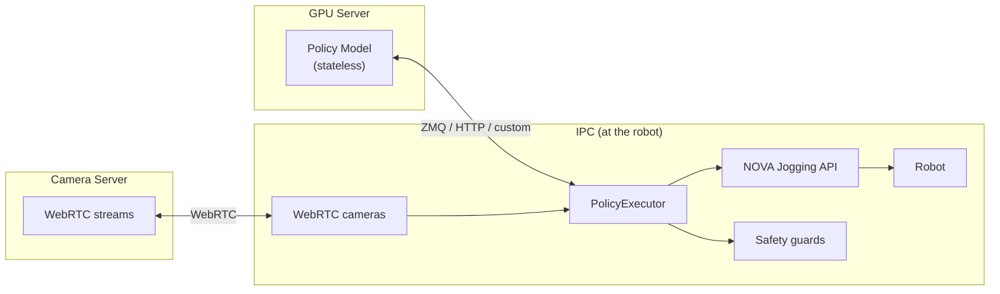

# policy

> **⚠️ EXPERIMENTAL** — This package is under active development and not ready for production use. Expect breaking changes between releases.

Velocity-controlled jogging for executing learned policies (imitation learning, reinforcement learning) on industrial robots via [Wandelbots NOVA](https://wandelbots.com).

Converts joint position targets from a policy into joint velocity commands streamed through the NOVA Jogging API.

## Architecture

**Robot control lives on the IPC, not on the (potentially remote) GPU server running the policy.**



The policy is a **stateless pure function**: `obs → actions`. It never controls lifecycle.
The executor decides **when** to start, **when** to stop, and handles all safety.

## Install

```bash
pip install wandelbots-nova[policy]
```

## Quick Start

A policy is just an async function: observations in, actions out.

```python
import asyncio
from nova import Nova
from policy import Observation, PolicyExecutor, PolicySchema


async def my_policy(obs):
    """Nudge each joint by a small offset."""
    return {k: v + 0.01 for k, v in obs.items() if k.startswith("arm_")}


async def main():
    async with Nova() as nova:
        cell = nova.cell()
        ctrl = await cell.controller("ur10e")
        mg = ctrl[0]

        schema = PolicySchema(observations=[
            Observation.joint_positions("arm", source=mg),
        ])

        executor = PolicyExecutor(schema, my_policy, timeout_s=10.0)
        result = await executor.run()
        print(f"Done: {result.reason}, {result.steps} steps, {result.duration_s:.1f}s")


asyncio.run(main())
```

Any async callable that maps `dict → dict` works — call a remote GPU server, run a local model, or return constants. The executor owns all complexity (motion control, safety, IO streaming, e-stop detection).

▶ [`execute_custom_policy_on_dual_arm.py`](examples/execute_custom_policy_on_dual_arm.py) — two UR5e robots with cameras, IOs, and safety guards\
▶ [`execute_gr00t_dual_arm.py`](examples/execute_gr00t_dual_arm.py) — dual arm with GR00T ZMQ + 4 cameras

## Motion Control

> **Note:** The current client-side velocity profile is a temporary implementation.
> It will be replaced by NOVA's native waypoint jogging API once available, which
> moves interpolation and servo control server-side for better tracking.

Action chunks are executed via the NOVA Jogging API using a **trapezoidal velocity profile**:
- Velocities computed from position differences between chunk steps
- Trapezoidal ramp envelope (smooth acceleration/deceleration)
- Time-based advancement with P-correction to track the intended trajectory
- ROS2-style desired-state tracking for smooth chunk transitions

```python
from policy import MotionConfig, PolicyExecutor

executor = PolicyExecutor(schema, policy, motion=MotionConfig(
    n_action_steps=8,       # execute only first 8 of 16 predicted steps
    velocity_limit=2.0,     # rad/s (scalar or per-axis list)
    ramp_steps=3,           # trapezoidal ramp smoothing
    execute_and_wait=True,  # wait for chunk to finish before next inference
))
```

### Receding Horizon (`execute_and_wait=True`, default)

Executes `n_action_steps` from the action chunk, waits until the robot
finishes those steps, then queries new inference with a fresh observation.
Later steps (higher prediction uncertainty) are discarded.
This is the standard approach used by GR00T and LeRobot.

### Continuous (`execute_and_wait=False`)

Queries inference at `inference_hz` without waiting. Each new chunk
replaces the previous one immediately. The P-correction ensures smooth
transitions between chunks. Use for fast policies (>10 Hz) where
overlapping predictions should feed through continuously.

See [`JOGGING.md`](JOGGING.md) for the velocity profile algorithm details.

## PolicySchema

Decouples the policy from hardware topology. The policy sees a flat dictionary of named features — it never knows about motion groups, controllers, or hardware IO keys.

```python
from policy import BoolMapping, Observation, PolicySchema

schema = PolicySchema(observations=[
    Observation.joint_positions("left", source=mg_left),
    Observation.joint_positions("right", source=mg_right),
    Observation.io("left_gripper", source=mg_left, io="digital_out[0]",
                   mapping=BoolMapping(on=100.0)),
    Observation.io("right_gripper", source=mg_right, io="digital_out[0]",
                   mapping=BoolMapping(on=100.0)),
])
```

This produces observations like:

```python
{
    "left_1": 0.1, "left_2": -1.5, ..., "left_6": 0.3,
    "right_1": 0.2, ..., "right_6": -0.1,
    "left_gripper": 0.0,      # closed
    "right_gripper": 100.0,   # open
}
```

The policy returns the same keys with target values. Joints go through velocity-controlled jogging, IOs get written to hardware with the mapping applied in reverse.

### Cameras

Cameras are provided by a WebRTC streaming server that NOVA manages — for example, the [Isaac Sim WebRTC Streamer](https://github.com/wandelbotsgmbh/wandelbots-isaacsim-webrtc-streamer) or a RealSense camera service running on the NOVA instance.  The policy client never starts or stops hardware streams — NOVA owns the camera lifecycle.  The client only opens a WebRTC session to receive frames.  If `width`, `height`, or `fps` are specified, they are validated against the stream NOVA provides and an exception is raised on mismatch.

```python
from policy import Observation, WebRTCCameras

# Point to the camera server running on your NOVA instance.
# NOVA must already be streaming at the expected resolution/fps.
cameras = WebRTCCameras(api_url="http://<nova-host>:8011/webrtc-streamer", width=640, height=480, fps=15)

schema = PolicySchema(observations=[
    Observation.joint_positions("arm", source=mg),
    Observation.image("flange", source=cameras.device("315122271048")),
    Observation.image("left", source=cameras.device("314522065367")),
])
```

Images arrive as `numpy.ndarray` (H×W×3, uint8, RGB) in the observation dict.

### Safety Guards

Guards see both the current robot state and the **intended action** before it executes.
Use them to reject dangerous targets, block IO writes, or stop execution when
an external signal (e.g. a sensor IO) indicates the task is done — policies
typically don't report "finished", so guards are the natural way to end an episode:

```python
from policy import GuardState

def workspace_guard(ctx: GuardState) -> bool:
    """Reject if policy would move joint 2 past 2.8 rad."""
    if ctx.target_joints:
        for step in ctx.target_joints:
            if abs(step[1]) > 2.8:
                return False
    return True

def io_guard(ctx: GuardState) -> bool:
    """Block writes to safety-critical output."""
    if ctx.target_ios and ctx.target_ios.get("digital_out[7]"):
        return False
    return True

def task_done_guard(ctx: GuardState) -> bool:
    """Stop when sensor detects object placed."""
    if ctx.io_values and ctx.io_values.get("digital_in[3]"):
        return False
    return True

executor = PolicyExecutor(schema, policy, safety_guards=[workspace_guard, io_guard, task_done_guard])
```

Guards must be fast (no network calls). Use `Observation.computed()` for async data.

### Execution lifecycle

| Trigger                      | Behavior                                    |
| ---------------------------- | ------------------------------------------- |
| `timeout_s` expires          | Returns `ExecutionResult(reason="timeout")` |
| `executor.stop()` called     | Returns `ExecutionResult(reason="stopped")` |
| Safety guard returns `False` | Raises `GuardStopError`                     |
| E-stop / protective stop     | Raises `EmergencyStopError`                 |
| Self-collision / joint limit | Raises `MotionError`                        |
| Connection lost              | Raises `RuntimeError`                       |

## Jogging (without a policy)

The jogging layer can be used standalone — no policy, no schema, no cameras:

```python
from policy import jog_joints

async with jog_joints(mg) as jogger:
    jogger.set_target([0.0, -1.57, 1.57, -1.57, -1.57, 0.0])
    async for state in jogger:
        print(state.joints)
```

See [`JOGGING.md`](JOGGING.md) for joint/TCP modes, dual-arm control, chunking, and error handling.\
▶ [`jogging_dual_arm.py`](examples/jogging_dual_arm.py)

## GR00T

Built-in `Gr00tPolicyClient` for [NVIDIA Isaac GR00T](https://github.com/NVIDIA/Isaac-GR00T) inference servers over ZMQ. See [`gr00t/README.md`](gr00t/README.md).

---

## Advanced Schema Features

### IO mappings

By default, `Observation.io(...)` entries are bidirectional — the policy observes and controls them. The `mapping` converts between hardware values and policy values:

```python
# Policy sees 0.0 (closed) or 100.0 (open)
# Hardware reads/writes True/False on digital_out[0]
Observation.io("gripper", source=mg, io="digital_out[0]",
               mapping=BoolMapping(on=100.0))
```

For read-only sensors, set `action=False`:

```python
Observation.io("sensor", source=mg, io="digital_in[0]", action=False)
```

If observation and action need different hardware keys, use an explicit `Action.io()`:

```python
from policy import Action

schema = PolicySchema(
    observations=[
        Observation.io("gripper", source=mg, io="analog_in[0]", action=False),
    ],
    actions=[
        Action.io("gripper", target=mg, io="digital_out[0]",
                  mapping=BoolMapping(on=1.0)),
    ],
)
```

### Relative actions

Joint and TCP observations support `mode="relative"`. The mode controls how the policy's action output is interpreted:

| Mode | Policy returns | Executor sends to jogging |
|------|----------------|----------------------|
| `"absolute"` (default) | target positions | as-is |
| `"relative"` | offsets from current | `current + offset` |

```python
Observation.joint_positions("arm", source=mg, mode="relative")
```

### TCP actions

Policies that output Cartesian targets instead of joint positions. Set `action=True` on `Observation.tcp()` — the executor creates a Cartesian jogging session for that motion group:

```python
Observation.tcp("eef_pose", source=mg, action=True)
```

The policy receives named values (`eef_pose_x`, `eef_pose_y`, `eef_pose_z`, `eef_pose_rx`, `eef_pose_ry`, `eef_pose_rz`) in mm and radians (NOVA's native TCP format), and returns target values in the same format. The session streams `TcpVelocityRequest` commands computed from the same trapezoidal profile used for joints. Combine with `mode="relative"` for delta-based Cartesian control.

### Rerun visualization

Add `viewer=nova.viewers.Rerun()` to the `@nova.program` decorator to get real-time 3D visualization of the execution. The executor automatically logs robot meshes, action chunk TCP paths, TCP trails, camera images, and joint timeseries — zero overhead when no viewer is active.

```python
from nova import viewers

@nova.program(id="my_policy", viewer=viewers.Rerun())
async def run(ctx):
    ...
    executor = PolicyExecutor(schema, policy, timeout_s=10.0)
    await executor.run()  # data streams to Rerun viewer automatically
```

Requires `wandelbots-nova[nova-rerun-bridge]`. Run `uv run download-models` once to fetch robot meshes.

### Computed observations and actions

For external data sources (OPC UA, PLC, databases) not covered by the built-in types:

```python
async def read_force_sensor(obs: dict) -> dict:
    values = await opcua_client.read(["ns=2;s=ForceZ"])
    return {"force_z": values[0]}

schema = PolicySchema(observations=[
    Observation.joint_positions("arm", source=mg),
    Observation.computed(read_force_sensor),
])
```

Computed actions trigger external side effects when the policy returns:

```python
async def write_plc(action: dict) -> None:
    await plc_client.write("ns=2;s=ConveyorSpeed", action.get("conveyor_speed", 0.0))

schema = PolicySchema(
    observations=[Observation.joint_positions("arm", source=mg)],
    actions=[Action.computed(write_plc)],
)
```
