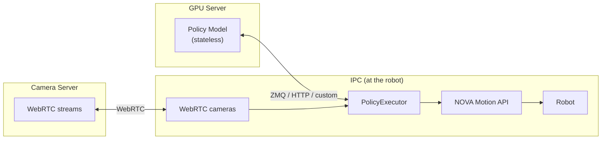

# policy

> **⚠️ EXPERIMENTAL** — This package is under active development and not ready for production use. Expect breaking changes between releases.

Execute learned policies (imitation learning, reinforcement learning) on industrial robots via [Wandelbots NOVA](https://wandelbots.com).

## Architecture

**Robot control lives on the IPC, not on the (potentially remote) GPU server running the policy.**



The policy is a **stateless pure function**: `obs → actions`. It never controls lifecycle.
The executor decides **when** to start and **when** to stop, and runs the software guards.

## Install

```bash
uv add wandelbots-nova
```

## Quick Start

A policy is just an async function: observations in, actions out.

```python
import asyncio
from nova import Nova
from policy import Observation, PolicyExecutor, PolicySchema


async def my_policy(obs):
    """Nudge each joint by a small offset."""
    return {k: v + 0.01 for k, v in obs.items() if k.startswith("arm_")}


async def main():
    async with Nova() as nova:
        cell = nova.cell()
        ctrl = await cell.controller("ur10e")
        mg = ctrl[0]

        schema = PolicySchema(observations=[
            Observation.joint_positions("arm", source=mg),
        ])

        executor = PolicyExecutor(schema, my_policy, timeout_s=10.0)
        result = await executor.run()
        print(f"Done: {result.reason}, {result.steps} steps, {result.duration_s:.1f}s")


asyncio.run(main())
```

Any async callable that maps `dict → dict` works — call a remote GPU server, run a local model, or return constants. The executor owns all complexity (motion control, safety, IO streaming, e-stop detection).

▶ [`execute_custom_policy_on_dual_arm.py`](examples/execute_custom_policy_on_dual_arm.py) — two UR5e robots with cameras, IOs, and safety guards\
▶ [`execute_gr00t_dual_arm.py`](examples/execute_gr00t_dual_arm.py) — dual arm with GR00T ZMQ + 4 cameras

## PolicySchema

Decouples the policy from hardware topology. The policy sees a flat dictionary of named features — it never knows about motion groups, controllers, or hardware IO keys.

```python
from policy import BoolMapping, Observation, PolicySchema

schema = PolicySchema(observations=[
    Observation.joint_positions("left", source=mg_left),
    Observation.joint_positions("right", source=mg_right),
    Observation.io("left_gripper", source=mg_left, io="digital_out[0]",
                   mapping=BoolMapping(on=100.0)),
    Observation.io("right_gripper", source=mg_right, io="digital_out[0]",
                   mapping=BoolMapping(on=100.0)),
])
```

This produces observations like:

```python
{
    "left_1": 0.1, "left_2": -1.5, ..., "left_6": 0.3,
    "right_1": 0.2, ..., "right_6": -0.1,
    "left_gripper": 0.0,      # closed
    "right_gripper": 100.0,   # open
}
```

The policy returns the same keys with target values. Joints are sent as `JointWaypointsRequest`, TCP targets as `PoseWaypointsRequest`, and IOs get written to hardware with the mapping applied in reverse.

### Cameras

Cameras are managed by the **Camera App** on the NOVA instance — the user starts and stops camera streams via the Camera App UI. The policy client only opens a WebRTC session to receive frames from an already-running stream. Pass `resize=(width, height)` to scale every frame to the size your policy expects on read.

```python
from policy import Observation, WebRTCCameras

# Point to the camera server running on your NOVA instance.
# Frames are resized to the policy's expected input size on read.
cameras = WebRTCCameras(api_url="http://<nova-host>:8011/webrtc-streamer", resize=(224, 224))

schema = PolicySchema(observations=[
    Observation.joint_positions("arm", source=mg),
    Observation.image("flange", source=cameras.device("315122271048")),
    Observation.image("left", source=cameras.device("314522065367")),
])
```

Images arrive as `numpy.ndarray` (H×W×3, uint8, RGB) in the observation dict.

### Stop conditions

Policies run open-ended — they don't signal "finished". A stop condition is a fast,
synchronous check that runs on every tick; returning `True` ends the run normally
(its name appears in `result.reason`). The typical use in an industrial cell is an
IO stop signal — end the episode when an operator button or PLC sets an input:

```python
from policy import StopContext

def stop_on_io(ctx: StopContext) -> bool:
    """Stop the policy when digital_in[3] goes high."""
    return bool(ctx.io_values and ctx.io_values.get("digital_in[3]"))

executor = PolicyExecutor(schema, policy, stop_conditions=[stop_on_io])
result = await executor.run()
# result.reason == "stop condition: stop_on_io"
```

Stop conditions must be fast (no network calls). Use `Observation.computed()` for async data.

> These are **software** stop conditions running in the executor loop — not a safety system. The robot can still move fast and a stop condition has no notion of its braking distance. For production, rely on the safety zones and protective stops configured on the robot controller.

### Execution lifecycle

| Trigger                      | Behavior                                          |
| ---------------------------- | ------------------------------------------------- |
| `timeout_s` expires          | Returns `ExecutionResult(reason="timeout")`       |
| `executor.stop()` called     | Returns `ExecutionResult(reason="stopped")`       |
| Stop condition returns `True`| Returns `ExecutionResult(reason="stop condition: <name>")` |
| E-stop / protective stop     | Raises `EmergencyStopError`                       |
| Self-collision / joint limit | Raises `MotionError`                              |
| Connection lost              | Raises `RuntimeError`                             |

## Motion Control

Action chunks are sent to the NOVA Jogging API as **timestamped waypoints**. The server handles velocity profiling, interpolation, and servo control internally.

```python
from policy import PolicyExecutor

executor = PolicyExecutor(
    schema,
    policy,
    n_action_steps=8,       # send only the first 8 of 16 predicted steps
    policy_rate_hz=20.0,    # query the policy at 20 Hz (overlapping chunks)
)
```

The executor operates as a **receding horizon controller**: at each tick it queries the policy for a new chunk and sends it to the server. Each chunk overlaps with the previous one — the server replaces waypoints older than the new chunk's first timestamp. This provides smooth, continuous motion even with variable inference latency.

Two request types are supported:

| Schema action type | Request sent | Coordinate system |
|---|---|---|
| Joint positions (default) | `JointWaypointsRequest` | Joint radians |
| TCP poses (`action=True`) | `PoseWaypointsRequest` | Robot base frame (mm + rotation vector) |

The server synchronizes its internal clock with the client via `jogger_session_timestamp_ms` in the state stream, ensuring timestamps remain aligned regardless of network latency.

See [`JOGGING.md`](JOGGING.md) for protocol details.

#### Jogging (without a policy)

The jogging layer can be used standalone — no policy, no schema, no cameras:

```python
from policy import jog_joints, jog_tcp
from nova.types import Pose

# Joint jogging — sends JointWaypointsRequest
async with jog_joints(mg) as jogger:
    async for state in jogger:
        jogger.set_target([0.0, -1.57, 1.57, -1.57, -1.57, 0.0])

# TCP jogging — sends PoseWaypointsRequest
async with jog_tcp(mg, tcp="Flange") as jogger:
    async for state in jogger:
        jogger.set_target(Pose(500, 200, 300, 0, 3.14, 0))
```

Both modes support chunked targets for smoother motion:

```python
async with jog_joints(mg) as jogger:
    async for state in jogger:
        chunk = [compute_target(t + i * 0.033) for i in range(8)]
        jogger.set_target(chunk, dt_ms=33.0)
```

See [`JOGGING.md`](JOGGING.md) for joint/TCP modes, dual-arm control, chunking, and error handling.\
▶ [`jogging_dual_arm.py`](examples/jogging_dual_arm.py)

## GR00T

Built-in `Gr00tPolicyClient` for [NVIDIA Isaac GR00T](https://github.com/NVIDIA/Isaac-GR00T) inference servers over ZMQ. See [`gr00t/README.md`](gr00t/README.md).

---

## Advanced Schema Features

### IO mappings

By default, `Observation.io(...)` entries are bidirectional — the policy observes and controls them. The `mapping` converts between hardware values and policy values:

```python
# Policy sees 0.0 (closed) or 100.0 (open)
# Hardware reads/writes True/False on digital_out[0]
Observation.io("gripper", source=mg, io="digital_out[0]",
               mapping=BoolMapping(on=100.0))
```

For read-only sensors, set `action=False`:

```python
Observation.io("sensor", source=mg, io="digital_in[0]", action=False)
```

If observation and action need different hardware keys, use an explicit `Action.io()`:

```python
from policy import Action

schema = PolicySchema(
    observations=[
        Observation.io("gripper", source=mg, io="analog_in[0]", action=False),
    ],
    actions=[
        Action.io("gripper", target=mg, io="digital_out[0]",
                  mapping=BoolMapping(on=1.0)),
    ],
)
```

### Relative actions

Joint and TCP observations support `mode="relative"`. The mode controls how the policy's action output is interpreted:

| Mode                   | Policy returns       | Executor sends to jogging |
| ---------------------- | -------------------- | ------------------------- |
| `"absolute"` (default) | target positions     | as-is                     |
| `"relative"`           | offsets from current | `current + offset`        |

```python
Observation.joint_positions("arm", source=mg, mode="relative")
```

### TCP actions

Policies that output Cartesian targets instead of joint positions. Set `action=True` on `Observation.tcp()` — the executor sends `PoseWaypointsRequest` for that motion group, and the server handles inverse kinematics internally:

```python
Observation.tcp("eef_pose", source=mg, tcp="Flange", action=True)
```

The policy receives named values (`eef_pose_x`, `eef_pose_y`, `eef_pose_z`, `eef_pose_rx`, `eef_pose_ry`, `eef_pose_rz`) in mm and radians (NOVA's native TCP format), and returns target values in the same format. Combine with `mode="relative"` for delta-based Cartesian control.

### Rerun visualization

Add `viewer=nova.viewers.Rerun()` to the `@nova.program` decorator to get real-time 3D visualization of the execution. The executor automatically logs robot meshes, action chunk TCP paths, TCP trails, camera images, and joint timeseries — zero overhead when no viewer is active.

```python
from nova import viewers

@nova.program(id="my_policy", viewer=viewers.Rerun())
async def run(ctx):
    ...
    executor = PolicyExecutor(schema, policy, timeout_s=10.0)
    await executor.run()  # data streams to Rerun viewer automatically
```

Requires `wandelbots-nova[nova-rerun-bridge]`. Run `uv run download-models` once to fetch robot meshes.

### Computed observations and actions

For external data sources (OPC UA, PLC, databases) not covered by the built-in types:

```python
async def read_force_sensor(obs: dict) -> dict:
    values = await opcua_client.read(["ns=2;s=ForceZ"])
    return {"force_z": values[0]}

schema = PolicySchema(observations=[
    Observation.joint_positions("arm", source=mg),
    Observation.computed(read_force_sensor),
])
```

Computed actions trigger external side effects when the policy returns:

```python
async def write_plc(action: dict) -> None:
    await plc_client.write("ns=2;s=ConveyorSpeed", action.get("conveyor_speed", 0.0))

schema = PolicySchema(
    observations=[Observation.joint_positions("arm", source=mg)],
    actions=[Action.computed(write_plc)],
)
```
