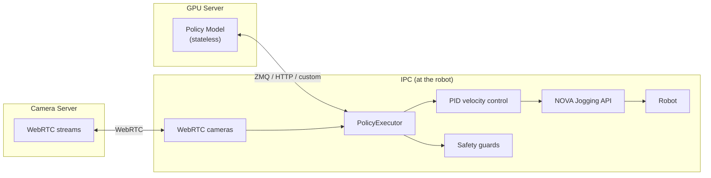
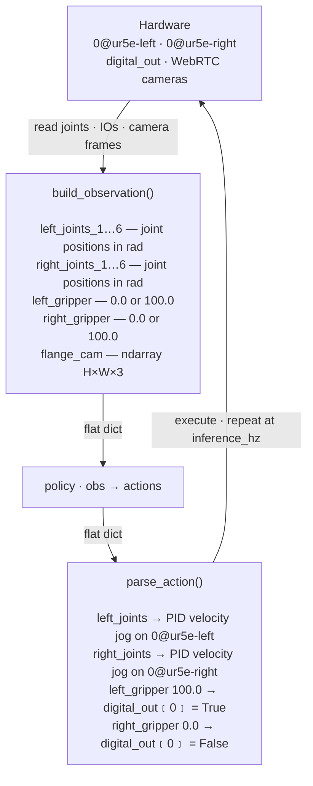

# policy

> **⚠️ EXPERIMENTAL** — This package is under active development and not ready for production use. Expect breaking changes between releases. Do not depend on it for stable deployments.

PID-controlled jogging for executing learned policies (imitation learning, reinforcement learning) on industrial robots via [Wandelbots NOVA](https://wandelbots.com).

Converts joint position targets from a policy into joint velocity commands streamed through the NOVA Jogging API.

## Architecture

The core design principle: **robot control lives on the IPC, not on the (potentially remote) GPU server running the policy.**



The policy is a **stateless pure function**: `obs → actions`. It never controls lifecycle.
The executor decides **when** to start, **when** to stop, and handles all safety.

## Install

```bash
pip install wandelbots-nova[policy]
```

## Quick Start

A policy is just an async function: observations in, actions out.
The executor handles all robot control — PID jogging, safety, IO, cameras.

```python
import asyncio

import aiohttp
from nova import Nova
from policy import Observation, PolicyExecutor, PolicySchema

POLICY_URL = "http://gpu-server:8080/predict"


async def main():
    async with Nova() as nova:
        cell = nova.cell()
        ctrl = await cell.controller("ur10e")
        mg = ctrl[0]

        schema = PolicySchema(observations=[
            Observation.joint_positions("arm_joints", source=mg),
        ])

        session = aiohttp.ClientSession()

        async def my_policy(obs):
            async with session.post(POLICY_URL, json=obs) as resp:
                return await resp.json()

        executor = PolicyExecutor(
            schema,
            my_policy,   # any async callable works
            timeout_s=10.0,
        )

        result = await executor.run()
        print(f"Done: {result.reason}, {result.steps} steps, {result.duration_s:.1f}s")
        await session.close()


asyncio.run(main())
```

Any async function that maps `obs → actions` works. The executor owns all complexity
(PID control, safety, IO streaming, e-stop detection).

The `obs` dict contains flat named features — everything declared in the schema:

- **Joint positions** — `arm_joints_1` … `arm_joints_6`
- **Joint velocities, torques, currents** — if configured via `Observation.joint_torques()` etc.
- **TCP pose** — if configured via `Observation.tcp()`
- **IO values** — if configured via `Observation.io()`
- **Camera images** — numpy arrays, if `Observation.image()` entries are present
- **Constants** — static values like language instructions via `Observation.constant()`
- **Computed values** — from external sources (OPC UA, PLC, etc.) via `Observation.computed()`

The policy returns a dict with the same keys containing target values.

For [NVIDIA GR00T](https://github.com/NVIDIA/Isaac-GR00T) inference servers, a built-in
`Gr00tPolicyClient` handles ZMQ transport, numpy array conversion, and the GR00T envelope
format. See [`gr00t/README.md`](gr00t/README.md) for details.

▶ Full example: [`execute_custom_policy_on_dual_arm.py`](examples/execute_custom_policy_on_dual_arm.py) — two UR5e robots with cameras, IOs, and safety guards.\
▶ GR00T example: [`execute_gr00t_dual_arm.py`](examples/execute_gr00t_dual_arm.py) — dual arm with GR00T ZMQ + 4 cameras.

## API

### PolicyExecutor

```python
executor = PolicyExecutor(
    schema,
    my_policy_client,
    timeout_s=10.0,                 # 0 = run until stop()
    safety_guards=[guard_fn],
    inference_hz=30,
)

# Blocking — runs until timeout/stop/error:
result = await executor.run()

# Non-blocking stop (call from another task, signal handler, HTTP endpoint):
executor.stop()
```

### Execution terminates when

| Trigger                      | Behavior                                    |
| ---------------------------- | ------------------------------------------- |
| `timeout_s` expires          | Returns `ExecutionResult(reason="timeout")` |
| `executor.stop()` called     | Returns `ExecutionResult(reason="stopped")` |
| Safety guard returns `False` | Raises `GuardStopError`                     |
| E-stop / protective stop     | Raises `EmergencyStopError`                 |
| Self-collision / joint limit | Raises `MotionError`                        |
| Connection lost              | Raises `RuntimeError`                       |

## PolicySchema

Decouples the policy from hardware topology. The policy sees a flat dictionary of named features — it never knows about motion groups, controllers, or hardware IO keys. Feature names are the contract between training and inference.



The schema maps hardware names to policy feature names, applies value conversions
(e.g. `bool ↔ 0/100`), and dispatches actions to PID jogging (joints) or IO writes (grippers).

```python
from policy import BoolMapping, Observation, PolicyExecutor, PolicySchema

schema = PolicySchema(observations=[
    Observation.joint_positions("left_joints", source=mg_left),
    Observation.joint_positions("right_joints", source=mg_right),
    Observation.io("left_gripper", source=mg_left, io="digital_out[0]",
                   mapping=BoolMapping(on=100.0)),
    Observation.io("right_gripper", source=mg_right, io="digital_out[0]",
                   mapping=BoolMapping(on=100.0)),
])

executor = PolicyExecutor(schema, my_policy, timeout_s=10.0)
```

This produces observations like:

```python
{
    "left_joints_1": 0.1,
    "left_joints_2": -1.5,
    ...
    "left_gripper": 0.0,
    "right_joints_1": 0.2,
    ...
    "right_gripper": 100.0,
}
```

The policy returns the same keys with target values.

### IO actions

By default, writable IOs (`Observation.io(...)`) are bidirectional — the policy can both observe and control them. The `mapping` converts between hardware values and policy values:

```python
# Policy sees "gripper" as 0.0 (closed) or 100.0 (open)
# Hardware writes True/False to digital_out[0]
Observation.io("gripper", source=mg, io="digital_out[0]",
               mapping=BoolMapping(on=100.0))
```

When the policy returns `{"gripper": 100.0}`, the executor writes `True` to `digital_out[0]`.
When it returns `{"gripper": 0.0}`, it writes `False`.

For read-only sensors, set `writable=False`:

```python
Observation.io("sensor", source=mg, io="digital_in[0]", writable=False)
```

If observation and action need different hardware keys, use an explicit `Action.io()`:

```python
from policy import Action

schema = PolicySchema(
    observations=[
        Observation.io("gripper", source=mg, io="analog_in[0]", writable=False),
    ],
    actions=[
        Action.io("gripper", target=mg, io="digital_out[0]",
                  mapping=BoolMapping(on=1.0)),
    ],
)
```

### Computed observations

Inject data from external sources (OPC UA, PLC, HTTP, databases) at every inference step:

```python
async def read_opcua(obs: dict) -> dict:
    values = await opcua_client.read(["ns=2;s=Temperature", "ns=2;s=ForceZ"])
    return {"temperature": values[0], "force_z": values[1]}

schema = PolicySchema(observations=[
    Observation.joint_positions("arm_joints", source=mg),
    Observation.computed(read_opcua),
])
```

### Computed actions

Trigger external side effects when the policy returns an action:

```python
async def write_plc(action: dict) -> None:
    conveyor_speed = action.get("conveyor_speed", 0.0)
    await plc_client.write("ns=2;s=ConveyorSpeed", conveyor_speed)

schema = PolicySchema(
    observations=[Observation.joint_positions("joints", source=mg)],
    actions=[Action.computed(write_plc)],
)
```

## Cameras

WebRTC cameras are declared in the schema via `Observation.image()`:

```python
from policy import Observation, PolicySchema, WebRTCCameras

cameras = WebRTCCameras(
    api_url="http://192.168.1.8:9100",
    width=640, height=480, fps=15,
)

schema = PolicySchema(observations=[
    Observation.joint_positions("arm_joints", source=mg),
    Observation.image("flange", source=cameras.device("315122271048")),
    Observation.image("left", source=cameras.device("314522065367")),
])

executor = PolicyExecutor(schema, my_policy, timeout_s=10.0)
```

Images arrive as `numpy.ndarray` (H×W×3, uint8, RGB) in the observation dict.

## Safety Guards

Guards run on every PID tick. They have access to joint state and streamed IO values:

```python
from policy import GuardState

def workspace_guard(ctx: GuardState) -> bool:
    """Return False to immediately stop the robot."""
    return ctx.state.pose.position[2] > 100  # stop if Z < 100mm

def io_guard(ctx: GuardState) -> bool:
    """Stop if an external sensor triggers."""
    sensor = ctx.io_values.get("digital_in[3]")
    return sensor != 1  # stop if sensor goes high

executor = PolicyExecutor(schema, policy, safety_guards=[workspace_guard, io_guard])
```

## PID Jogging

This package converts position targets into velocity commands via a PID controller running at the robot controller's cycle rate. For chunked policies (ACT, Diffusion, GR00T), targets are linearly interpolated and feedforward velocity is added for smooth tracking. New chunks arriving mid-execution are seamlessly merged via inference-delay compensation.

The PID jogging layer can also be used standalone — no policy, no schema, no cameras:

```python
from policy import jog_joints

async with jog_joints(mg) as jogger:
    jogger.set_target([0.0, -1.57, 1.57, -1.57, -1.57, 0.0])
    async for state in jogger:
        print(state.joints)
```

See [`JOGGING.md`](JOGGING.md) for joint/TCP modes, dual-arm control, chunking, error handling, and PID tuning.\
▶ Example: [`jogging_dual_arm.py`](examples/jogging_dual_arm.py)

## Deployable Apps

| App                                                                     | Description                                                   |
| ----------------------------------------------------------------------- | ------------------------------------------------------------- |
| [`apps/gr00t/`](examples/apps/gr00t/)                                   | GR00T ZMQ mock policy + robot controller (deployable Nova apps) |
| [`apps/mock-camera-server/`](examples/apps/mock-camera-server/)         | WebRTC camera server for development without real cameras     |
