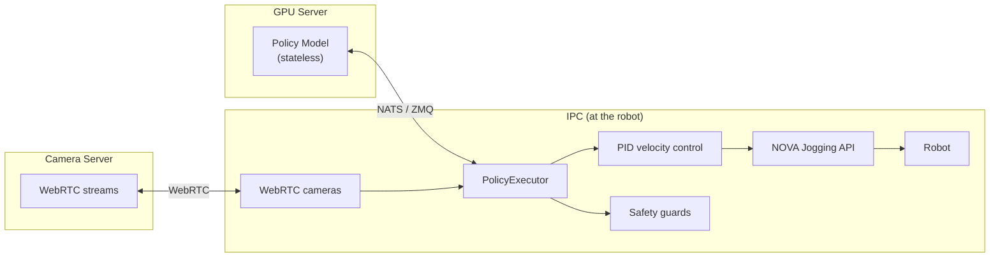

# policy

> **⚠️ EXPERIMENTAL** — This package is under active development and not ready for production use. Expect breaking changes between releases. Do not depend on it for stable deployments.

PID-controlled jogging for executing learned policies (imitation learning, reinforcement learning) on industrial robots via [Wandelbots NOVA](https://wandelbots.com).

Converts joint position targets from a policy into joint velocity commands streamed through the NOVA Jogging API.

## Architecture

The core design principle: **robot control lives on the IPC, not on the (potentially remote) GPU server running the policy.**



The policy is a **stateless pure function**: `obs → actions`. It never controls lifecycle.
The executor decides **when** to start, **when** to stop, and handles all safety.

## Install

```bash
pip install wandelbots-nova[policy]
```

## Quick Start

A policy is just an async function: observations in, actions out.
The executor handles all robot control — PID jogging, safety, IO, cameras.

```python
import asyncio

import aiohttp
from nova import Nova
from policy import FeatureGroup, FeatureMap, PolicyExecutor

POLICY_URL = "http://gpu-server:8080/predict"


async def main():
    async with Nova() as nova:
        cell = nova.cell()
        ctrl = await cell.controller("ur10e")
        mg = ctrl[0]

        feature_map = FeatureMap(groups=[
            FeatureGroup(motion_group=mg, name="arm"),
        ])

        session = aiohttp.ClientSession()

        async def my_policy(obs):
            async with session.post(POLICY_URL, json=obs) as resp:
                return await resp.json()

        executor = PolicyExecutor(
            feature_map=feature_map,
            policy=my_policy,   # any async callable works
            timeout_s=10.0,
        )

        result = await executor.run()
        print(f"Done: {result.reason}, {result.steps} steps, {result.duration_s:.1f}s")
        await session.close()


asyncio.run(main())
```

The policy client is just an adapter: **reformat obs → call your server → reformat response**.
There's no hidden state machine — the executor owns all complexity (PID control, safety,
IO streaming, e-stop detection). Any async function that maps `obs → actions` works.

The `obs` dict passed to the policy contains flat named features:
- **Joint positions** — `arm_joint_position_1` … `arm_joint_position_6`
- **IO values** — if configured via `FeatureGroup.ios`
- **TCP pose** — if configured via `FeatureGroup.tcp_format`
- **Camera images** — numpy arrays, if a `CameraSet` is passed to the executor

The policy returns a dict with the same keys containing target values.

For common transports, built-in clients handle serialization and protocol quirks:

| Client | Transport | What it adds |
|--------|-----------|-------|
| Bare async function | Any | Nothing — you own the transport |
| `NatsPolicyClient` | NATS request/reply | msgpack encoding, image splitting (NATS 1MB limit) |
| `Gr00tPolicyClient` | ZMQ | numpy array conversion, DOF padding, GR00T envelope format |

See [`nats/README.md`](nats/README.md) and [`groot/README.md`](groot/README.md) for details.

## API

### PolicyExecutor

```python
executor = PolicyExecutor(
    feature_map=feature_map,
    policy=my_policy_client,
    cameras=camera_set,             # WebRTC cameras
    timeout_s=10.0,                 # 0 = run until stop()
    safety_guards=[guard_fn],
    rate_hz=30,
)

# Blocking — runs until timeout/stop/error:
result = await executor.run()

# Non-blocking stop (call from another task, signal handler, HTTP endpoint):
executor.stop()
```

### Execution terminates when

| Trigger | Behavior |
|---------|----------|
| `timeout_s` expires | Returns `ExecutionResult(reason="timeout")` |
| `executor.stop()` called | Returns `ExecutionResult(reason="stopped")` |
| Safety guard returns `False` | Raises `GuardStopError` |
| E-stop / protective stop | Raises `EmergencyStopError` |
| Self-collision / joint limit | Raises `MotionError` |
| Connection lost | Raises `RuntimeError` |

### Policy Clients

| Client | Transport | Use case |
|--------|-----------|----------|
| Bare async function | Any (you choose) | Most flexible — use any transport |
| `NatsPolicyClient` | NATS request/reply | App-to-app on Nova platform |
| `Gr00tPolicyClient` | ZMQ (msgpack) | NVIDIA GR00T inference servers |

See [`nats/README.md`](nats/README.md) and [`groot/README.md`](groot/README.md) for transport-specific details.

## FeatureMap

Decouples the policy from hardware topology. The policy sees a flat dictionary of named features — it never knows about motion groups, controllers, or hardware IO keys. Feature names are the contract between training and inference.

```python
from policy import FeatureMap, FeatureGroup, PolicyExecutor

feature_map = FeatureMap(groups=[
    FeatureGroup(
        motion_group=mg_left,
        name="left",
        ios={"left_gripper": "digital_out[0]"},
    ),
    FeatureGroup(
        motion_group=mg_right,
        name="right",
        ios={"right_gripper": "digital_out[0]"},
    ),
])

executor = PolicyExecutor(
    feature_map=feature_map,
    policy=my_policy,
    timeout_s=10.0,
)
```

This produces observations like:

```python
{
    "left_joint_position_1": 0.1,
    "left_joint_position_2": -1.5,
    ...
    "left_gripper": 0.0,
    "right_joint_position_1": 0.2,
    ...
    "right_gripper": 1.0,
}
```

The policy returns the same keys with target values.

## Cameras

WebRTC cameras are attached to the executor. Images are included in every observation:

```python
from policy import CameraSet

cameras = CameraSet(
    api_url="http://192.168.1.8:9100",
    devices={"flange": "315122271048", "left": "314522065367"},
    width=640,
    height=480,
    fps=15,
)

executor = PolicyExecutor(
    feature_map=feature_map,
    cameras=cameras,
    policy=my_policy,
    timeout_s=10.0,
)
```

Images arrive as `numpy.ndarray` (H×W×3, uint8, RGB) in the observation dict:

```python
obs["camera.flange"]  # shape (480, 640, 3), dtype uint8
```

## Safety Guards

Guards run on every PID tick. They have access to joint state and streamed IO values:

```python
from policy import GuardState

def workspace_guard(ctx: GuardState) -> bool:
    """Return False to immediately stop the robot."""
    return ctx.state.pose.position[2] > 100  # stop if Z < 100mm

def io_guard(ctx: GuardState) -> bool:
    """Stop if an external sensor triggers."""
    sensor = ctx.io_values.get("digital_in[3]")
    return sensor != 1  # stop if sensor goes high

executor = PolicyExecutor(..., safety_guards=[workspace_guard, io_guard])
```

## Examples

| Example | Description |
|---------|-------------|
| [`JOGGING.md`](JOGGING.md) | **PID Jogging** — direct position-controlled jogging with `jog_joints()` / `jog_tcp()` |
| [`jogging_dualarm.py`](examples/jogging_dualarm.py) | Single-arm + dual-arm jogging, joint + TCP modes |
| [`execute_policy_on_dualarm.py`](examples/execute_policy_on_dualarm.py) | Two UR10e robots, FeatureMap, cameras, safety guards |
| [`execute_groot_single_arm.py`](examples/execute_groot_single_arm.py) | Single arm with GR00T ZMQ inference server |
| [`apps/nats/`](examples/apps/nats/) | NATS mock policy + robot controller (deployable Nova apps) |
| [`apps/zmq/`](examples/apps/zmq/) | GR00T ZMQ mock policy + robot controller (deployable) |
| [`apps/mock-camera-server/`](examples/apps/mock-camera-server/) | WebRTC camera server for development without real cameras |
