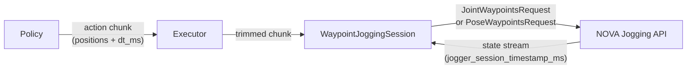

# PolicyExecutor & Timestamp Protocol

Advanced internals: how `PolicyExecutor` drives the jogging layer, and how
client and server keep their clocks aligned. For the simple standalone jogging
API (`jog_joints` / `jog_tcp`), see [jogging.md](jogging.md).

## Pipeline



## Execution Loop

### Sequential mode (`policy_rate_hz=-1`, default)

```
1. Observe robot state
2. Query policy → get action chunk
3. Send waypoints to server
4. Wait for chunk to finish (n_steps * dt_ms)
5. Go to 1
```

### RTC mode (`policy_rate_hz=20`)

In RTC mode the executor runs as a **receding horizon controller**: at each tick
it queries the policy for a fresh chunk and sends it, overlapping the previous
one. The server replaces waypoints older than the new chunk's first timestamp,
giving smooth, continuous motion even with variable inference latency.

```
1. Observe robot state
2. Query policy → get action chunk
3. Send waypoints to server (overrides previous chunk)
4. Sleep until next tick (1/policy_rate_hz)
5. Go to 1
```

## Configuration

```python
from policy import PolicyExecutor, WaypointConfig

# WaypointConfig: how waypoints are sent to the robot
config = WaypointConfig(
    n_action_steps=8,       # send only first N steps per chunk (0 = all)
    state_rate_ms=10,       # state stream update rate
)

# PolicyExecutor: controls timing
executor = PolicyExecutor(
    schema, policy,
    motion=config,
    policy_rate_hz=-1,      # -1 = wait, 0 = ASAP, >0 = fixed Hz
)
```

### policy_rate_hz

| Value | Behavior | Use case |
|---|---|---|
| `-1` (default) | Wait for chunk to finish, then replan | Policies without RTC |
| `0` | Call as fast as possible (no sleep) | Benchmarking / max throughput |
| `>0` (e.g. `20`) | Fixed-rate overlapping calls | RTC-capable policies (e.g. GR00T) |

```python
# Sequential (non-RTC policy, e.g. GR00T without RTC)
executor = PolicyExecutor(
    schema, policy,
    motion=WaypointConfig(n_action_steps=8),
)

# RTC-capable policy (overlapping chunks at 20 Hz)
executor = PolicyExecutor(
    schema, policy,
    policy_rate_hz=20,
    motion=WaypointConfig(n_action_steps=8),
)
```

Higher rates give smoother overlapping but require faster inference.
The server requires continuous waypoint updates — if the buffer empties
(no new chunk arrives before the previous one finishes), the robot pauses.
With 20 Hz and 1s lookahead chunks, there is ~95% overlap between
consecutive chunks, providing ample buffer.

## Timestamp Protocol

Each waypoint carries a timestamp (milliseconds since session start). The server
maintains an internal clock that starts when the first `JointWaypointsRequest`
or `PoseWaypointsRequest` is received.

The server exposes its current clock as `jogger_session_timestamp_ms` in the
state stream (`JoggingDetails`). The client uses this to compute a **speed ratio**
(server_time / client_time) and scales outgoing timestamps accordingly.

```
client sends:    timestamps = [start_ms * ratio, start_ms * ratio + dt * ratio, ...]
server receives: timestamps aligned with its internal clock
```

This auto-synchronization ensures the robot moves at real-time speed regardless
of any clock drift between client and server.

### Trajectory-absolute timestamps

For overlapping chunks, timestamps are **trajectory-absolute**: the chunk is
anchored at an explicit point on the server's session timeline rather than at
"now". This is what lets consecutive overlapping chunks line up — identical
steps land at identical timestamps, so the server stitches them into one
trajectory instead of restarting at every resend.

A policy can set an explicit anchor via `ActionChunk.first_timestamp_ms`:

```python
ActionChunk(
    joints={"0@ur10e": chunk_steps},
    dt_ms=10.0,
    first_timestamp_ms=int(step_idx * 10.0),  # explicit absolute anchor
)
```

When left at `-1`, the executor anchors automatically (see
`policy/chunking.py::placement`): step 0 is placed at an absolute anchor with an
offset measured in whole `dt` steps —

| case | anchor | offset |
|------|--------|--------|
| explicit `first_timestamp_ms >= 0` | that value | `0` (exact) |
| wait-for-chunk (`policy_rate_hz < 0`) | `now` | `+1` step (one dt ahead) |
| overlapping / RTC (`policy_rate_hz >= 0`) | `now` | `-seam_backdate_steps` (backdated) |

The `now` anchor is resolved at *yield time* (right before the websocket send)
so it cannot go stale while the chunk waits in the session queue.
