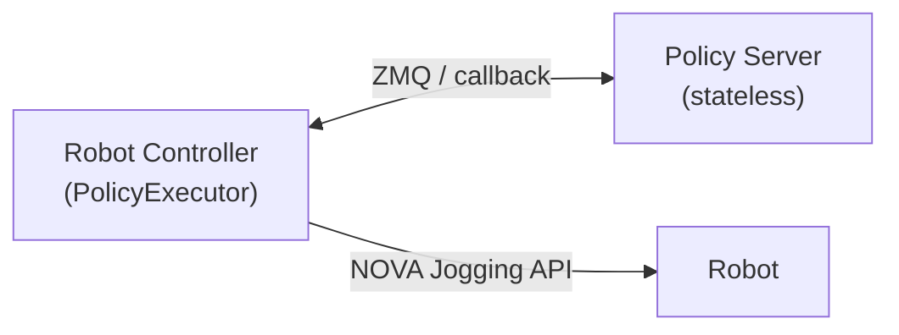

# Example Apps

Deployable Nova apps demonstrating policy execution patterns.

## `zmq/` — ZeroMQ (GR00T)

Direct ZMQ REQ/REP for NVIDIA GR00T-compatible inference servers. Uses msgpack serialization with numpy array transport.

- **[`gr00t-dual-arm-controller`](zmq/gr00t-dual-arm-controller/)** — Dual-arm UR5e controller with 4 Isaac Sim cameras.

## `mock-camera-server/` — WebRTC camera mock

Local camera server for development without real cameras. Streams video from a HuggingFace dataset over WebRTC.

```bash
cd policy/examples/apps/mock-camera-server
uv run python -m mock_camera_server
# Open http://localhost:9100
```

## Architecture



The executor (robot controller) is always the **active side** — it owns PID jogging, safety, and lifecycle.
The policy service is always **passive/stateless** — it just replies to observation → action queries.
