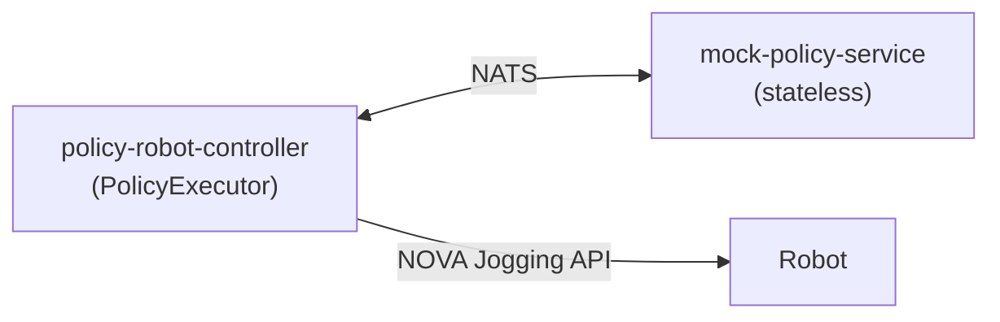

# Example Apps

Deployable Nova apps demonstrating policy execution patterns.

## `nats/` — NATS request/reply

App-to-app communication via NATS (the transport layer in Nova).

- **[`mock-policy-service`](nats/mock-policy-service/)** — Stateless inference endpoint. Subscribes to a NATS subject and replies with action chunks.
- **[`policy-robot-controller`](nats/policy-robot-controller/)** — Moves robots to home, then runs a policy episode via PID jogging.

### Deploy & test

```bash
# Deploy mock policy
nova app install policy/examples/apps/nats/mock-policy-service --omit-credentials

# Deploy controller (needs policy package copied in)
cd policy/examples/apps/nats/policy-robot-controller
cp -r ../../../../../policy .
nova app install . --omit-credentials
rm -rf policy

# Start execution
curl -X POST http://<instance>/cell/policy-robot-controller/start

# Check status
curl http://<instance>/cell/policy-robot-controller/status

# Stop
curl -X POST http://<instance>/cell/policy-robot-controller/stop
```

## `zmq/` — ZeroMQ (GR00T)

Direct ZMQ REQ/REP for NVIDIA GR00T-compatible inference servers. Uses msgpack serialization with numpy array transport.

- **[`mock-groot-policy-service`](zmq/mock-groot-policy-service/)** — Stateless GR00T-compatible inference server (ZMQ + msgpack).
- **[`groot-robot-controller`](zmq/groot-robot-controller/)** — Dual-arm controller that queries the GR00T service.

## `mock-camera-server/` — WebRTC camera mock

Local camera server for development without real cameras. Streams video from a HuggingFace dataset over WebRTC.

```bash
cd policy/examples/apps/mock-camera-server
uv run python -m mock_camera_server
# Open http://localhost:9100
```

## Architecture



The executor (robot controller) is always the **active side** — it owns PID jogging, safety, and lifecycle.
The policy service is always **passive/stateless** — it just replies to observation → action queries.
