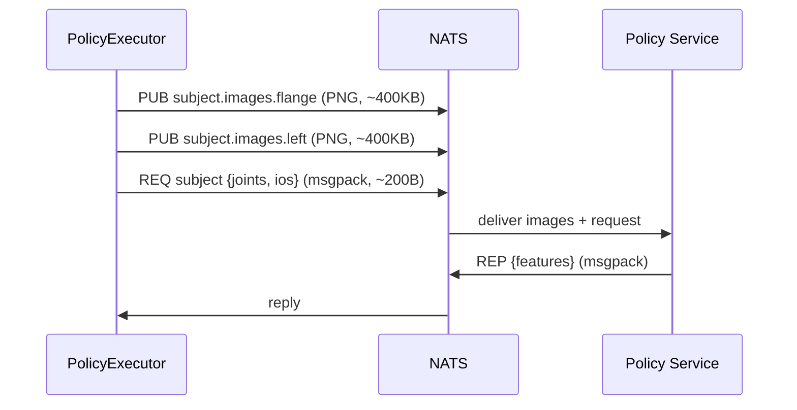

# NatsPolicyClient

NATS request/reply transport for policy inference on the Nova platform.

## Usage

```python
import nats
from policy import NatsPolicyClient

nc = await nats.connect()  # uses NATS_BROKER env on Nova
client = NatsPolicyClient(nc, subject="nova.v2.cells.cell.apps.my-policy.predict", timeout=5.0)
```

## Wire Protocol

Scalar observations (joints, IOs, TCP) are sent as **msgpack** via NATS request/reply.

Camera images are published on **separate subjects** to stay under the 1MB `max_payload` limit:



The policy service subscribes to `subject` for scalar requests and `subject.images.*` for camera frames.

## Response Format

The policy service replies with msgpack. If the response contains a `joints` key, it's parsed as structured. Otherwise the entire dict is treated as flat features:

```python
# Structured:
{"joints": {"0@ur10e": [[j1, j2, j3, j4, j5, j6]]}, "dt_ms": 33.0}

# Flat features:
{"arm_joint_position_1": 0.15, "arm_joint_position_2": -1.4, ...}
```

## Example Apps

See [`examples/apps/nats/`](../examples/apps/nats/) for deployable Nova app examples.
